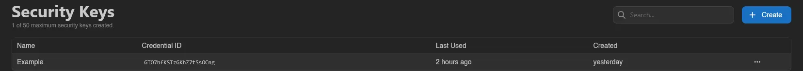
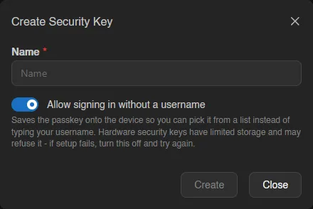
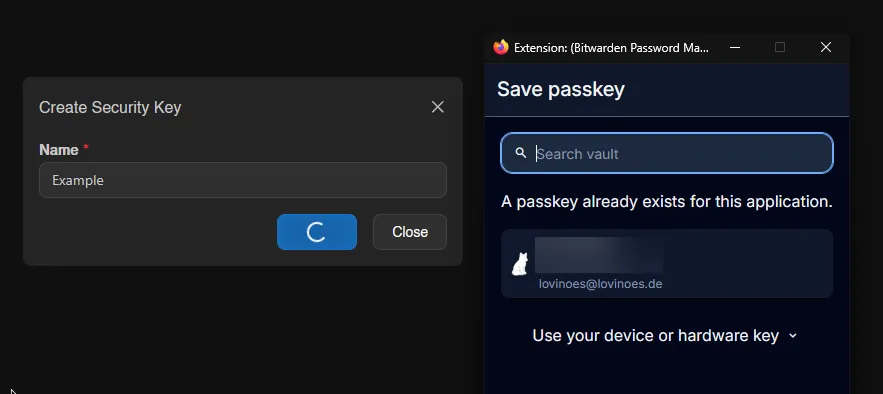
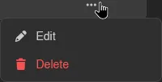
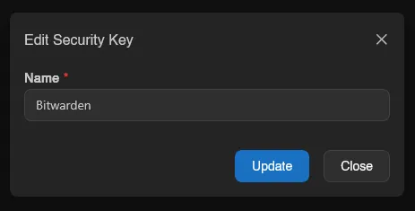

# Security Keys

Security keys use [WebAuthn](https://webauthn.io/) to let you log in with a passkey, your device's biometrics, or a physical hardware key instead of typing your password; see the [login flow](../auth/login.md#step-2-passkey-or-password) for how they're used. Your instance needs a valid SSL certificate for this to work; see [Generating SSL Certificates](../../../additional/ssl-certificates.md) if it doesn't have one yet.

Existing keys are listed with their name, credential ID, last used, and created timestamps.

## Creating a Security Key

Click **Create** in the top right and give the key a name.

After confirming, the browser takes over and asks where to save the credential: a password manager extension like Bitwarden, a platform prompt (Windows Hello, iCloud Keychain, Android), or a physical key. Closing that prompt cancels the creation.

## Editing and Removing

Right-click a key (or open the menu at the end of its row) to rename it or delete it. Editing only changes the display name, not the credential itself.

::: info
Whether security keys and usernameless login are available at all, and how many keys an account may have, is controlled by the instance administrator under [Settings > Webauthn](../admin/settings.md#webauthn) and [Settings > User](../admin/settings.md#user).
:::

