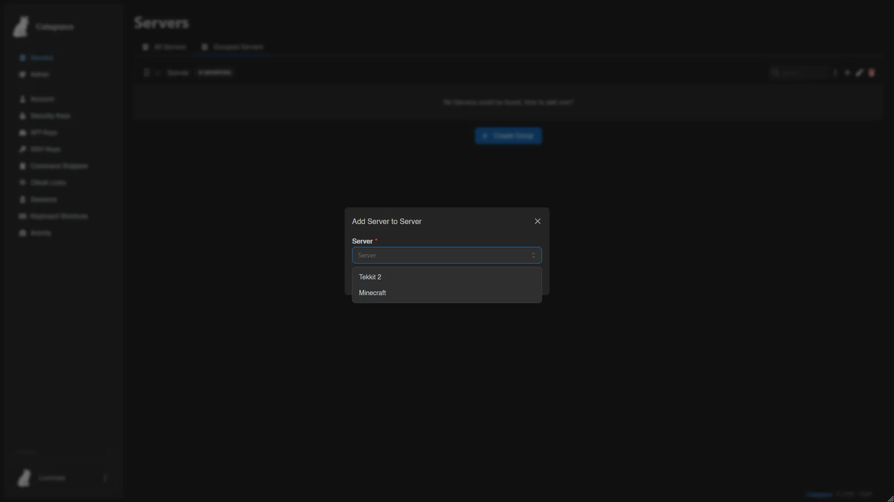
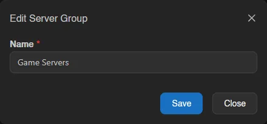

# Servers

The Servers page is the landing page for most users and lists every server you have access to. It has two views: **All Servers**, a flat list, and **Grouped Servers**, where you organize servers into your own groups.

Each server card shows its power state, name, address, and live CPU, memory, and disk usage. If you have access to servers owned by other users (for example as a subuser), a **Show other user's servers** toggle appears in the top right; it's off by default.

## Grouped Servers

Groups are personal and only affect how servers are organized for you, they don't change who has access to a server.

### Creating a Group

Switch to the **Grouped Servers** tab and click **Create**. Give the group a name.

### Adding and Removing Servers

Open a group's menu to add a server to it, then search for and pick the server you want to add.

Groups are collapsible; click the chevron to expand or collapse one.

Click a server inside a group to select it. A small action bar appears with power controls (start, stop, restart) and an option to remove it from the group without deleting the server itself.

### Renaming and Deleting a Group

Open the group's menu for **Edit** to rename it, or **Delete** to remove the group. Deleting a group never deletes the servers inside it, it just ungroups them.

