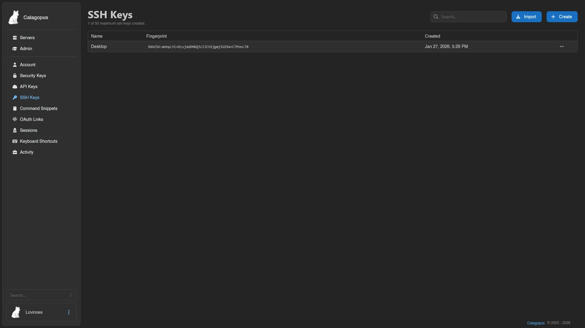
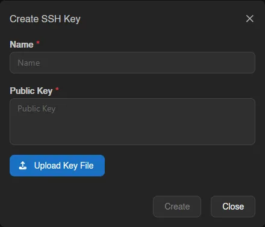
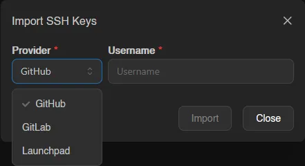
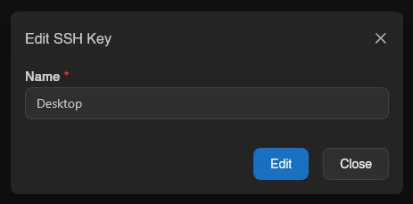

# SSH Keys

SSH keys added here are used for SFTP and SSH logins to Wings, the node daemon, instead of your panel password; the connection details themselves live on each server's [SSH Details](../server/console.md#ssh-details) and [SFTP](../server/files.md#connect) views. The list shows each key's name, fingerprint, and when it was created, with a counter against your key limit.

## Adding a Key

**Create** takes a name plus the public key itself: paste it, or pick a `.pub` file to fill the field.

**Import** skips the copy-pasting entirely: pick **GitHub**, **GitLab**, or **Launchpad**, enter your **Username** there, and the panel imports the public keys published on that account, all of them at once if there are several.

Keys work for SFTP and SSH logins immediately after being added.

::: info
The maximum number of SSH keys per account is set by the instance administrator under [Settings > User](../admin/settings.md#user).
:::

## Editing and Removing

Right-click a key (or open the menu at the end of its row) to edit or delete it. Editing only changes the key's name, not the key material itself; add a new key instead if the underlying key pair changed.

