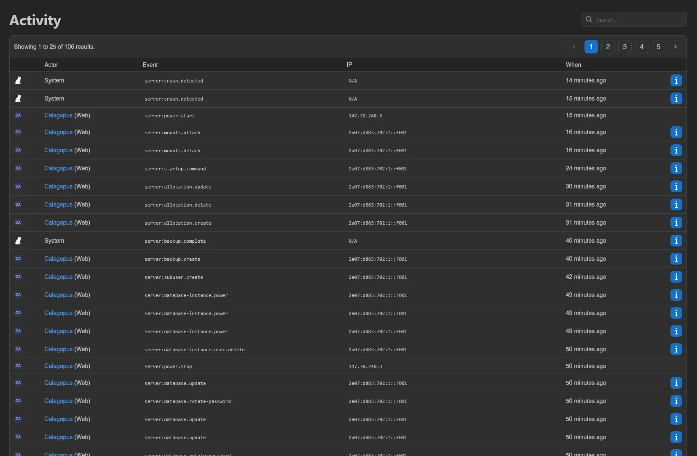
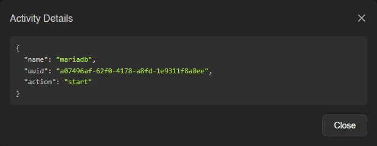

# Activity

Activity is the audit log for this server: every action, who performed it, the IP it came from, and when. Like most tables in the panel, it's paginated and searchable. Viewing it requires the `activity.read` permission; for the account-wide log, see the dashboard's [Activity](../dashboard/activity.md) page.

Events are namespaced keys, which makes them easy to search: `server:power.restart`, `server:console.command`, `server:file.write`, `server:allocation.update`, `server:database.update`, `server:subuser.create`, and so on. Everything from power actions down to individual file reads gets a row.

## Actor

The **Actor** column shows the user's avatar and username, plus the source in parentheses: **Web** for actions taken in the panel, **API** for API keys. Entries without a user are labeled **Schedule** (triggered by a schedule) or **System**, and if an admin was impersonating the user at the time, the row says so with "Impersonated by ...".

Click an actor's username to filter the log to just that user; a **Clear User Filter** button appears while the filter is active.

## Details

The **IP** column shows the address the request came from, or "N/A" for events without one. Rows with extra metadata have an info button at the end that opens an **Activity Details** modal with the raw JSON, and `server:file.write` rows link straight to that revision in the file editor's diff view.

::: info
Server activity is pruned automatically. Retention defaults to 90 days; instance administrators can change it, cap the number of entries kept, and toggle whether admin and schedule actions are logged at all.
:::
