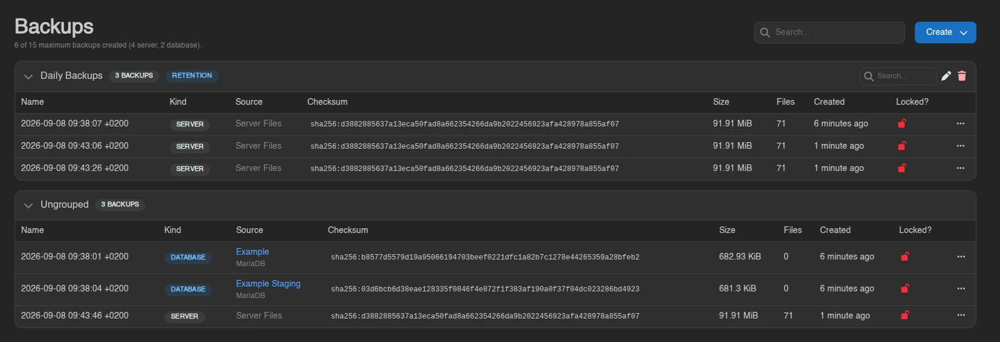
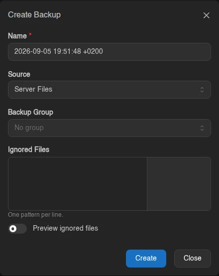
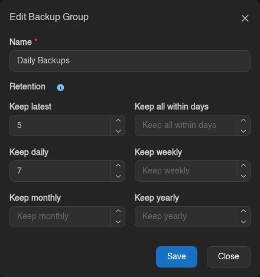
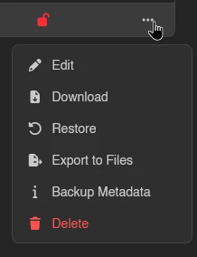
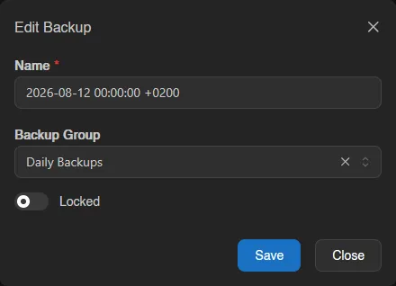
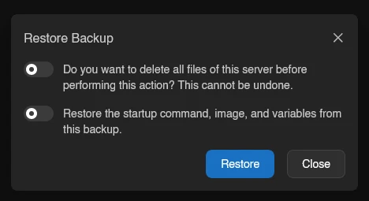
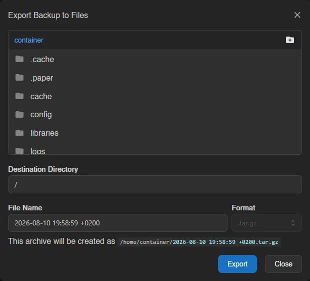
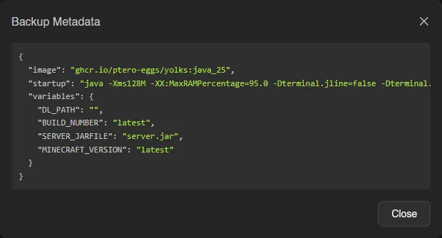

# Backups

The Backups page lists every backup of your server, with a counter like "2 of 15 maximum backups created." at the top. The limit is part of the server's [feature limits](../admin/servers.md#feature-limits); once you hit it, the create option is disabled with the tooltip "This server is limited to 15 backups."

Each row shows the backup's **Name**, **Checksum** (e.g. `sha256:...`), **Size**, **Files** (file count), **Created**, and **Locked?** (a green closed lock when locked, a red open one when not). A backup that is still running shows a progress bar instead; a failed one shows a **Failed** badge.

## Creating a Backup

Click **Create** in the top right. If backup groups are available, the button opens a menu instead, with **Create Backup** and **Create Backup Group**.

The form has three fields:

| Field | Notes |
| --- | --- |
| **Name** | Pre-filled with a generated timestamp name; change it if you like. |
| **Backup Group** | Only shown when the server has groups. Defaults to **No group**. |
| **Ignored Files** | Patterns for files to exclude, one pattern per line. |

The **Ignored Files** field shows a live match count next to each pattern, supports `!` exceptions, and has a **Preview ignored files** toggle that opens a file browser showing exactly what would be skipped.

## Backup Groups

Groups organize backups and can rotate them automatically. Each group is a collapsible card with its own search box, and any backups outside a group collect under **Ungrouped**.

The group header shows retention at a glance:

| Badge | Meaning |
| --- | --- |
| `1/5` | Usable backups versus the group's **Keep count**. Turns yellow when over the limit. |
| **Keep 7 Days** | The group's **Keep days** retention. |
| **No auto-deletion** | No retention set; the group is just a label. |
| **All locked** | Every backup in the group is locked, so nothing can be rotated out. |

### Creating and Editing a Group

Pick **Create Backup Group** from the **Create** menu. Give it a name and optionally set:

- **Keep count**: maximum number of usable backups to keep in this group. Leave empty for no limit.
- **Keep days**: delete backups in this group older than this many days. Leave empty for no limit.

With neither set, the group never deletes backups automatically. Use the pencil icon in a group's header to edit it later. There is also a panel-wide limit on groups per server, set under [Settings > Server](../admin/settings.md#server); the **Create Backup Group** option disappears once you reach it.

### Deleting a Group

Click the trash icon in the group header and type the group's name to confirm. The backups inside are not deleted, they become ungrouped and follow standard rotation. A **Lock backups** switch locks all backups in the group first, so they cannot be rotated out automatically afterwards.

## Backup Actions

Right-click a backup (or use the menu at the end of the row) for its actions.

### Edit

Rename the backup, move it to another group, or toggle **Locked**. A locked backup cannot be deleted and is never rotated out by group retention.

### Browse

Opens the backup's contents directly in the [file manager](./files.md#browsing-backups) (under a read-only `/.backups/` path), so you can inspect it and pull out individual files without downloading the whole archive. Browse only appears for backups whose storage driver and format support it; see [Browsing Backups from the Client UI](../../../wings/advanced/backup-configurations.md#browsing-backups-from-the-client-ui) for which do.

### Download

Downloads the backup as an archive. For backups stored in a driver that can re-stream them, the entry expands into **Download as ...** options (`.tar`, `.tar.gz`, `.tar.xz`, `.tar.lz`, `.tar.bz2`, `.tar.lz4`, `.tar.zst`, `.zip`); others download in their stored format.

### Restore

Restores the backup onto the server. Two switches control how:

- **Do you want to delete all files of this server before performing this action? This cannot be undone.** wipes the server first for a clean restore.
- **Restore the startup command, image, and variables from this backup.** is only available when the backup captured that metadata.

The server switches into a restoring state and you're taken back to the console while it runs.

### Export to Files

Writes the backup as an archive file into the server's own file area. Pick a destination directory, file name, and archive format (fixed for backups whose stored format can't be converted); the modal shows the resulting path under `/home/container/` before you hit **Export**.

### Backup Metadata

Shown only for backups that captured metadata (startup command, image, variables); opens a JSON view of it.

### Delete

Asks for confirmation, then deletes the backup. Disabled while the backup is locked.

::: info
Where backups are physically stored (local disk, S3, restic, and so on) is a backup configuration admins assign at the server, node, or location level. See [Setting up Backup Configurations](../../../wings/advanced/backup-configurations.md).
:::
