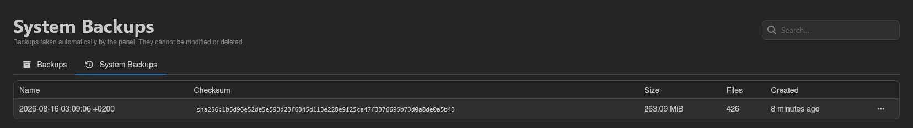
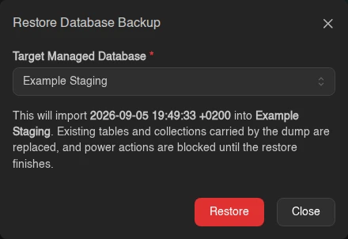

# Backups

The Backups page lists every backup of your server, with a counter like "2 of 15 maximum backups created." at the top. There are two kinds of backup. A **Server** backup is an archive of the server's files. A **Database** backup is a dump of one of the server's [managed databases](./databases.md#managed-databases). Both kinds count toward the same limit, which is part of the server's [feature limits](../admin/servers.md#feature-limits); as soon as a database backup exists the counter splits, as in "11 of 15 maximum backups created (9 server, 2 database)." Once you hit the limit, the create option is disabled with the tooltip "This server is limited to 15 backups."

Each row shows the backup's **Name**, **Kind** (**Server** or **Database**), **Source** (**Server Files**, or the managed database the dump was taken from, with its engine next to it), **Checksum** (e.g. `sha256:...`), **Size**, **Files** (file count, always 0 for a database backup), **Created**, and **Locked?** (a green closed lock when locked, a red open one when not). If the managed database a dump came from has since been deleted, the source reads "Example (deleted)". A backup that is still running shows a progress bar instead; a failed one shows a **Failed** badge. Deletion is asynchronous: the row dims under a **Deleting...** badge, which turns into **Deletion failed** if it goes wrong.

## Creating a Backup

Click **Create** in the top right. If backup groups are available, the button opens a menu instead, with **Create Backup** and **Create Backup Group**.

The form has four fields:

| Field | Notes |
| --- | --- |
| **Name** | Pre-filled with a generated timestamp name; change it if you like. |
| **Source** | **Server Files** (the default) or **Managed Database**. Only shown when you can see the server's managed databases; picking **Managed Database** adds a picker for which one to dump. |
| **Backup Group** | Only shown when the server has groups. Defaults to **No group**. |
| **Ignored Files** | Patterns for files to exclude, one pattern per line. Server backups only. |

The **Ignored Files** field shows a live match count next to each pattern, supports `!` exceptions, and has a **Preview ignored files** toggle that opens a file browser showing exactly what would be skipped.

## Database Backups

A database backup is a dump of a managed database, written by the database's own tooling: a SQL dump for PostgreSQL and MariaDB, a `mongodump` archive for MongoDB, and an RDB snapshot for Redis. It goes through the same backup configuration as your server backups and sits in the same list and the same groups. The managed database it came from lists it too, on its own [Backups tab](./databases.md#backups-tab), where you can take one without leaving the database's page.

A few things have to be true before the panel takes one:

- The managed database must be running. Its Backups tab disables **Create** with "The managed database must be running to take a backup." while it is off.
- The server's backup configuration cannot be a btrfs or ZFS one; those store file snapshots and have nowhere to put a dump. Every other driver works.
- No restore may be running into that managed database at the time.

A dump has no file tree, so **Browse**, **Export to Files**, and **Backup Metadata** are not offered for database backups. **Download** hands you the dump file as it was stored. **Edit**, **Restore**, and **Delete** work as they do for server backups; restoring is covered under [Restore](#restore) below.

## Backup Groups

Groups organize backups, and their retention rules decide which ones the panel keeps. Each group is a collapsible card with its own search box, and any backups outside a group collect under **Ungrouped**. An empty group reads "This group has no backups yet." with a **Create backup in this group** button.

The group header shows:

| Badge | Meaning |
| --- | --- |
| `N Backups` | How many backups the group holds. |
| **Retention** | The group has retention rules. Hover it to see them. |
| **No retention rules** | Nothing is set, so the group is only a label. |
| **All locked** | Every backup in the group is locked, so nothing can be deleted automatically. |

The tooltip lists only the rules that are switched on, so it doubles as a summary of what the group keeps without opening the edit form.

### Retention Rules

A group has six rules, each off when you leave it empty or set it to 0.

| Rule | Keeps |
| --- | --- |
| **Keep latest** | The newest N backups. |
| **Keep all within days** | Every backup taken in the last N days. |
| **Keep daily** | The newest backup from each of the last N days that has one. |
| **Keep weekly** | The newest backup from each of the last N weeks that has one. |
| **Keep monthly** | The newest backup from each of the last N months that has one. |
| **Keep yearly** | The newest backup from each of the last N years that has one. |

A backup is kept when any one rule selects it, so the rules stack: **Keep latest** 5 alongside **Keep monthly** 12 gives you the five most recent backups plus one per month going back a year. Anything no rule selects is deleted. Periods follow UTC and weeks start on Monday.

Empty periods don't use up a slot. **Keep daily** 7 holds the newest backup from each of the seven most recent days that actually have one, so a quiet week doesn't push your older dailies out.

Every source has its own history: the server's files are one, and each managed database is another. **Keep latest** 3 in a group holding server backups and two database backups therefore keeps three of each. A locked backup fills a slot but is never deleted. Failed backups sit outside retention entirely, and the panel removes unlocked failed ones 24 hours after they finish, whether they are in a group or not.

Retention is evaluated when a backup finishes, when you move one between groups, and once an hour for every group.

### Creating and Editing a Group

Pick **Create Backup Group** from the **Create** menu. Give it a name and fill in whichever rules you want; **Retention** has a helper popover describing them.

Leave them all empty and the modal tells you what that means: "With no retention set, this group is just a label and never deletes successful backups automatically." Use the pencil icon in a group's header to edit it later. There is also a panel-wide limit on groups per server, set under [Settings > Server](../admin/settings.md#server); the **Create Backup Group** option disappears once you reach it.

Once you have more than one group, each header grows a grip handle: drag it to reorder the groups on the page. This is display order only and doesn't affect retention.

### Reaching the Backup Limit

The server's backup limit is a hard cap that groups don't raise; retention only decides which backup goes when room is needed. At the limit, an automatic backup makes room for itself by deleting whatever your rules no longer keep. If there is nothing expendable it takes one more, preferring a failed backup, then an ungrouped one, and only then a backup a group still keeps. A manual backup is refused rather than delete something a rule still keeps, and locked backups are never touched. Every automatic deletion shows up in the server's [Activity](./activity.md) log with the rule and the group that caused it.

### Deleting a Group

Click the trash icon in the group header and type the group's name to confirm. The backups inside are not deleted, they become ungrouped, so no retention rule applies to them and they only go if the server reaches its backup limit. A **Lock backups** switch locks all backups in the group first, so they cannot be deleted automatically afterwards.

## System Backups

When the panel has taken automatic backups of this server through a [system backup policy](../admin/system-backup-policies.md), a sub-navigation appears with a **System Backups** tab at `/backups/system`: "Backups taken automatically by the panel. They cannot be modified or deleted." The rows are read-only in the sense that you cannot rename, lock or delete them - but they are still fully usable backups: browsing, downloading, restoring, exporting to files and viewing metadata all work exactly as they do on your own backups, with the same permissions.

## Backup Actions

Right-click a backup (or use the menu at the end of the row) for its actions.

### Edit

Rename the backup, move it to another group, or toggle **Locked**. A locked backup cannot be deleted, and retention never removes it or evicts it to make room at the backup limit.

### Browse

Opens the backup's contents directly in the [file manager](./files.md#browsing-backups) (under a read-only `/.backups/` path), so you can inspect it and pull out individual files without downloading the whole archive. Browse only appears for server backups whose storage driver and format support it; see [Browsing Backups from the Client UI](../../../wings/advanced/backup-configurations.md#browsing-backups-from-the-client-ui) for which do.

### Download

Downloads the backup as an archive. For server backups stored in a driver that can re-stream them, the entry expands into **Download as ...** options (`.tar`, `.tar.gz`, `.tar.xz`, `.tar.lz`, `.tar.bz2`, `.tar.lz4`, `.tar.zst`, `.zip`); others download in their stored format. A database backup downloads as its dump file.

### Restore

Restores the backup onto the server. Two switches control how:

- **Do you want to delete all files of this server before performing this action? This cannot be undone.** wipes the server first for a clean restore.
- **Restore the startup command, image, and variables from this backup.** is only available when the backup captured that metadata.

The server switches into a restoring state and you're taken back to the console while it runs. A progress toast showing the bytes and files restored so far stays in the corner on every page of the server until the restore finishes.

For a database backup, **Restore** opens **Restore Database Backup** instead. Pick the **Target Managed Database**; the list only offers managed databases running the same engine as the dump, with the one the backup was taken from preselected, so a dump from a deleted database can be restored into a new one. The modal spells out what happens: "Existing tables and collections carried by the dump are replaced, and power actions are blocked until the restore finishes." The target has to be running, and only one restore can run into a given database at a time.

The restore itself runs in the background. While it runs, the database's page shows a **Restoring backup** badge and a progress banner, and its power buttons are disabled. A toast tells you when it completes or fails. See [The Instance Page](./databases.md#the-instance-page).

### Export to Files

Server backups only. Writes the backup as an archive file into the server's own file area. Pick a destination directory, file name, and archive format (fixed for backups whose stored format can't be converted); the modal shows the resulting path under `/home/container/` before you hit **Export**.

### Backup Metadata

Shown only for server backups that captured metadata (startup command, image, variables); opens a JSON view of it.

### Delete

Asks for confirmation, then deletes the backup. Disabled while the backup is locked.

::: info
Where backups are physically stored (local disk, S3, restic, and so on) is a backup configuration admins assign at the server, node, or location level. See [Setting up Backup Configurations](../../../wings/advanced/backup-configurations.md).
:::
