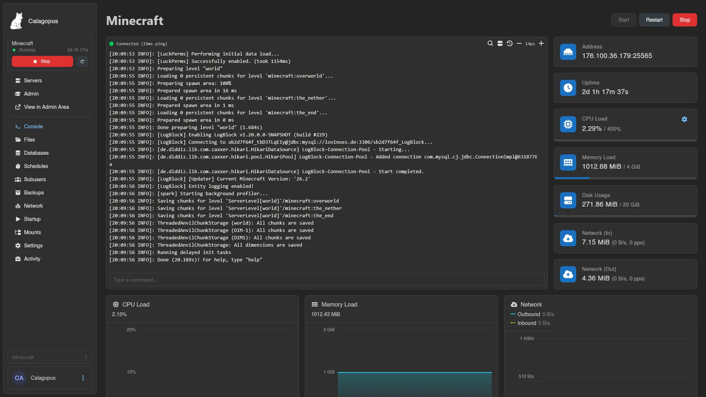
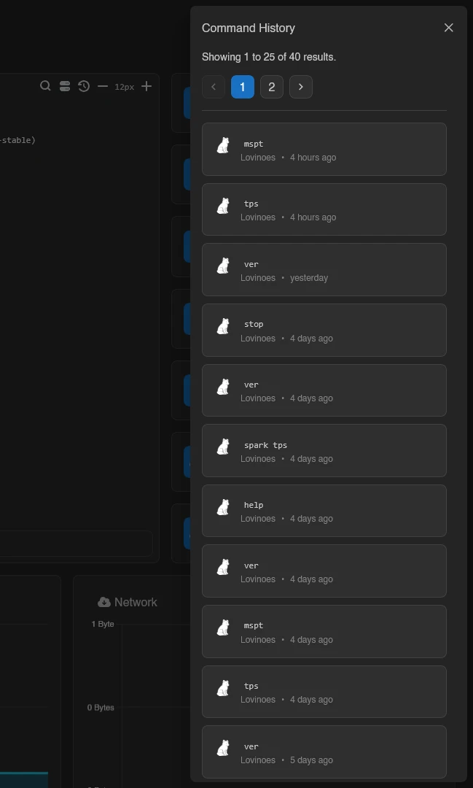
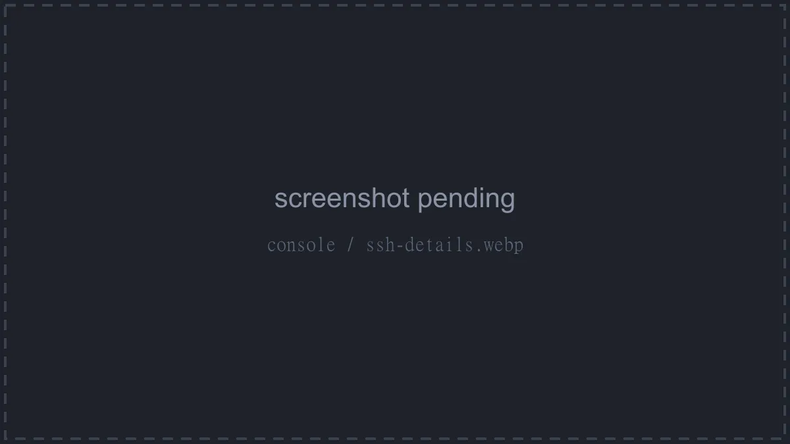
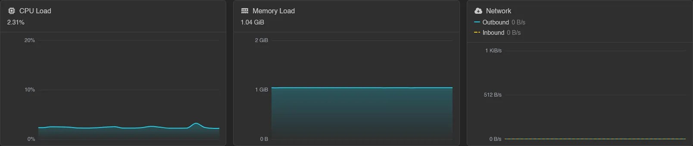

# Console

The Console is the landing tab of every server: power controls, the live terminal, resource stats, and usage graphs on one page.

## Power Controls

**Start**, **Restart**, and **Stop** sit next to the server's name. **Start** is only clickable while the server is offline, **Stop** only while it isn't. While the server is stopping, **Stop** turns into **Kill** to force-stop the process.

::: warning
**Kill** asks for confirmation first (**Forcibly Stop Process**), because forcibly stopping a server can lead to data corruption. Use it only when a normal stop hangs.
:::

Each button requires its matching permission (`control.start`, `control.restart`, `control.stop`), and all of them are disabled while the server is suspended, transferring, or installing.

## The Terminal

Output streams in live over a websocket. The dot in the top left shows the connection: green with **Connected (12ms ping)**, refreshed every 10 seconds, or red with **Disconnected** if the connection drops. Recent logs replay when you open the page, and state changes are written into the stream as "Server marked as Running...".

The icons in the top right of the terminal:

| Icon | Does |
| --- | --- |
| **Search** | Search the scrollback (also `Ctrl`+`F`). Enter jumps to the next match, Shift+Enter to the previous. |
| **SSH Details** | Connection details for SSH access, see below |
| **Command History** | Previously sent commands, see below |
| **Decrease Font Size** / **Increase Font Size** | Adjust the terminal font between 10px and 24px; the choice is remembered by your browser |

Select text to copy it: `Ctrl`+`C` copies the selection, and on touch screens a long press starts selecting and shows a **Copy Selection** button. If you've scrolled up, an arrow button jumps back to the bottom.

When the server's Docker image has to be pulled before it can start, pull and extract progress bars appear below the terminal.

## Sending Commands

The input below the terminal (**Type a command...**) sends commands straight to the server process. It requires the `control.console` permission and is disabled while the server is offline.

Arrow Up and Arrow Down cycle through your last commands (up to 32, kept per server in your browser); the bindings are rebindable in [Keyboard Shortcuts](../dashboard/keyboard-shortcuts.md).

Typing `!` suggests your [Command Snippets](../dashboard/command-snippets.md); picking one pastes its full command into the input.

### Command History

**Command History** opens a drawer of every command sent to this server, pulled from the [Activity](./activity.md) log (so it needs the `activity.read` permission). Click an entry to see the full command, who sent it (a user, a schedule, or the system), and when. From there, **Send Command** runs it again and **Copy Command** copies it.

### SSH Details

**SSH Details** shows everything needed to open a shell on the server over SSH: protocol, host, port, the username (your panel username followed by the server's short ID, like `<username>.<server-id>`), and a ready-made **SSH Command**. The password is your panel password, or add an [SSH Key](../dashboard/ssh-keys.md) to skip it. Every field except the password copies on click, and **Launch** opens the connection in your system's SSH client. Both this and **Command History** are disabled while the server is suspended or busy installing, restoring, or transferring.

## Stats

To the right of the terminal, tiles show the server's live stats. Usage tiles show current use against the server's limit, like `869.89 MiB / 4 GiB`, or **Unlimited** where no limit is set; while the server is offline they read **Offline**, except **Disk Usage**, which always shows the stored amount.

| Tile | Shows |
| --- | --- |
| **Address** | The server's primary address, click to copy. Eggs that use a separate port show a **Port** tile too. |
| **Uptime** | Time since the server started |
| **CPU Load** | CPU usage against the CPU limit, like `2.35% / 400%`. A checkbox on the tile, **Normalize CPU Load (shifted to max 100%)**, rescales it to a 0-100% range instead. |
| **Memory Load** | Memory usage against the memory limit |
| **Disk Usage** | Disk usage against the disk limit |
| **Network (In)** / **Network (Out)** | Received and sent traffic, with the current per-second rate and packets per second below |

## Graphs

Below everything, three live graphs: **CPU Load**, **Memory Load**, and **Network**. The Network graph tracks both directions; click **Hide Outbound** or **Hide Inbound** in its legend to focus on one. While the server is offline, the graphs show a **Server is offline** overlay instead.

## Automatic Prompts

On some eggs, the console reacts to known startup problems:

- Minecraft eggs: if the server stops because the EULA isn't accepted, a **Minecraft EULA Agreement** modal appears. **Accept EULA** sets `eula=true` in `eula.txt` and restarts the server.
- If the server can't start because it's running an unsupported Java version, an **Unsupported Java Version** modal lets you pick a supported Docker image and apply it with **Update Docker Image**.
