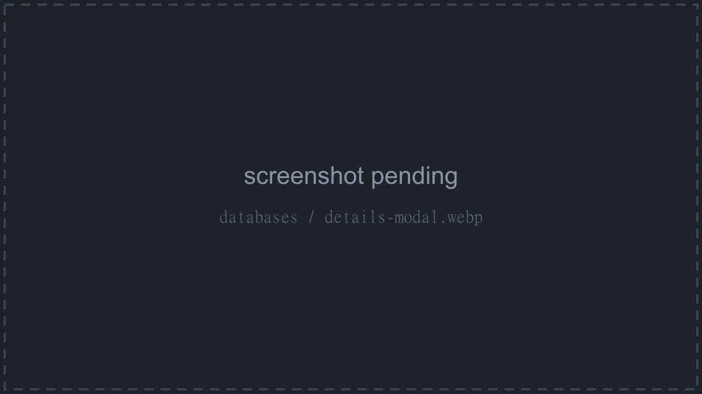
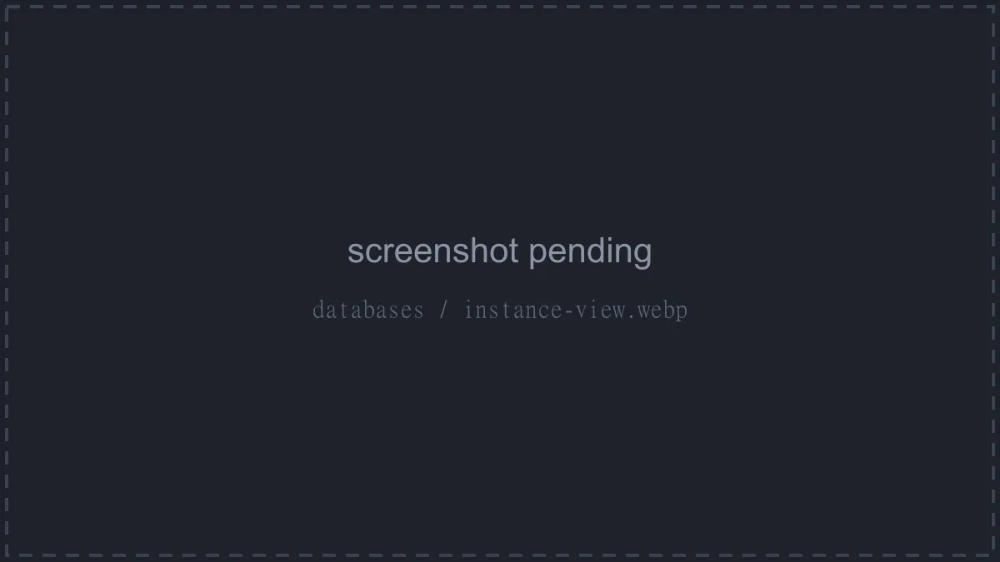
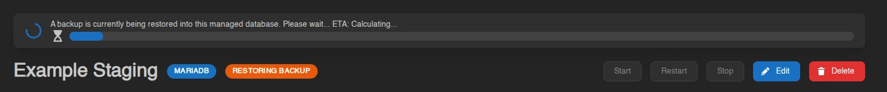
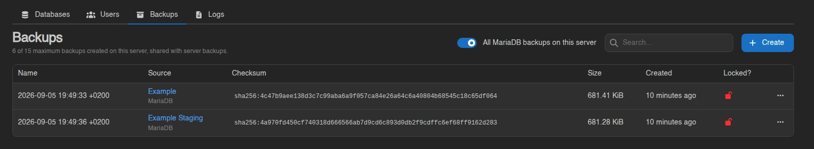

# Databases

Calagopus has two kinds of server databases. **Classic Databases** are single databases provisioned on a shared database host, the familiar setup from other panels. **Managed Databases** are full database instances run for you by [DB Agent](../../../db-agent/index.md), with their own container, power controls, and live stats.

Both kinds count toward the same limit, shown at the top of the page as "6 of 15 maximum databases created."; the limit is part of the server's [feature limits](../admin/servers.md#feature-limits). The page splits into a **Databases** tab for classic databases and a **Managed Databases** tab at `/databases/instances`, each with its own search box and **Create** button.

A tab only appears when it's relevant to your server: classic when you have databases or a database host to create on, managed when you have instances or templates to create from. With only one relevant, the tab bar hides and you get a single plain list.

## Classic Databases

The **Databases** tab lists each database's name, type (MySQL, PostgreSQL, or MongoDB), address, username, size, and whether it's locked. Click the address to copy it.

### Creating a Database

Click **Create**. Pick a **Database Name** and a **Database Host**; hosts are grouped by database type, and a host marked **Under Maintenance** can't be selected. The button is disabled with a tooltip once the shared limit is hit, or with "No hosts found" when there's nothing to provision on.

::: info
Database hosts are set up by administrators and attached to locations, see [Database Hosts](../../../additional/database-hosts/index.md). Users only ever pick from the hosts made available to their server.
:::

### Connection Details

Right-click a database and choose **Details** to open the **Database connection details** modal: database name, host, username, password, and a ready-made **JDBC Connection String** in the form `jdbc:mysql://<username>:<password>@192.0.2.1:3306/<database>`.

The password is only visible with the `databases.read-password` permission. From the same modal, **Rotate Password** generates a new password immediately, invalidating the old one.

### Editing, Recreating, and Deleting

The rest of the right-click menu:

| Action | What it does |
| --- | --- |
| **Explore Data** | Opens the [Data Explorer](#data-explorer). |
| **Edit** | Toggle **Locked**. A locked database can't be recreated or deleted, and its password can't be rotated. |
| **Recreate** | Wipes all data and creates a fresh, empty database with the same connection details. Type the database name to confirm. |
| **Delete** | Permanently deletes the database and all data. Type the database name to confirm. |

## Managed Databases

Managed databases are dedicated Redis, MongoDB, PostgreSQL, or MariaDB instances. The **Managed Databases** tab lists each instance's name, type, address, memory, disk, and lock state; an instance with a pending template update also shows an **Update Available** badge. Right-click a row for power actions (**Start**, **Restart**, **Stop**, **Kill**) and **Delete**, or click it to open the instance page.

### Creating a Managed Database

Click **Create** on the **Managed Databases** tab. Choose a **Database Name** and a **Template**; templates are grouped by database type, and each one defines the instance's resource limits (memory, swap, disk, CPU, and IO weight). If the template offers more than one **Docker Image**, you pick one too.

::: info
Templates and the resource limits they carry are configured by administrators under [Database Agent Templates](../admin/database-agent-templates.md); the per-instance database and user caps live in [Settings > Server](../admin/settings.md#server). See the [DB Agent docs](../../../db-agent/index.md) for how instances are provisioned.
:::

### The Instance Page

Each instance has its own page at `/server/<id>/databases/instances/<id>` with the instance name, its type badge, and badges for **Locked**, **Update Available**, and **Restoring backup** where relevant.

Along the top:

- **Start**, **Restart**, and **Stop** power buttons. While the instance is stopping, **Stop** turns into **Kill**; killing warns you first, since forcibly killing a database can corrupt data.
- **Export** and **Import** (Redis only, and only while running): download a dump of the whole instance, or upload one, optionally with **Wipe all existing data before importing**.
- **Apply Update**, shown when the instance's template has a newer configuration. Applying it restarts the database on the updated template.
- **Edit** to rename the instance or toggle **Locked**. A locked instance can't be deleted, template updates can't be applied, and its user passwords can't be rotated.
- **Delete** to remove the instance and all its data. Type the name to confirm.

Below that are live **CPU Load** and **Memory Load** graphs (with an "Instance is offline" overlay when it's off) and stat tiles for Address, Uptime, CPU Load, Memory Load, and Disk Usage. Tiles show usage against the template's limits; a limit of zero displays as Unlimited. If a background operation like a remote import is running, a progress ring appears next to the power buttons where you can watch or cancel it, or **Cancel all operations** at once.

While a [database backup](./backups.md#database-backups) is being restored into the instance, a banner at the top reads "A backup is currently being restored into this managed database. Please wait..." with a progress bar and time estimate, and **Start**, **Restart**, and **Stop** are disabled until it finishes. A toast tells you whether the restore completed or failed.

### Databases Tab

Not shown for Redis, which has no named databases. Lists the databases inside the instance with their size, up to its own per-instance cap. **Create** asks for a name (letters and numbers only) and requires the instance to be running. It also has a **Create a user for this database** switch, on by default, which "creates a user named after the database, grants it access and shows its credentials once the database is created" - leave it on and you get a working database and login in one step. A warning icon next to a database means it has no user attached yet, so nothing can connect to it.

Right-click a database for:

| Action | What it does |
| --- | --- |
| **Explore Data** | Opens the [Data Explorer](#data-explorer). |
| **Export** | Downloads a dump of this database. |
| **Import** | Uploads a **Dump File**, optionally wiping existing data first. MongoDB imports also need the **Source Database** name the dump was taken from. |
| **Import from Remote** | Dumps another database server over a **Connection String** and imports the result. An optional **Source Database** field "Overrides the database named in the connection string", and a wipe toggle clears the target first. The connection string is only used to take the dump, it is never stored. Runs in the background as a cancellable operation. |
| **Recreate** | Wipes all data and recreates an empty database with the same name and user access. Type the name to confirm. |
| **Delete** | Permanently deletes the database and its data. |

### Users Tab

Per-instance database users, also capped ("0 of 10 maximum users created."). Each row lists the databases that user can reach as badges under a **Databases** column, blue for read and write access, grey for read-only.

**Create** takes a **Username** (letters and numbers only) and, for everything except Redis, a **Database Access** list: every database in the instance with a **No Access** / **Read Only** / **Read & Write** control next to it. A user can hold access to as many databases as you like, at a different level in each.

Right-click a user for:

| Action | What it does |
| --- | --- |
| **Details** | Opens the **Database Credentials** modal: address, username, password, and a **JDBC Connection String**, plus the same **Rotate Password** button classic databases have. When the user can reach more than one database, a selector switches which one the connection string is built for. |
| **Permissions** | Opens **Database Permissions** - "Controls which databases **{username}** can access, and what it may do in them." - the same No Access / Read Only / Read & Write list used when creating the user. |
| **Delete** | Removes the user. |

### Backups Tab

Shown with the `backups.read` permission. Lists the database backups taken from this instance, under a counter like "2 of 15 maximum backups created on this server, shared with server backups." - the same limit the server's [Backups](./backups.md) page counts against. Backups that belong to a [backup group](./backups.md#backup-groups) show the group's name under theirs.

**Create** asks for a **Name** and, when the server has groups, a **Backup Group**, then dumps the running instance. It is disabled while the instance is offline ("The managed database must be running to take a backup.") and while a restore is in progress.

Flip **All MariaDB backups on this server** (the engine name follows the instance) to widen the list to every database backup of the same engine on this server. A **Source** column then names the managed database each dump was taken from, marking one whose database no longer exists as "Example (deleted)". Restoring one of those into this instance is how you move data between managed databases, or recover a dump whose database has been deleted.

Right-click a backup for **Edit**, **Download**, **Restore**, and **Delete**; they work as described under [Backup Actions](./backups.md#backup-actions).

### Logs Tab

A live log stream from the instance's container, the managed-database equivalent of the server console (read-only, no command input). While the agent is pulling a new Docker image, pull and extract progress bars appear beneath the log.

## Data Explorer

**Explore Data** on a classic database or on a database inside a managed instance opens a database browser built into the panel, no external tool needed. MongoDB databases cannot be explored, nor can Redis instances.

A searchable **Tables** sidebar (collapsible via **Hide Tables**) lists the database's tables with estimated row counts; views carry a **View** badge. Three tabs work on the selected table:

- **Rows**: browse with pagination and stackable column filters (equals, contains, starts with, greater or less than, and more); column headers show each column's type and sort the listing. Edit cells inline and hit **Save**, insert with **New Row** (columns can keep their **Database default**), or select rows and delete them after confirmation.
- **Structure**: the column list shows Name, Type, Nullable, Key, Default, and Attributes. Create tables (columns with **Type**, **Nullable**, **Primary Key**, and **Auto Increment**), add, rename, and delete columns, and rename or delete whole tables; deleting a table or column permanently destroys its data, and adding a non-nullable column to a table that already has rows fails.
- **Query**: a SQL console with syntax highlighting, a **Row Limit** (default 100), and **Run**. **Read-only** is on by default ("Rejects statements that change data or structure."); turn it off to run writes.

Browsing needs the `databases.query` permission (`database-instances.query` inside instances); editing rows, editing structure, deleting structure, and the Query tab each map to their own key, see the [Permissions Reference](../dashboard/permissions.md). Treat `query-raw` like handing out the database credentials themselves, and note that a [database host in maintenance mode](../admin/database-hosts.md#maintenance-mode) blocks the explorer entirely. SQLite files in the file manager get the same treatment via the [files page](./files.md#sqlite-databases).
