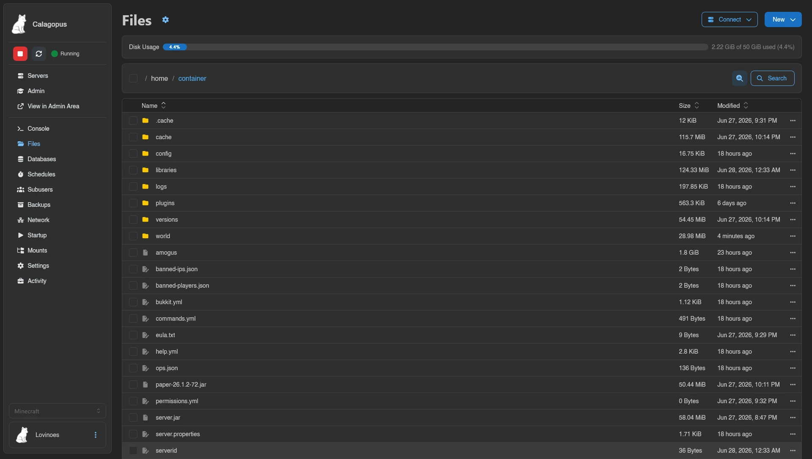
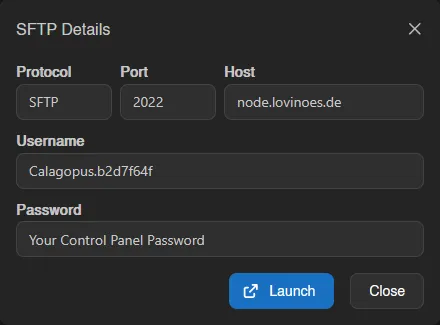
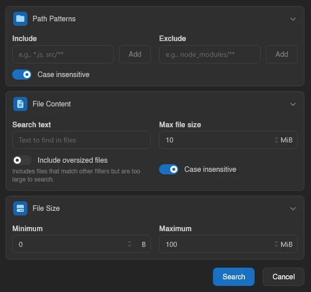
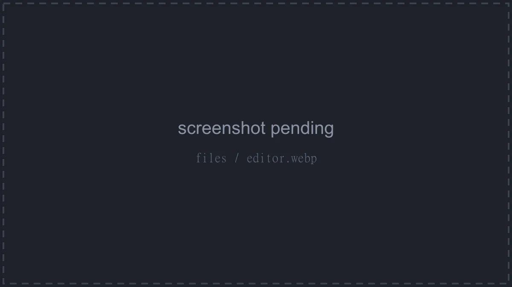

# Files

The Files tab is a full file manager for your server: browse and sort, upload and download, edit with a code editor, pack and unpack archives, and roll files back to earlier revisions. Everything is gated by the `files.*` permissions, see the [Permissions Reference](../dashboard/permissions.md).

## The List View

Files are listed with **Name**, **Size**, and **Modified** columns; click a column header to sort, click again to flip the direction. Single-click selects a row, double-click opens it, and typing a few letters jumps to the first matching entry. Inside a subdirectory, the top row takes you back up one level.

The breadcrumb bar above the table always starts at `home / container` and every segment is clickable. It also holds the select-all checkbox, a directory-size analyzer, and the **Search** button.

The gear next to the page title opens the file manager settings:

| Setting | Effect |
|---|---|
| **Click once to open file or folder** | Single-click opens entries instead of selecting them. |
| **Show physical size instead of logical size** | The Size column shows actual disk usage rather than file length. |
| **VS Code URI Scheme** | Which editor the **via VS Code** connect option launches (`vscode` by default, e.g. `vscodium` or `cursor` for forks). |

### Connect

The **Connect** menu offers two ways to work on your files outside the browser:

- **via SFTP** opens the **SFTP Details** modal with the connection info: **Protocol**, **Host**, **Port**, **Username** (your panel username plus the server's short ID, like `user.1a2b3c4d`), and your panel password. Every field copies on click, and **Launch** opens an `sftp://` link for clients registered to handle it. Holding Shift while clicking **via SFTP** skips the modal and launches directly. Requires the `files.sftp` permission.
- **via VS Code** mounts the server as a workspace folder in your editor. See the [VS Code integration](../../../integrations/vscode.md) for setup and everything it can do.

### New

The **New** menu (shown when you can write to the current directory and hold `files.create`) creates content in the directory you are browsing:

| Option | What it does |
|---|---|
| **File from Editor** | Opens an empty code editor; **Create** asks for a file name. |
| **Directory** | Creates a new directory. |
| **File from Pull** | Downloads a file from a URL directly onto the server, see [Pulling from a URL](#pulling-from-a-url). |
| **File from Upload** | Uploads files from your device. |
| **Directory from Upload** | Uploads an entire folder, keeping its structure. |

### Disk Usage

Below the toolbar, a **Disk Usage** bar shows how much of the server's disk limit is in use, for example `271.86 MiB of 20 GiB used (1.3%)`. It turns yellow at 80% and red at 95%, and is hidden on servers with unlimited disk.

### Search

**Search** (or `Ctrl+K`) opens the **Search Files** modal. The plain text box matches file names anywhere below the current directory. **Advanced Filters** adds three optional sections:

| Filter | Fields |
|---|---|
| **Path Patterns** | **Include** and **Exclude** glob patterns (`*.js`, `node_modules/**`), plus a **Case insensitive** toggle. |
| **File Content** | Deep search: **Search text** looked for inside files, a **Max file size** per file, **Include oversized files** (list files that match the other filters but are too large to scan), and **Case insensitive**. |
| **File Size** | **Minimum** and **Maximum** file size. |

Results replace the listing, with a banner summarizing the query and active filters; close the banner to return to normal browsing. The content-search size cap is limited by a panel-wide maximum under [Settings > Server](../admin/settings.md#server), and the **File Content** section only appears on filesystems where the daemon supports fast content scanning.

### Analyzing Disk Usage

The chart icon next to **Search** ("Analyze directory sizes") opens **Largest Directories**, a treemap of which directories eat your disk. Click a directory in the map to jump into it.

### Browsing Backups

Backups can be browsed read-only through the same file manager; the breadcrumb root switches to `backups / <backup name>` and an **Exit Backup** button brings you back to the live filesystem. Actions that modify files are hidden while browsing a backup.

## Selecting Files and Mass Actions

Use the row checkboxes, `Ctrl`-click to toggle, `Shift`-click for a range, drag a selection box across rows, or the breadcrumb checkbox / `Ctrl+A` for everything. As soon as anything is selected, an action bar appears with quick buttons for download (as a `.zip`), remote copy, copy, archive, rename, move, and delete.

Right-clicking a selected row opens the mass action menu:

| Item | What it does |
|---|---|
| **Download** | Bundles the selection into an archive; pick the format from **Download as** (`.tar`, `.tar.gz`, `.tar.xz`, `.tar.lz`, `.tar.bz2`, `.tar.lz4`, `.tar.zst`, `.zip`). |
| **Remote Copy** | Copies the selection to another server, see [Remote Copy](#remote-copy). |
| **Copy** | Marks the selection for copying. |
| **Archive** | Packs the selection into an archive on the server. |
| **Rename** | Opens the batch [Rename Files](#renaming) modal. |
| **Move** | Marks the selection for moving. |
| **Delete** | Deletes the selection after confirmation. |

**Copy** and **Move** work like cut and paste: the marked files stay highlighted while you navigate to the target directory, then the action bar offers **Copy ... here** or **Move ... here** (or `Ctrl+V`), with a cancel button to back out. If names collide while copying, a **Resolve Copy Conflicts** modal lists each clash with the source and destination details and lets you **Skip**, **Overwrite**, or **Rename** each file individually, or **Skip all** / **Overwrite all** at once.

You can also simply drag rows onto a directory row or a breadcrumb segment to move them; dragging any selected row drags the whole selection.

## Per-File Actions

Right-click a row (or use its menu button) for the single-file context menu:

| Item | What it does |
|---|---|
| **Open in new Window** | Opens the file in a floating window inside the panel, so you can keep browsing next to it. |
| **Rename** | Renames the file. |
| **Copy** | Copies it; in read-only directories you pick a destination instead. |
| **Remote Copy** | Copies it to another server. |
| **Move** | Marks it for moving, same paste-style flow as mass move. |
| **Archive** / **Extract** | Packs the entry into an archive; for archive files the item becomes **Extract** instead. |
| **Download** | Downloads the file directly; for directories, pick an archive format from the **Download as** submenu. |
| **More** > **Details** | Shows **Path**, **Mode**, **Logical Size**, **Physical Size**, **MIME Type**, **Last Modified At**, and **Created At**. |
| **More** > **Fingerprint** | Computes a checksum: MD5, CRC32, SHA-1, SHA-224, SHA-256, SHA-384, SHA-512, or CurseForge. |
| **More** > **Permissions** | Unix permissions editor, see below. |
| **Delete** | Deletes the file after confirmation. Deletion is permanent. |

### Permissions (chmod)

**File Permissions** shows the current mode as both **Symbolic** (`-rw-r--r--`) and **Octal** (`644`), with Read/Write/Execute checkboxes for **Owner**, **Group**, and **Other** and a breakdown of what each bit means. For directories, a switch applies the change recursively to everything inside. Changes can be undone straight from the confirmation toast.

### Renaming

A single **Rename** is a simple name prompt (also `F2`), undoable from the toast. Renaming a selection opens **Rename Files**, a batch tool with **Find** / **Replace with** (optionally as a regular expression with `$1` group references), an **Apply to** scope (**Name**, **Extension**, **Full name**), prefix/suffix, case conversion, and automatic numbering via a `{n}` token. A live preview shows every resulting name and flags conflicts before anything is renamed.

### Remote Copy

**Remote Copy Files** sends files to a different server you have access to: pick the target **Server**, browse to a destination directory, and optionally give a single file a new name. You need `files.create` on the destination server.

### Archives

**Archive** opens **Create Archive** with an optional **Archive Name** (a timestamped name is generated if you leave it empty) and a **Format**: `.tar`, `.tar.gz`, `.tar.xz`, `.tar.lz`, `.tar.bz2`, `.tar.lz4`, `.tar.zst`, `.zip`, or `.7z`. **Extract** unpacks an archive into any directory you pick in the browser. Both run in the background; progress appears next to the toolbar, where individual operations (compressing, extracting, pulling, copying) can be cancelled.

## Uploading

Drag files from your device anywhere onto the page and a **Drop files here to upload** overlay appears; drop to start. Alternatively use **New** > **File from Upload** or **Directory from Upload**. Upload progress lives in a popover next to the toolbar, where uploads can be paused, resumed, and cancelled.

::: info
The maximum size per uploaded file is set by the Wings option [`api.upload_limit`](../../../wings/configuration.md#api-upload-limit) (default 100 MiB). For anything bigger, use SFTP.
:::

### Pulling from a URL

**New** > **File from Pull** makes the server download a file itself, no round trip through your browser. Enter the **File URL** and hit **Query** to fetch the file's name and size in advance, adjust the **File Name** if needed, then **Pull**. The download runs on the node and shows up in the background operations progress.

## The Editor

Openable files launch a code editor at `/files/edit` with syntax highlighting, a minimap, and search. **Save** or `Ctrl+S` writes the file back; leaving with unsaved changes prompts you first. The gear next to the title holds the editor settings:

| Setting | Effect |
|---|---|
| **Show File Minimap** | Toggles the code overview strip on the right. |
| **Wrap Line Overflow** | Wraps long lines instead of scrolling horizontally. |
| **Editor Font Size** | Font size, 6 to 72. |
| **VS Code URI Scheme** | Same setting as in the list view; the editor's **Connect** menu can hand the open file straight to your editor. |

While you type, the editor keeps a local draft in your browser (for up to three days). If you come back to a file with an abandoned draft, a **Restore Draft** modal offers to **Restore** or **Discard** it, and warns if the file changed on the server in the meantime. A revert button next to the title discards your unsaved changes and reloads the file from disk.

Files above the panel-wide view-size limit ([Settings > Server](../admin/settings.md#server)) show a warning instead of opening; images open in a zoomable viewer (its own gear has a **Smoothen Image (Anti-Aliasing)** toggle, turn it off to inspect pixel art), and audio files open in a player with a waveform, 15-second skips, and playback speed control.

## File History

The clock icon ("File History") in the editor header opens a drawer listing the file's revisions, newest first. Each entry shows the revision number, who made the change, when, its size, and a **Full Snapshot** badge where the daemon stored the entire file rather than a diff. Per revision you can:

- **View diff against current file**, which opens `/files/diff` titled `<file> - Revision #N vs Current`. The current side is editable; **Save** writes it back, and **Restore this revision into the editor** replaces the file with the old revision.
- **Compare to previous revision**, a read-only `Revision #N vs #M` diff.
- **Restore this revision into the editor**, which loads the old content into the editor as an unsaved change so you can review before saving.

::: info
Revisions are recorded by Wings for edits made through the file manager and SFTP. Admins control this via the [`system.file_history`](../../../wings/configuration.md#system-file-history-enabled) options, including retention and the per-file size cap; files above the cap are not tracked.
:::

## Live Collaboration

When several people open the same file, the editor switches to a shared real-time session: everyone's avatar appears in the header, and each participant gets a colored cursor and selection labeled with their name. Edits merge live, and **Save** persists the shared document for everyone. The [VS Code extension](../../../integrations/vscode.md) supports the same real-time collaboration, synchronized through the panel.

If the file changes on disk outside the session (for example via SFTP), a warning banner appears with **View Diff** to compare, **Load Disk Version** to replace the session contents with the file on disk, or **Keep Editor Version** to overwrite the disk with what the session has.

## Keyboard Shortcuts

The file manager is fully keyboard-driven: `Ctrl+A` select all, `Ctrl+X`/`Ctrl+C`/`Ctrl+V` cut/copy/paste, `Delete`, `F2` rename, `Ctrl+K` search, arrow keys to move the selection, and `Alt+ArrowUp` to go up a directory. See [Keyboard Shortcuts](../dashboard/keyboard-shortcuts.md) for the full list and how to rebind them.
