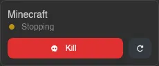

# Server

Clicking a server on the [Servers](../dashboard/servers.md) page opens the server view, where everything about that one server lives. Each tab only appears if you have the matching [permission](../dashboard/permissions.md) on that server.

| Page | Description |
| --- | --- |
| [Console](./console.md) | Live terminal, power controls, resource stats, and graphs |
| [Files](./files.md) | Browse, edit, and manage the server's files, plus SFTP access |
| [Databases](./databases.md) | Classic and managed databases for the server |
| [Schedules](./schedules.md) | Automated action steps with triggers and conditions |
| [Subusers](./subusers.md) | Give other users scoped access to the server |
| [Backups](./backups.md) | Server backups, with groups and automatic retention |
| [Network](./network.md) | The server's IP and port allocations |
| [Startup](./startup.md) | Startup command, Docker image, and egg variables |
| [Mounts](./mounts.md) | Toggle extra directories mounted into the server |
| [Settings](./settings.md) | Rename, reinstall, auto-kill, auto-start, and timezone |
| [Activity](./activity.md) | A log of everything that's happened on the server |

## Server Header

The sidebar stays the same on every tab. At the top, a status card shows the server's name, its current state (**Running**, **Starting**, **Stopping**, **Offline**, or a special status like installing or transferring), and its uptime while running. Below that sit quick power buttons: **Start** while the server is offline, **Stop** while it runs, and a restart button. While the server is stopping, the button becomes **Kill**, with the same force-stop confirmation as on the [Console](./console.md).

Above the tabs, **Servers** takes you back to the dashboard.

::: info
Admins also see an **Admin** link and a **View in Admin Area** link, the latter jumping straight to this server in the Admin area.
:::

At the bottom, a server switcher shows the current server's name; click it to search your servers and switch to another one without going back to the dashboard. The profile box below doubles as a search box, just like on the [Dashboard](../dashboard/index.md).
