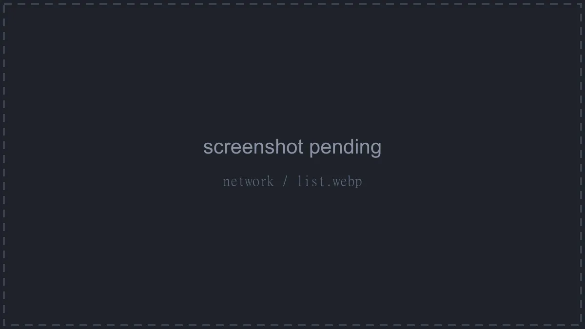

# Network

The Network page lists the server's allocations - the IP (or hostname) and port combinations it can be reached on. A counter at the top shows something like "2 of 15 maximum allocations assigned."

Each row shows a primary indicator (a star with a **Primary** tooltip on the primary allocation), the **Hostname** (the allocation's IP, or the alias an admin set for it), the **Port**, an editable **Notes** field, and **Created**.

## Adding an Allocation

Click **Add** in the top right. There's nothing to fill in: the panel automatically assigns a free allocation from the node's pool. Once you reach the server's limit the button is disabled with the tooltip "This server is limited to 15 allocations."

## Notes

Type directly into an allocation's **Notes** field; changes save automatically a moment after you stop typing. Handy for remembering what each port is for (`Query port`, `Voice chat`, and so on).

## Primary, and Removing

Right-click an allocation (or use the menu at the end of the row):

- **Set Primary** - makes this allocation the server's main address, the one shown on the console page. **Unset Primary** appears instead on the current primary.
- **Remove** - deletes the allocation from the server after a confirmation like "Are you sure you want to remove **203.0.113.1:25565** from this server?".

::: info
The pool allocations are drawn from is defined per node by admins, under the node's **Allocations** tab in the admin area. See [Setting up Allocations](../../../wings/next-steps/setting-up-allocations.md).
:::
