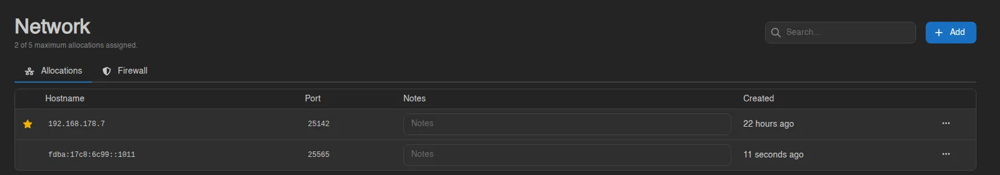

# Allocations

The first tab under [Network](./index.md) lists the server's allocations: the IP and port combinations it can be reached on. A counter at the top shows something like "2 of 5 maximum allocations assigned."; the limit is part of the server's [feature limits](../../admin/servers.md#feature-limits), set by an admin.

Each row shows a primary indicator (a star with a **Primary** tooltip on the primary allocation), the **Hostname**, the **Port**, an editable **Notes** field, and **Created**. The Hostname is the allocation's IP unless an admin set an **IP Alias** on it, in which case the alias is shown everywhere instead, including the console's Address tile.

## IPv4 and IPv6

Allocations can be IPv4 or IPv6, and a server can hold both at once, for example a v4 and a v6 allocation on the same port. Which kinds exist depends entirely on what the admin added to the node's allocation pool. Note that reaching a server over IPv6 also requires IPv6 on the node's container network, which is a [Wings setting](../../../../wings/configuration.md#docker-network-interfaces-v6-enabled).

## Adding an Allocation

Click **Add** in the top right. There's nothing to fill in: the panel automatically assigns a free allocation from the node's pool. Once you reach the server's limit the button is disabled with the tooltip "This server is limited to 15 allocations."

::: info
Self-assigning allocations only works when an [egg configuration](../../admin/egg-configurations.md#allocation-configuration) enables **User Self Assign** for the server's egg, which also pins the port range the panel picks from. Without one, **Add** is rejected.
:::

## Notes

Type directly into an allocation's **Notes** field; changes save automatically a moment after you stop typing. Handy for remembering what each port is for (`Query port`, `Voice chat`, and so on).

## Primary, and Removing

Right-click an allocation (or use the menu at the end of the row):

- **Set Primary** makes this allocation the server's main address, the one shown on the console page. **Unset Primary** appears instead on the current primary. Both IPv4 and IPv6 allocations can be primary.
- **Remove** deletes the allocation from the server after a confirmation like "Are you sure you want to remove **203.0.113.1:25565** from this server?".

::: info
The pool allocations are drawn from is defined per node by admins, under the node's [Allocations tab](../../admin/nodes.md#allocations). See [Setting up Allocations](../../../../wings/next-steps/setting-up-allocations.md).
:::
