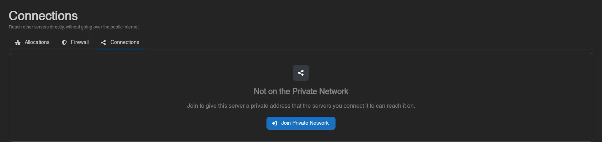
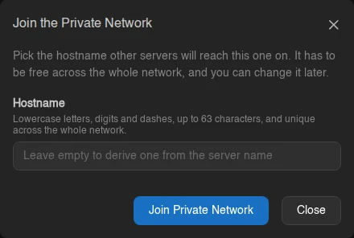
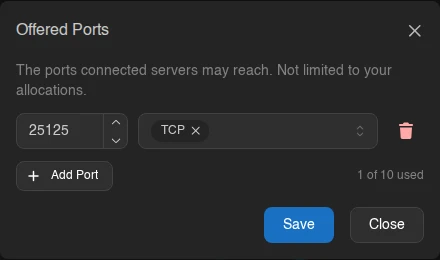
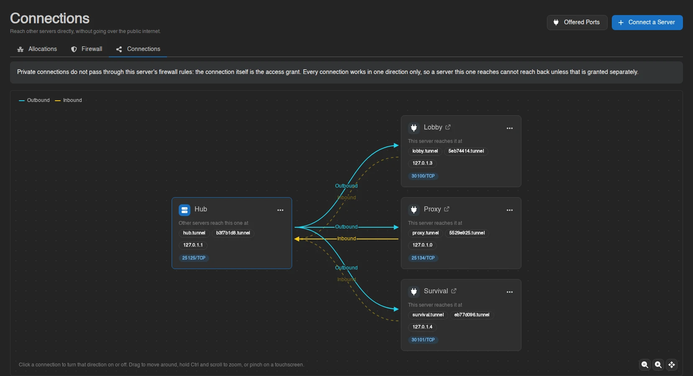
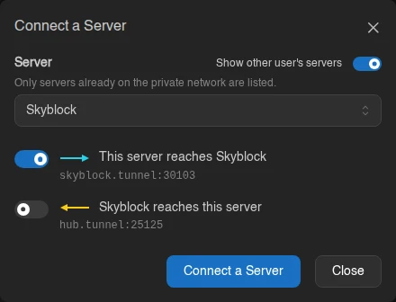

# Connections

The Connections page joins a server to the **private network** and wires it up to other servers. It is the third tab under [Network](./index.md), at `/server/<id>/network/connections`, and needs the `connections.read` permission to view.

Servers on the private network reach each other by hostname, over an encrypted tunnel that runs node to node. Traffic between them never goes out to the public internet, even when the two servers sit in different datacenters, and it does not consume a public allocation on either side.

A server can only join if the node it runs on is on the network, which is an administrator's decision per node. Until then the page says so:

> The node this server runs on is **not on the private network**, so it cannot join. Ask an administrator to enable it for the node.

## Joining

A server that has not joined shows **Not on the Private Network**, with "Join to give this server a private address that the servers you connect it to can reach it on." Without the `connections.create` permission the button is gone and the text reads "This server has no private address, so no other server can reach it privately." instead.

**Join Private Network** asks for a hostname and nothing else.

Leave it empty and the panel derives one from the server name, lowercasing it and turning anything that isn't a letter or digit into a dash. Type your own and it has to be lowercase letters, digits and dashes, 1 to 63 characters, not starting or ending with a dash. Eight hexadecimal characters are rejected, because that shape is reserved for the alias below; a derived name of that shape gets `-1` appended.

Hostnames do not have to be unique across the network. Two servers can share one as long as no third server connects to both of them, since a server resolves `<hostname>.tunnel` among the servers it reaches. Connecting to a second server with a hostname you already reach is refused with "this server already reaches another server with that hostname", and renaming a server to a hostname that would collide for one of the servers reaching it is refused the same way.

## Addresses

Joining gives the server three addresses, all shown on its card and all copied by clicking them:

| Address | What it is |
| --- | --- |
| `<hostname>.tunnel` | The hostname you picked. It changes when you rename it. |
| `<alias>.tunnel` | The server's eight-character short ID. It never changes, so it is the safe one to hardcode. |
| `127.0.x.y` | A loopback address inside the reaching server's network namespace. |

These addresses only resolve from a server that has been granted a connection to this one. They are not public DNS, and they mean nothing from your own machine.

## Offered Ports

A connection only grants access to the ports the destination server *offers*. **Offered Ports** (needing `connections.update`) is where that list lives.

Each entry is a port and one or both of **TCP** and **UDP**. **Add Port** appends a row; when the server has allocations whose ports aren't offered yet, they appear as `+ 25565` badges next to the button that add themselves in one click. The counter on the right reads "1 of 10 used" against the administrator's [per-server cap](../../admin/settings.md#server), and listing the same port twice is refused.

Offered ports are not limited to the server's allocations. Anything the server listens on inside its container can be offered, including ports that were never published publicly - a database or an RCON port, say, that you deliberately never gave a public allocation.

Offer nothing and the card says "You offer no ports, so nothing on this server can be reached." Connecting to a server in that state gives you a hostname that resolves and refuses every connection.

## The Connection Graph

The canvas puts this server on the left and every server it is linked with on the right, with two edges per peer:

| Edge | Meaning |
| --- | --- |
| **Outbound** | This server may reach that one's offered ports. |
| **Inbound** | That server may reach this one's offered ports. |

Both edges are always drawn. A granted one is solid and arrowed; an ungranted one is dashed and faded, so "that server cannot reach us" looks different from "that server isn't here". The two colours are the same pair the console's network graph uses for outbound and inbound traffic.

Above, this server reaches all three peers, and only `proxy` reaches back.

Click an edge to turn that direction on or off. Granting takes effect immediately; removing asks for confirmation first. The same two actions sit in each peer card's menu, as **Stop Reaching This Server** / **Let This Server Reach It** and **Stop This Server Reaching Us** / **Let It Reach This Server**. Drag the canvas to move around, hold `Ctrl` and scroll to zoom, or pinch on a touchscreen; the buttons in the corner zoom and recentre. A peer's name links through to that server.

Each peer card lists the addresses and ports *you* would use to reach it. A peer that only reaches this server, with nothing granted the other way, shows "Reaches this server. Nothing on it can be reached from here." in place of them.

## Connecting a Server

**Connect a Server** opens a picker of servers already on the private network - a server has to have joined before it can be connected - and then a switch per direction. Each switch previews the addresses it would make reachable. Admins get a **Show other user's servers** toggle to reach beyond their own.

Both switches can be flipped at once, which grants two separate connections. Either one is blocked, with the reason shown inline, when:

| Reason | Message |
| --- | --- |
| Already granted | "Already connected in this direction." |
| Port collision | "This server uses port *N* for its own allocations, so it can never reach *server* on it." |
| Quota reached | "This server is limited to *N* outgoing connections." |
| Missing permission | "You are not allowed to grant this from *server*." |

The port collision needs some explaining. A peer's offered ports are reached on a loopback address inside your server's own network namespace, so if your server has an allocation on port `25565`, it already owns that port there and can never use it to reach a peer offering `25565`. Two servers that both bind the same port cannot be connected in that direction at all. The same check runs the other way when you add an offered port: a port already bound by a server that reaches you is refused.

If the server you picked offers no ports at all, the dialog says so and offers to add one for you, which needs `connections.update` on that server. Without it you get an alert instead:

> **server** offers no ports. Connecting would give you a hostname that resolves and refuses every connection. Someone with access to *server* has to offer a port first.

::: warning
A connection needs `connections.create` on **both** servers, because it is a grant against both of them, and it is the peer's quota that it spends. Granting the inbound direction is a change made on the peer, so it is checked against your permissions there - if you don't have them, it fails with a toast rather than being greyed out in advance.
:::

## Connections and the Firewall

An alert above the canvas spells this out:

> Private connections do not pass through this server's firewall rules: the connection itself is the access grant. Every connection works in one direction only, so a server this one reaches cannot reach back unless that is granted separately.

[Firewall](./firewall.md) rules govern traffic arriving over the public network. Private connections arrive on a different path and are authorized by the connection itself, so the way to close one off is to remove it here, not to write a deny rule.

## Renaming and Leaving

**Change Hostname** in the server card's menu takes a new hostname under the same rules as joining, including the collision check against the servers that reach this one. Nothing is disconnected and peers pick the new one up within a minute, but anything still pointing at the old hostname stops resolving, which is exactly what `<alias>.tunnel` avoids.

**Leave Private Network** takes the server back off entirely. It loses its private address, its offered ports and every connection in both directions, and rejoining afterwards assigns a new address rather than the old one.

::: info
How many outgoing connections and offered ports a server may have is set by the administrator under [Settings > Server](../../admin/settings.md#server). Whether the node can carry private traffic at all is set per node under the node's [Private Network](../../admin/nodes.md#private-network) tab, and has to be enabled in that node's [wings configuration](../../../../wings/configuration.md#tundra-enabled) first.
:::
