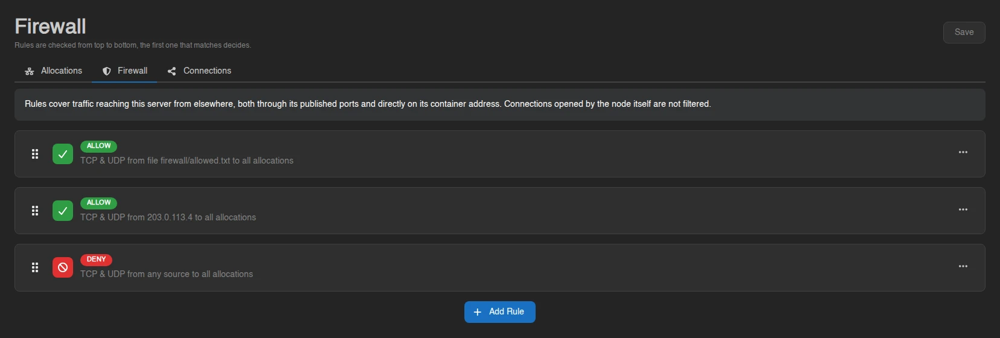
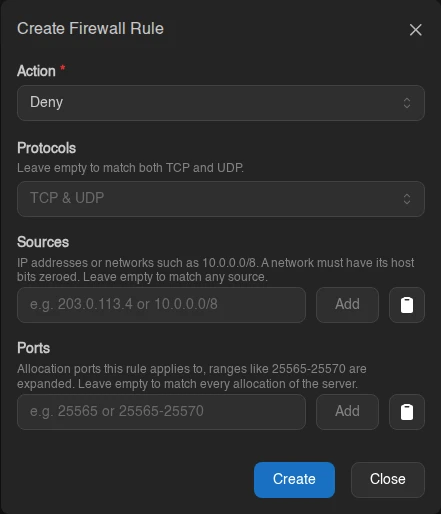

# Firewall

The Firewall page controls who is allowed to reach this server's allocations. It lives under [Network](./index.md) as a second tab, at `/server/<id>/network/firewall`, and needs the `firewall.read` permission to view and `firewall.update` to change.

With no rules configured, the page tells you as much: "Every connection to this server's allocations is allowed. Add a rule to start restricting who can reach it." Nothing is filtered until you add the first rule.

## How Rules Are Evaluated

Rules are checked from top to bottom, and **the first one that matches decides**. That makes the order they sit in as important as the rules themselves; drag a rule by its grip handle to move it.

Anything that matches no rule at all is **allowed**. The page warns about this:

> Traffic that matches none of these rules is **allowed**. Add a deny rule at the bottom that matches everything to turn this into a default deny firewall.

The **Deny Everything Else** button next to that warning appends a deny rule with no protocols, no sources and no ports, so it matches everything the rules above it didn't. Put your allow rules above it and the server is closed by default.

The ruleset above does exactly that: one rule allowing a single address, with a catch-all deny beneath it.

## Rule Fields

**Add Rule** opens a modal with four fields. An empty field means "match everything", so a rule with nothing filled in matches all traffic.

| Field | What it does |
| --- | --- |
| **Action** | **Allow** or **Deny** the traffic this rule matches. |
| **Protocols** | **TCP**, **UDP**, or both. Leave empty to match both. |
| **Sources** | IP addresses or networks such as `10.0.0.0/8`. A network must have its host bits zeroed, so `10.1.0.0/8` is rejected while `10.0.0.0/8` is fine. Leave empty to match any source. |
| **Ports** | Allocation ports the rule applies to. Ranges like `25565-25570` are expanded into individual ports. Leave empty to match every allocation of the server. |

Each rule card summarizes itself in the form *protocols* from *sources* to *ports*, falling back to "TCP & UDP", "any source" and "all allocations" for the empty cases. Right-click a rule to edit, or use its card menu to remove it.

## Saving

Nothing you do on this page reaches the server until you press **Save**. Adding, editing, removing and reordering only change the pending list. An alert appears while you have unsaved work ("You have unsaved changes. Nothing is applied until you save."), and navigating away asks for confirmation before discarding it.

## Warnings You May See

On top of the default-allow notice above, the page raises these:

| Alert | Meaning |
| --- | --- |
| **Not enforced** | "This node will not enforce firewall rules. Rules are saved but have no effect, and **this server may refuse to start while any are configured.**" The node either runs Wings rootless or has its firewall backend disabled. Don't leave rules configured on a node like that. |
| **Shadowed rule** | "Rule *N* can never match, an earlier rule already covers everything it does." Harmless, but that rule is doing nothing; reorder or remove it. |
| **Unallocated ports** | The ruleset names ports that aren't allocated to this server. The node ignores them until matching allocations exist. |
| **Limitations** | "Rules cover traffic reaching this server from elsewhere, both through its published ports and directly on its container address. Connections opened by the node itself are not filtered." Traffic arriving over a [private connection](./connections.md) is not filtered either; that connection is its own access grant. |

::: info
How many rules a server may have, and how many sources each rule may list, are set by the administrator under [Settings > Server](../../admin/settings.md#server). Whether a node can enforce rules at all depends on its Wings configuration.
:::
