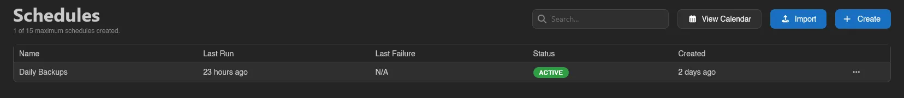
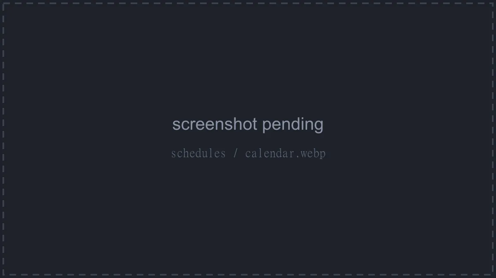
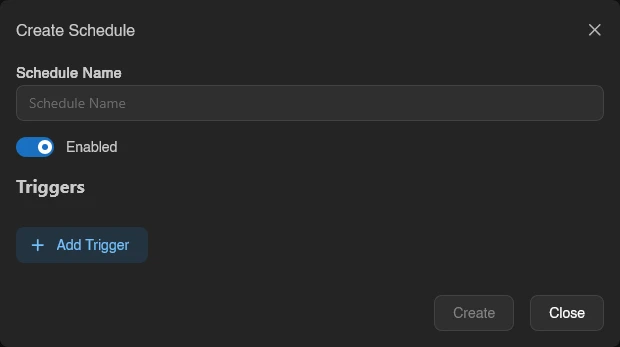
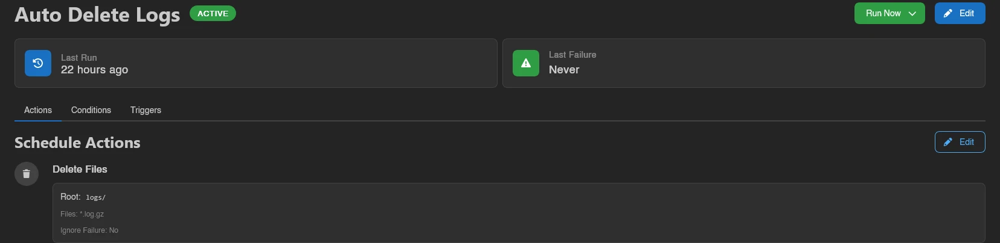
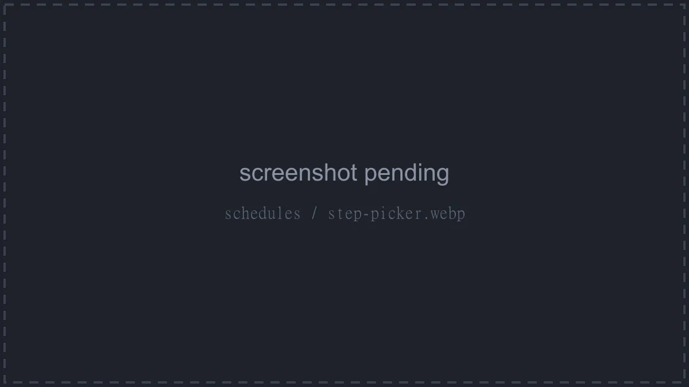
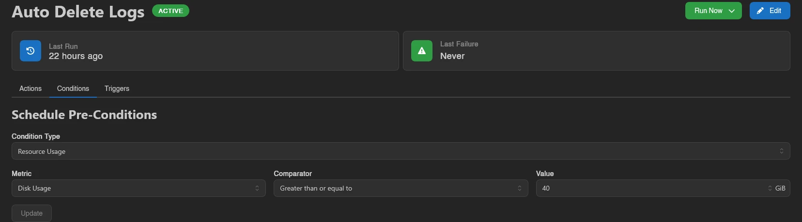

# Schedules

Schedules automate work on your server. Each schedule combines **triggers** (when it fires), an optional **pre-condition** (checked right before it runs), and an ordered list of **actions** (what it actually does). The subtitle shows your usage against the server's [feature limit](../admin/servers.md#feature-limits), e.g. "1 of 15 maximum schedules created."

The list shows each schedule's name, **Last Run**, **Last Failure**, **Status** (**Active** or **Inactive**), and **Created** timestamps. Click a row to open the schedule, or right-click it for **Run Now**, **Export**, **Duplicate**, and **Delete**.

**View Calendar** opens the **Upcoming Runs Calendar**, which plots upcoming cron runs in a day, week, or month view. Click an entry to jump to its schedule.

::: info
What a subuser can do here is controlled by the `schedules` permission group. See the [Permissions Reference](../dashboard/permissions.md#schedules).
:::

## Creating a Schedule

Click **Create**. A schedule starts with a **Schedule Name**, an **Enabled** toggle, and any number of triggers added via **Add Trigger**. Saving takes you straight to the schedule's page, where you add actions. The same form opens later via **Edit** on the schedule's page.

A disabled schedule ignores its triggers and can't be run manually until re-enabled.

## Triggers

A schedule runs whenever any one of its triggers fires.

| Trigger | Fires |
| --- | --- |
| **Time Interval (Cron)** | On a time schedule, in the server's timezone |
| **Power Action** | When a **Power Action** (**Start**, **Stop**, **Restart**, **Kill**) is requested |
| **Server State** | When the server reaches a **Server State** (**Running**, **Offline**, **Starting**, **Stopping**) |
| **Backup Status** | When a server backup reaches a **Backup Status** (**Starting**, **Finished**, **Failed**) |
| **Database Backup Status** | When a [database backup](./backups.md#database-backups) reaches a **Backup Status** (**Starting**, **Finished**, **Failed**) |
| **Schedule Completion** | When another **Schedule** finishes, filtered by **Completion Status** (**Successful** or **Failed**) |
| **Resource Usage** | When a **Metric** (**CPU Usage**, **Memory Usage**, **Disk Usage**) passes a threshold continuously **For (seconds)** |
| **Console Line** | When the console prints a line matching **Line Contains** (optionally **Case Insensitive**), with the line optionally stored into a variable via **Output into** |
| **Crash** | When the server crashes |

### Cron Triggers

By default the cron trigger uses friendly controls: pick how often it **Runs** (**Every few minutes**, **Every few hours**, **Daily**, **Weekly**, **Monthly**) plus the matching interval, weekday, day, and **At** time fields. A plain-language description of the resulting schedule is shown underneath, along with a "Times use the server timezone" hint naming the zone (or UTC).

Flip **Edit as cron expression** to write the expression yourself; clicking the field opens a small per-segment editor.

::: warning
Calagopus cron expressions put **seconds** first: `second minute hour day month weekday`. So `0 0 0 * * *` is daily at midnight. Classic five-field crontab lines work as-is (5 to 7 fields are accepted); the seconds field only applies when present.
:::

## The Schedule Page

Opening a schedule shows its name with an **Active**/**Inactive** badge, a **Run Now** button, and **Edit**. Two cards show **Last Run** and **Last Failure** ("Never" until they happen). Below that are three tabs: **Actions**, **Conditions**, and **Triggers**.

**Run Now** offers two modes: **Run now (check conditions first)** and **Run now (ignore conditions)**. The button is disabled while the schedule itself is disabled ("Cannot run a disabled schedule").

### Actions

The **Schedule Actions** tab is the heart of a schedule: an ordered list of steps. Add one with **Add Step** (or **Create First Step** on an empty schedule), drag the handle to reorder, and click a step's chevron to expand its full configuration. The maximum number of steps per schedule is a panel-wide setting under [Settings > Server](../admin/settings.md#server).

Each step's menu offers **Edit**, **Duplicate**, and **Delete**. While the schedule executes, the current step shows a **Running** badge; a step that failed on the last run shows a red warning icon with the error message.

Steps are picked from a searchable **Action Type** list, organized into five groups.

Most steps have an **Ignore Failure** switch to let the schedule carry on if that step fails. Long-running operations (backups, file copies, archives) additionally have **Run in Foreground**, which makes the schedule wait for the operation to finish before moving on.

#### Server

| Step | What it does | Key fields |
| --- | --- | --- |
| **Send Command** | Send a command to the server console. | **Command** |
| **Send Power Signal** | Start, restart, stop or kill the server. | **Power Action** |
| **Wait for Server State** | Wait until the server reaches a power state. | **Server State**, **Timeout (milliseconds)** |

#### Backups

| Step | What it does | Key fields |
| --- | --- | --- |
| **Create Backup** | Create a backup of the server files. | **Backup Name** (auto-generated if left empty), **Backup Group**, **Ignored Files**, **Output Backup UUID Into**, **Run in Foreground** |
| **Restore Backup** | Stop the server and restore a backup of the server files. | **Backup to Restore**, **Delete all files before restore**, **Restore startup settings** |
| **Delete Backup** | Delete a backup selected by the backup selector. | **Backup to Delete** |
| **Move Backup** | Move a backup selected by the backup selector into a backup group. | **Backup to Move**, **Target Backup Group** |
| **Create Database Backup** | Create a backup of a managed database. | **Managed Database**, **Backup Name**, **Backup Group**, **Output Backup UUID Into**, **Run in Foreground** |
| **Restore Database Backup** | Restore a database backup into a managed database. | **Database Backup to Restore**, **Only Consider Backups From**, **Restore Into** |
| **Delete Database Backup** | Delete a database backup selected by the backup selector. | **Database Backup to Delete**, **Only Consider Backups From** |
| **Move Database Backup** | Move a database backup selected by the backup selector into a backup group. | **Database Backup to Move**, **Only Consider Backups From**, **Target Backup Group** |

The backup selector picks the **Latest Backup**, the **Oldest Backup**, a **Specific Backup (UUID)**, or one **By Name** (optionally matching the oldest instead of the newest), and can be narrowed to a [backup group](./backups.md#backup-groups).

The four database steps use the same selector, restricted to [database backups](./backups.md#database-backups). Each has an **Only Consider Backups From** picker that narrows the selector to dumps taken from one managed database; leave it at **Any managed database** to consider every dump on the server. **Restore Database Backup** also has **Restore Into**, which defaults to "The database the backup was taken from" - set it when that database no longer exists, or to copy data into a different managed database running the same engine.

::: warning
Restoring stops the server and overwrites its files; avoid combining **Restore Backup** with power or server state triggers that could re-trigger the schedule. **Restore Database Backup** overwrites the contents of the target database and does not wait for the import to finish, so later steps can run while it is still in progress. **Delete Backup** and **Delete Database Backup** permanently delete the backup and its files on the node, and fail if the selected backup is locked.
:::

#### Files

| Step | What it does | Key fields |
| --- | --- | --- |
| **Create Directory** | Create a new folder in the server files. | **Root Path**, **Directory Name** |
| **Write File** | Write or append text to a file. | **File Path**, **Content**, **Append to File** |
| **Copy File** | Copy a file to a new location. | **Source File**, **Destination**, **Run in Foreground** |
| **Delete Files** | Delete files or folders. | **Root Path**, **Files to Delete** |
| **Rename Files** | Rename or move files. | **Root Path**, file pairs (**from** / **to**) |
| **Compress Files** | Compress files into an archive. | **Root Path**, **Files to Compress**, **Archive Format** (`.tar` family, `.zip`, `.7z`), **Archive Name**, **Run in Foreground** |
| **Decompress File** | Extract an archive into a folder. | **Root Path**, **File**, **Run in Foreground** |
| **Pull File** | Download a file from a URL into a folder. | **File URL**, **Root Path**, **File Name** (derived from the URL or the response when left empty), **Use Response File Name**, **Run in Foreground** |

#### Startup Settings

| Step | What it does | Key fields |
| --- | --- | --- |
| **Update Startup Variable** | Change the value of a startup variable. | **Environment Variable**, **Value** |
| **Update Startup Command** | Change the command used to start the server. | **Startup Command** |
| **Update Docker Image** | Change the Docker image the server runs in. | **Docker Image** |

#### Advanced Logic

| Step | What it does | Key fields |
| --- | --- | --- |
| **Sleep** | Wait for a set amount of time before continuing with the next action. | **Duration (milliseconds)**, up to 24 hours |
| **Ensure** | Stop the schedule here unless a condition is true. | Condition builder |
| **If** / **Else If** / **Else** / **End If** | Run the following steps only when a condition is true, until Else/End If. | Condition builder on **If** and **Else If** |
| **Exit** | Stop the schedule here, marking the run as successful or failed. | **Mark run as successful** |
| **Format** | Build a text value from variables and store it in a variable. | **Format String** (wrap variables in <code v-pre>{{...}}</code>), **Output into** |
| **Match Regex** | Extract parts of a text value using a regular expression. | **Input**, **Regex**, **Outputs** (one variable per capture, added via **Add Output**) |
| **Wait for Console Line** | Wait until the server console outputs a matching line. | **Line Contains**, **Case Insensitive**, **Timeout (milliseconds)**, **Output into** |
| **HTTP Request** | Send an HTTP request, for example to a webhook. | See below |

Creating an **If** step automatically adds its **End If**, and steps inside the block are indented in the list. The menu on an **If** or **Else If** step offers **Add Else If** and **Add Else** to grow the block. The editor warns if a block is broken: "An \"If\" block is missing its \"End If\"" or an **Else**/**Else If**/**End If** exists "without a matching \"If\" before it".

#### Variables

Many step fields accept either plain text or a variable; the icon at the field's right edge toggles between the two ("Use a variable instead of plain text"). Variables are produced by outputs elsewhere in the schedule: the Console Line trigger's **Output into**, **Match Regex** captures, **Format**, the UUID outputs of **Create Backup** and **Create Database Backup**, and the HTTP Request outputs. A variable holds up to 16 KiB.

#### HTTP Request

The most configurable step: **Method** (GET, POST, PUT, PATCH, DELETE, HEAD), **URL**, **Headers** (name/value pairs via **Add Header**, up to 32), an optional **Body**, and a **Timeout (milliseconds)** of up to 60 seconds. **Ignore Error Status Codes** keeps an error response from failing the step, and **Output Status Code Into** / **Output Response Body Into** store the response into variables for later steps.

::: info
For admins: HTTP Request steps are sent from the node, and Wings enforces node-level limits, by default 5 requests per 60-second window per server, a 16 KiB captured-response cap, private CIDR ranges blocked, and an option to disable the step entirely. See the [Wings configuration reference](../../../wings/configuration.md#schedule-steps).
:::

### Conditions

The **Schedule Pre-Conditions** tab defines a condition checked before the schedule runs (unless triggered with **Run now (ignore conditions)**). Build it with the **Condition Type** select; the combinators **AND (All must be true)**, **OR (Any must be true)**, and **NOT (Must not be true)** nest further conditions via **Add Condition**, up to three levels deep.

| Condition | Checks |
| --- | --- |
| **None** | Nothing, always passes |
| **AND (All must be true)** | Every nested condition |
| **OR (Any must be true)** | At least one nested condition |
| **NOT (Must not be true)** | Inverts its nested condition |
| **Server State** | The server's current power state |
| **Uptime** | Server uptime against a **Comparator** and **Value (seconds)** |
| **Resource Usage** | A **Metric** (**CPU Usage** in percent, **Memory Usage** or **Disk Usage** as a size) against a **Comparator** and value |
| **File Exists** | Whether a **File Path** exists |
| **Variable Exists** / **Variable Equals** / **Variable Contains** / **Variable Starts With** / **Variable Ends With** | A schedule variable against a value |

Comparators are **Smaller than**, **Smaller than or equal to**, **Equal to**, **Greater than or equal to**, and **Greater than**. The same builder appears inside **Ensure**, **If**, and **Else If** steps.

Changes here must be saved with **Update**; navigating away with unsaved changes prompts you first.

### Triggers

The **Schedule Triggers** tab lists each trigger as a card. Cron cards also show the next and last run times. To change triggers, use **Edit** at the top of the page.

## Import and Export

Right-click a schedule for **Export**, then **Export as JSON** or **Export as YAML**; this downloads the schedule as a file (`schedule-<uuid>.json` or `.yml`) that can be imported again, on this server or another one.

**Import** accepts a `.json`, `.yml`, or `.yaml` schedule file. You can also drag files straight onto the page ("Drop some files here to import them as Schedules"); multiple files import multiple schedules. Imports count toward the schedule limit.

## Duplicating and Deleting

**Duplicate** in the row menu asks for a **New Name** (prefilled with "(copy)") and creates a copy of the schedule. **Delete** asks for confirmation and removes the schedule outright.
