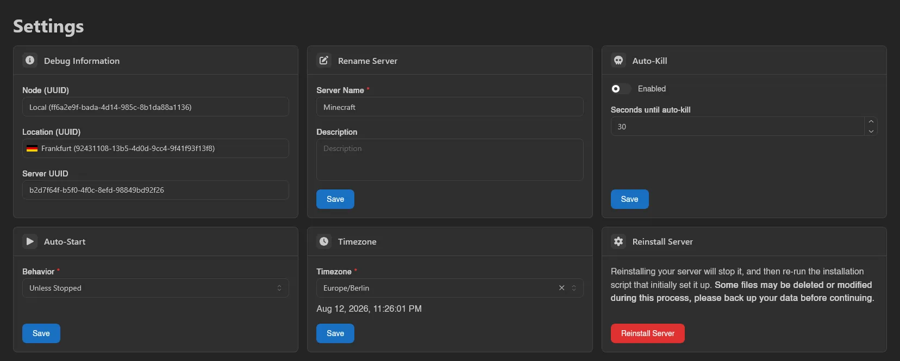
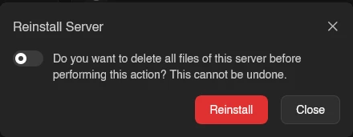

# Settings

The Settings page is a set of cards: debug information, rename, auto-kill, auto-start, timezone, and reinstall. Each editable card has its own **Save** button (debug information is read-only, and reinstall uses **Reinstall Server** instead); nothing here restarts your server on save.

## Debug Information

Three read-only fields you'll be asked for when reporting problems: **Node (UUID)**, **Location (UUID)**, and **Server UUID**. Click any of them to copy the value.

## Rename Server

**Server Name** (required) and an optional **Description**, then **Save**. This only changes how the server is labeled, nothing about how it runs.

## Auto-Kill

Sometimes a server refuses to shut down cleanly. With **Enabled** on, a server that is still stopping after **Seconds until auto-kill** is killed instead of hanging forever. Accepts 1 to 3600 seconds; off by default with 30 seconds prefilled.

## Auto-Start

**Behavior** controls whether the node starts the server again on its own:

| Behavior | Meaning |
| --- | --- |
| **Always** | Always bring the server back up. |
| **Unless Stopped** | Bring it back up unless it was deliberately stopped. The default. |
| **Never** | Never start it automatically. |

## Timezone

Sets the timezone inside the server's container, which is what timestamps in your server's own logs and anything time-based the server does will use. The **Timezone** dropdown is searchable, shows a live clock preview for the selected zone, and can be cleared to fall back to **System**, the node's own timezone.

## Reinstall Server

Runs the egg's install script again, as if the server were being set up fresh.

::: danger
"Reinstalling your server will stop it, and then re-run the installation script that initially set it up. **Some files may be deleted or modified during this process, please back up your data before continuing.**"
:::

Clicking **Reinstall Server** opens a confirmation with one switch: "Do you want to delete all files of this server before performing this action? This cannot be undone." Leave it off to keep your files (the install script may still touch some of them), or turn it on to wipe the server first. Confirm with **Reinstall**; the server switches into an installing state and you're returned to the console.

Each card maps to its own subuser permission (`settings.rename`, `settings.auto-kill`, `settings.auto-start`, `settings.timezone`, `settings.install`), and `settings.cancel-install` separately gates the **Cancel** button on the installing banner. See the [Permissions Reference](../dashboard/permissions.md).
