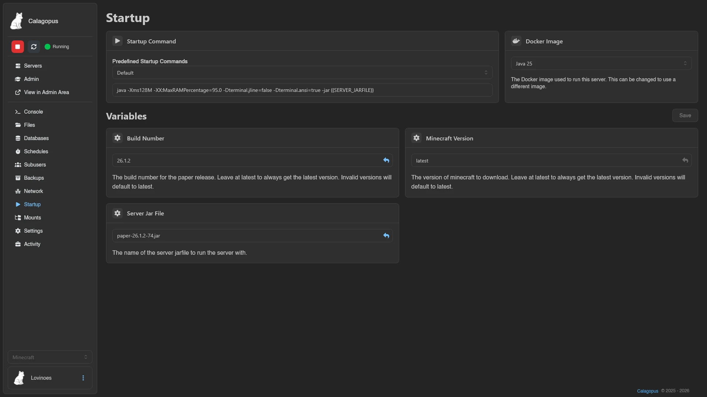
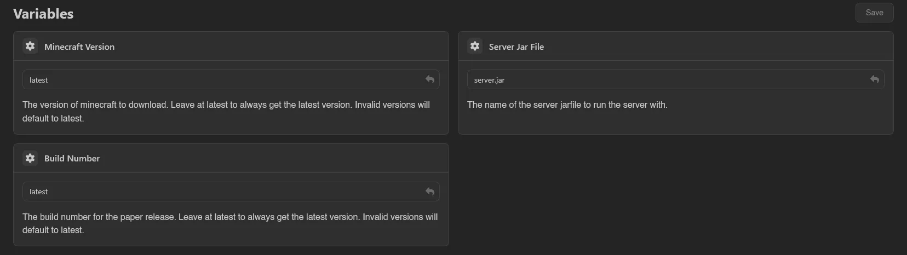

# Startup

The Startup page controls how your server boots: the command that launches it, the Docker image it runs in, and the egg variables that feed into both.

## Startup Command

The **Startup Command** box holds the exact command used to start the server. Edit it and it saves automatically a moment after you stop typing, confirmed by a "Startup command updated." toast.

If the egg ships predefined commands, a **Predefined Startup Commands** dropdown sits above the box. Picking an entry replaces the command with that preset; a **Custom** entry represents anything you typed yourself. Whether custom commands are allowed at all is an [egg configuration](../admin/egg-configurations.md#startup-configuration) setting; when they aren't, the box is read-only and you can only pick from the list.

## Docker Image

A searchable dropdown of the images the egg offers: "The Docker image used to run this server. This can be changed to use a different image." Selecting one saves immediately.

If an administrator assigned an image outside the egg's list, the selector locks and shows "The Docker image used to run this server. This has been set by an administrator and cannot be changed.", unless the panel-wide [**Allow Overwriting Custom Docker Image**](../admin/settings.md#server) setting keeps it editable.

## Variables

Each variable is a card with its name, a description, and an input. The input type follows the variable's validation rules:

| Variable | Input |
| --- | --- |
| Boolean (or a `0`/`1`, `true`/`false` choice) | Toggle switch |
| Fixed list of allowed values | Dropdown of those values |
| Integer or numeric | Number input |
| Secret | Password-style input that hides the value |
| Anything else | Text input with a **Reset to default** button |

Required variables are marked with an asterisk (toggle-style boolean variables never are), and the input's placeholder shows the default value. Variables the egg does not let users change carry a **Read-Only** badge.

Unlike the command and image, variables only save when you hit **Save** (or Ctrl+S). Navigating away with unsaved values triggers an **Unsaved Changes** prompt; **Leave Page** discards them.

Saving never restarts the server. New values are pushed to the node right away and take effect the next time the server starts.

::: info
The predefined commands, image list, and variables come from the [egg](../admin/nests.md#editing-an-egg); whether custom commands are allowed comes from [egg configurations](../admin/egg-configurations.md). Both are managed by administrators.
:::

Viewing this page needs the `startup.read` permission; editing variables, the command, and the image need `startup.update`, `startup.command`, and `startup.docker-image` respectively. See the [Permissions Reference](../dashboard/permissions.md).
