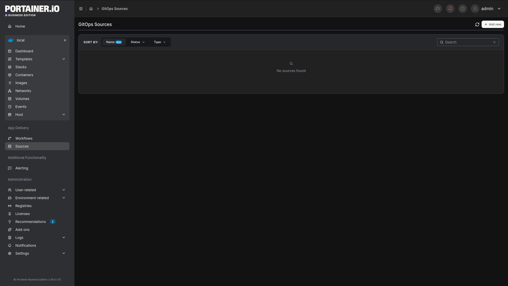
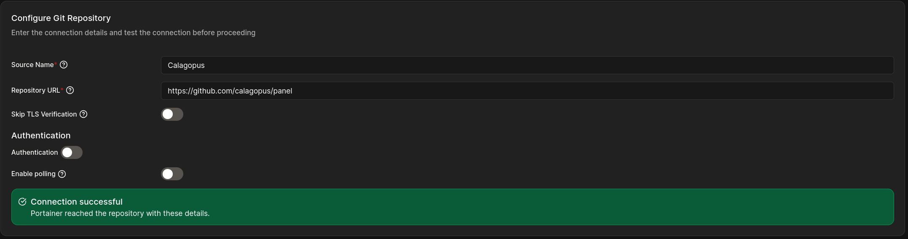
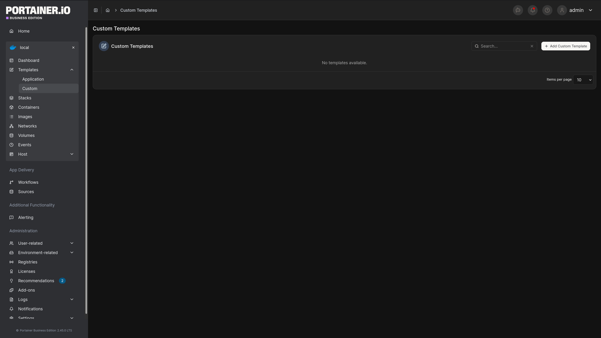
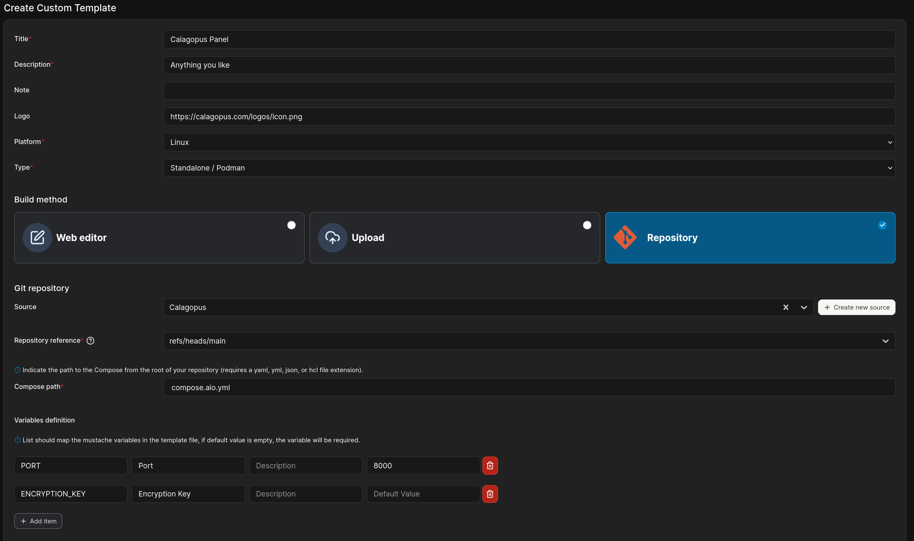
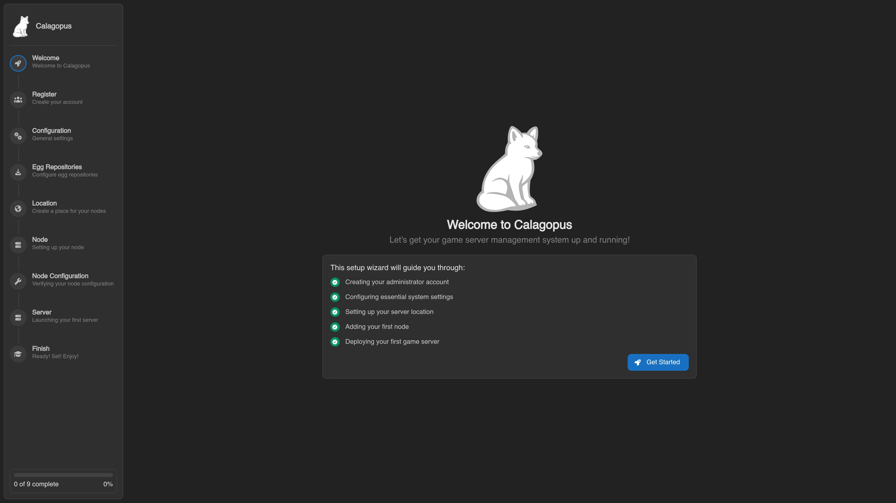

# Portainer Panel Installation

[Portainer](https://www.portainer.io/) is a web UI for managing Docker. Instead of running `docker compose` commands by hand as in the [Docker installation guide](../docker.md), you can register the official Calagopus compose file as a **Custom Template** and deploy (and later update) the stack entirely from Portainer's interface. This still runs the **All-in-One (AIO)** image, bundling the Panel, Wings, PostgreSQL, and Valkey together in one stack, the same as the plain Docker AIO guide, just managed through Portainer.

This guide assumes Portainer is already installed and connected to the Docker environment you want to deploy Calagopus on.

::: info Homelab-oriented setup
This is still a single-stack AIO deployment: the Panel, Wings, database, and cache all run on whichever host Portainer deploys the stack to, competing with your game servers for CPU and RAM. This is fine for small deployments, but for larger production hosting, consider running Wings on a dedicated machine connected to a standalone Panel instead, see the [main installation guide](../index.md).
:::

## 1. Pick a compose file

Calagopus publishes two AIO compose files in the [calagopus/panel](https://github.com/calagopus/panel) repository, pick the one matching your needs:

| File | Use when |
| --- | --- |
| [`compose.aio.yml`](https://github.com/calagopus/panel/blob/main/compose.aio.yml) | Standard install, Panel + Wings, no extensions |
| [`compose.heavy.aio.yml`](https://github.com/calagopus/panel/blob/main/compose.heavy.aio.yml) | You plan to install [extensions](../../extensions/index.md), includes the build tooling needed to compile them |

## 2. Create GitOps Source

In Portainer, navigate to **Sources** and click **+ Add new**.



Fill in the repository details:
- **Source Name**: Calagopus
- **Repository URL**: `https://github.com/calagopus/panel`
- **Authentication**: Off



Click continue, set the right access control for your use case, and click create.

## 3. Open Custom Templates

Select the environment you want to deploy Calagopus on, then go to **Templates → Custom** and click **+ Add Custom Template**.



## 4. Add the repository as a template source

Fill in the template details:

- **Title**: e.g. Calagopus Panel
- **Description**: Anything you like
- **Logo**: `https://calagopus.com/logos/icon.png`
- **Platform**: Linux
- **Type**: Standalone / Podman

Then under **Build method** choose **Repository**. Select the source you crated in step 2.

- **Repository reference**: `refs/heads/main`
- **Compose path**: the file path from the table above (`compose.aio.yml` or `compose.heavy.aio.yml`)

Also fill out 2 variable definitions:
- **PORT**
   - Label: `Port`
   - Default: `8000`
- **ENCRYPTION_KEY**
   - Label: `Encryption Key`
   - Leave default empty



Click **Create custom template**. Portainer re-fetches this path from the repository every time you deploy or update the stack, so you don't need to touch this template again to pick up upstream compose changes.

::: info Switching between AIO and Heavy AIO later
Each custom template is pinned to a single compose path. If you started on `compose.aio.yml` and later want extensions, create a second custom template pointing at `compose.heavy.aio.yml` instead of editing this one, the heavy image also needs four extra volume mounts that only exist in that file. See [Switching to the Heavy Image](../../extensions/switching-to-the-heavy-image.md) for what changes.
:::

## 5. Deploy the template

Open your new template from the **Custom Templates** list. Give the stack a name, and click **View stack**. Replace the `APP_ENCRYPTION_KEY` environment variable with a randomly generated string. Generate one from any Linux terminal:

```bash
openssl rand -hex 32
```

Leave the rest at their defaults for a fresh single-node install, or review the [Environment Configuration documentation](../../environment.md) for what each variable does.

Click **Deploy the stack**.

## 6. Access the Panel

Once the stack shows all three containers running, open your browser to:

```
http://<docker-host-ip>:8000
```

You will see the OOBE (Out Of Box Experience) setup screen where you create your first admin account and complete initial configuration.



## Updating

Open the stack in Portainer and click **Pull and redeploy**. Portainer re-fetches the compose file from the repository reference, pulls any newer images, and recreates changed containers; your data volumes are preserved. Check the [Environment Configuration documentation](../../environment.md) in case a new release adds variables you need to set.
