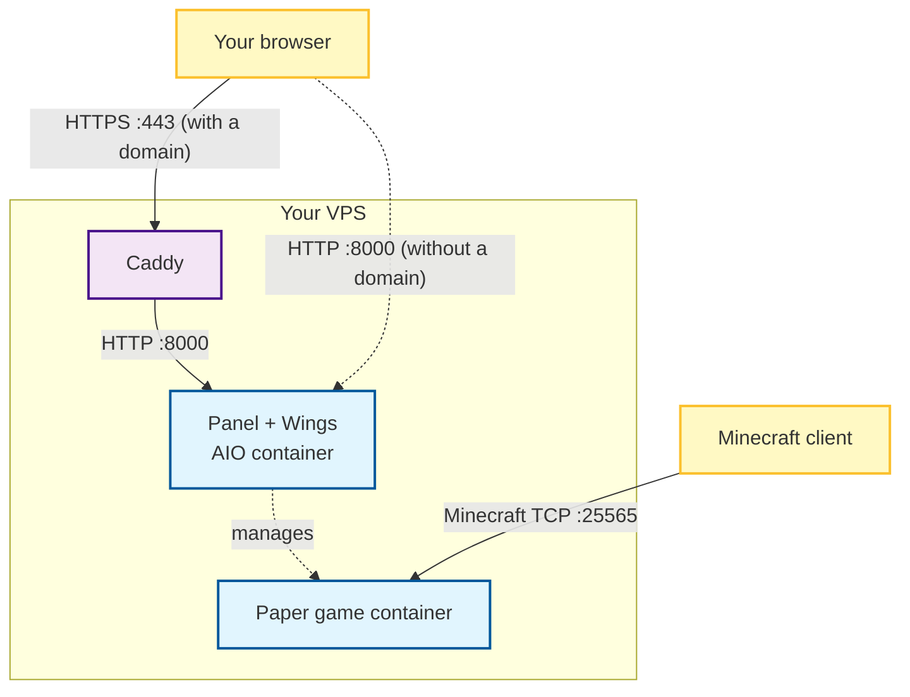
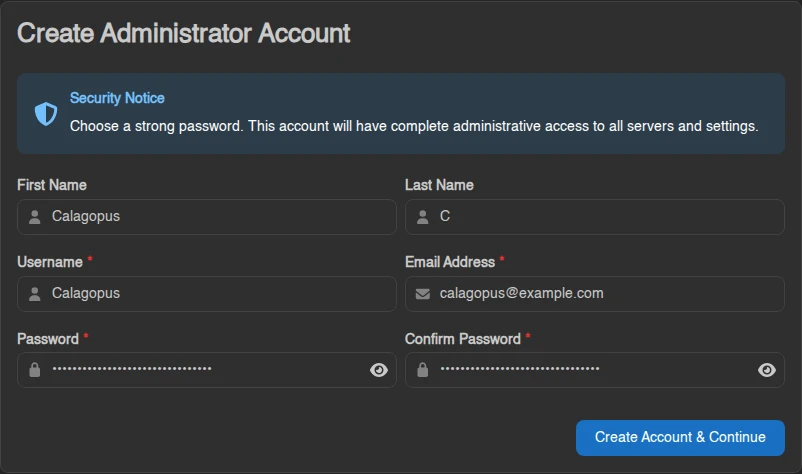
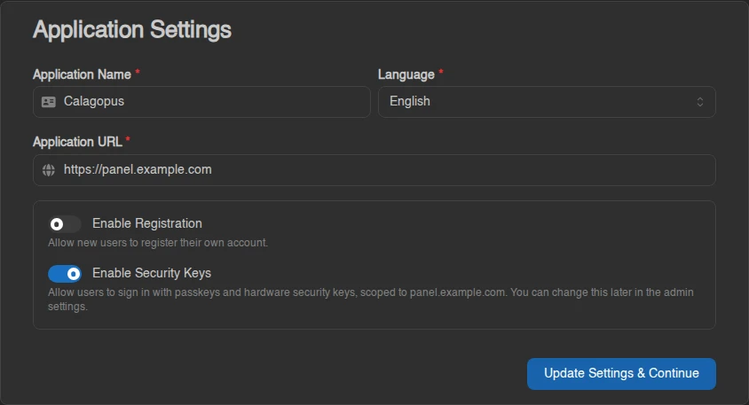
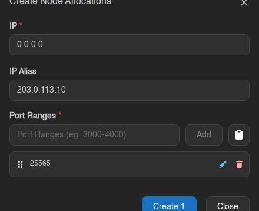
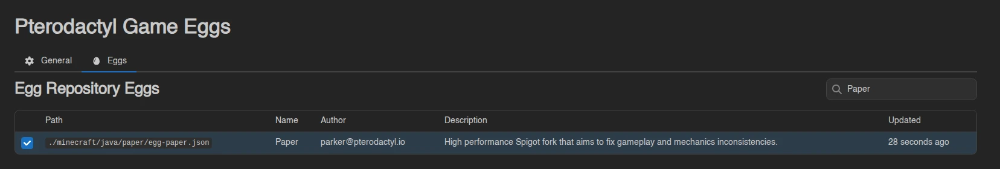
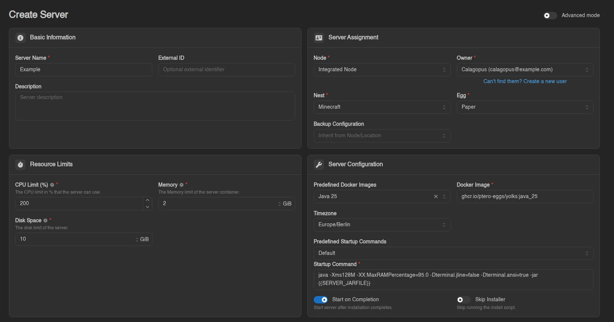
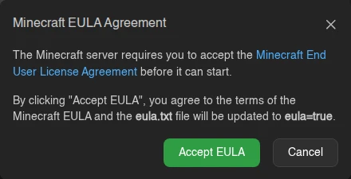
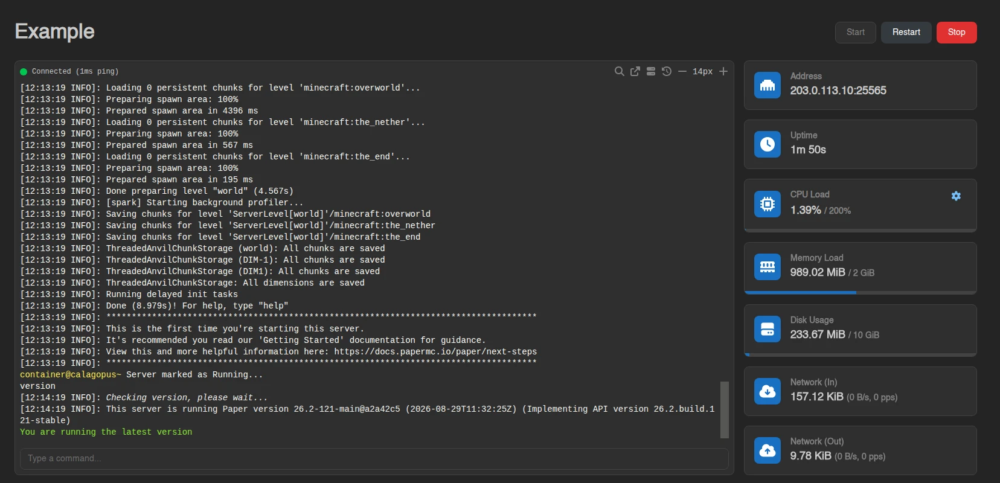
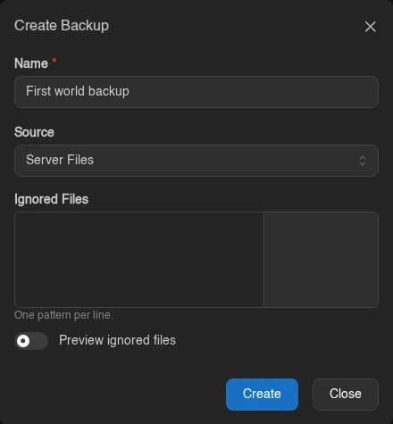

# Set up Calagopus on your first VPS

This guide uses one VPS for the Panel and Wings. You'll install the All-in-One (AIO) image, create a Minecraft Java server using Paper, and connect to it from your computer. A domain is optional: with one, Caddy serves the Panel over HTTPS; without one, you use the Panel at its IP address over plain HTTP.

The Panel is the website you use to manage your servers. Wings runs the game containers. The AIO image ships both, and its Compose stack also provides the PostgreSQL database and Valkey cache the Panel needs.



Caddy is only part of the setup with a domain. Players never go through it; the Minecraft port works the same on both paths.

## Before you start

You need:

- A fresh **Linux VPS** with root or sudo access and a public IPv4 address. The commands are written for Ubuntu 26.04 LTS. On other distributions only the package installs (`apt`), the host firewall (`ufw`), and the Caddy package differ; everything else is the same. For an existing installation, use the [installation guides](./index.md).
- Optionally, a domain whose DNS records you can edit. See [Do you need a domain?](#do-you-need-a-domain) below.
- Minecraft **Java Edition** on your computer. Bedrock Edition needs a different egg and different ports.

The resource examples assume **2 vCPUs, 4 GB RAM, and 40 GB disk**. The game gets 2 GiB RAM and 10 GiB disk, leaving room for the operating system, the Panel, its database, container images, and backups. Mods, plugins, and world size change what a game needs; the [Panel's minimum requirements](../overview.md#minimum-requirements) cover the Panel alone.

The examples use `203.0.113.10` for the VPS address, `ubuntu` for its SSH user, and `panel.example.com` for the Panel hostname if you use a domain. Replace them with your own values.

### Do you need a domain?

No. The Panel works at `http://203.0.113.10:8000` without one, and players connect to the game by IP either way. A domain is what makes HTTPS possible, and HTTPS is what protects your Panel password and session on the way to the VPS.

| | With a domain | Without a domain |
| --- | --- | --- |
| Panel address | `https://panel.example.com` | `http://203.0.113.10:8000` |
| Encryption to the Panel | Yes, Caddy obtains a certificate | No, everything including your login password crosses the internet in plain text |
| Extra ports | 80 and 443 | 8000 |
| Passkeys and security keys | Available | Unavailable; use an authenticator app for two-factor authentication |
| Minecraft on port 25565 | Same | Same |

Pick one and stick to it. Steps 2 and 6 differ by path; every other step is the same. The **With a domain** and **Without a domain** tabs in those steps switch together, so select yours once. Running without a domain is a reasonable choice for one administrator on a hobby server. If you get a domain later, follow the [reverse-proxy guide](../../additional/reverse-proxies.md) to add HTTPS.

## 1. Connect to your VPS

Open a terminal on your computer and connect:

```bash
ssh ubuntu@203.0.113.10
```

Your provider supplies the username and either a password or an SSH key. If it uses a custom SSH port, add `-p PORT` to every `ssh` command in this guide.

Once connected, start a root shell:

```bash
sudo -i
```

Skip this if your provider logs you in as `root`. From here on, every command runs **on the VPS in this root shell** unless marked otherwise.

Check the OS, memory, and free disk:

```bash
cat /etc/os-release
free -h
df -h /
```

## 2. Set up DNS and the provider firewall

::::tabs key:domain
=== With a domain

In the DNS settings for your domain, create an `A` record:

| Type | Name | Value |
| --- | --- | --- |
| A | `panel` | Your VPS's public IPv4 address |

For `example.com`, that creates `panel.example.com`. If you use Cloudflare, set the record to **DNS only** (grey cloud). Don't add an `AAAA` record unless the VPS also has working IPv6, and remove any old one that points elsewhere.

In your provider's firewall (sometimes called a security group), allow these inbound connections:

| Port | Protocol | Source | Purpose |
| --- | --- | --- | --- |
| `22` | TCP | Your IP where practical | SSH; use your provider's port if it differs |
| `80` | TCP | Internet | Caddy certificate validation and HTTP redirects |
| `443` | TCP | Internet | The Panel over HTTPS |
| `25565` | TCP | Your players | The Paper server in this guide |
| `2022` | TCP | Your IP, optional | SFTP access to game files through Wings |

Keep other ports closed; nothing in this setup needs public access to `8000`, `8080`, PostgreSQL, or Valkey.

If a host firewall is active (check with `ufw status`), allow the same ports there:

```bash
ufw allow 22/tcp
ufw allow 80/tcp
ufw allow 443/tcp
ufw allow 25565/tcp
```

Docker's published ports [bypass UFW rules](https://docs.docker.com/engine/network/packet-filtering-firewalls/#docker-and-ufw), so rely on the provider firewall to control access to game and SFTP ports.

=== Without a domain

There is no DNS to set up. In your provider's firewall (sometimes called a security group), allow these inbound connections:

| Port | Protocol | Source | Purpose |
| --- | --- | --- | --- |
| `22` | TCP | Your IP where practical | SSH; use your provider's port if it differs |
| `8000` | TCP | Your IP where practical | The Panel over HTTP; **add this rule in step 6**, not now |
| `25565` | TCP | Your players | The Paper server in this guide |
| `2022` | TCP | Your IP, optional | SFTP access to game files through Wings |

Port `8000` stays closed until your administrator account exists, so nobody else can claim it first. Limiting the source to your own IP is the best protection you have without HTTPS; if your IP changes often, allow the internet and rely on a strong password and two-factor authentication. Keep other ports closed; nothing in this setup needs public access to `8080`, PostgreSQL, or Valkey.

If a host firewall is active (check with `ufw status`), allow SSH and the game port there:

```bash
ufw allow 22/tcp
ufw allow 25565/tcp
```

Docker's published ports [bypass UFW rules](https://docs.docker.com/engine/network/packet-filtering-firewalls/#docker-and-ufw), so a UFW rule for `8000` would have no effect; the provider firewall is what controls access to the Panel, game, and SFTP ports.

::::

## 3. Install Docker

Install the tools used below:

```bash
apt update
apt install -y ca-certificates curl nano openssl dnsutils
```

Install Docker with [Docker's installation script](https://get.docker.com/). It adds Docker's repository, installs the engine and the Compose plugin, and starts the service:

```bash
curl -sSL https://get.docker.com/ | CHANNEL=stable bash
```

Check that Docker runs containers and that Compose is available:

```bash
docker run --rm hello-world
docker compose version
```

The first command should print `Hello from Docker!`.

## 4. Download and configure Calagopus

Keep the installation in a fixed directory; you'll return to it for updates and backups:

```bash
mkdir -p /opt/calagopus-panel
cd /opt/calagopus-panel
curl -fL https://raw.githubusercontent.com/calagopus/panel/refs/heads/main/compose.aio.yml -o compose.yml
echo 'app_name: Calagopus' > wings-config.yml
```

The Wings configuration file must exist before the first start. Otherwise Docker creates a directory at that path and the container cannot load it.

Generate the Panel's encryption key and replace the placeholder:

```bash
PANEL_KEY=$(openssl rand -hex 16)
sed -i "s/CHANGEME/$PANEL_KEY/g" compose.yml
unset PANEL_KEY
chmod 600 compose.yml wings-config.yml
```

Run this once. `compose.yml` now contains the key needed to read stored secrets, so back it up and never generate a new key when updating or restoring.

Open the file with `nano compose.yml`. In the `ports:` section under `web`, change `8000:8000` to:

```yaml
      - 127.0.0.1:8000:8000
```

Keep the indentation and the `2022:2022` line below it. Binding to `127.0.0.1` keeps the Panel port private to this VPS while you create your administrator account, whether or not your provider's firewall is already blocking it. This edit is temporary on the no-domain path: step 6 changes the line back to `8000:8000` once your account exists. With a domain it stays, and Caddy connects through the loopback address. Leave the image as `ghcr.io/calagopus/panel:aio`. Press `Ctrl+O`, `Enter`, then `Ctrl+X` to save and exit.

Validate and start the stack:

```bash
docker compose config --quiet
docker compose up -d
docker compose ps
```

`ps` should show `web`, `db`, and `cache` running; `db` may show `health: starting` for a moment. The first start downloads images and sets up the database. Check that the Panel answers:

```bash
curl -s -o /dev/null -w '%{http_code}\n' http://127.0.0.1:8000
```

A `200` or redirect code means it's up. Otherwise, inspect `docker compose logs --tail 80 web db` and see [Troubleshooting](../../additional/troubleshooting.md#the-panel-won-t-start).

## 5. Create your administrator account privately

The first account becomes administrator, so create it before the Panel is public. In a **second terminal on your computer**, open an SSH tunnel:

```bash
ssh -N -o ExitOnForwardFailure=yes -L 127.0.0.1:8000:127.0.0.1:8000 ubuntu@203.0.113.10
```

It prints nothing once connected. Leave it open and visit `http://localhost:8000`. If port 8000 is already in use on your computer, change the first `8000` to `8001` and visit `http://localhost:8001`.

Click **Get Started** and create your administrator account with a strong, unique password.



On **Application Settings**, set **Application URL** to the exact address you'll use from step 6 on, without a trailing slash: `https://panel.example.com` with a domain, or `http://203.0.113.10:8000` without one. The Panel derives the login cookie settings and the console connection address from this value, so a mismatch in scheme, host, or port breaks logging in and the console. Leave **Enable Registration** off.



Without a domain, the **Security keys** switch shown here is absent because passkeys need HTTPS. If a yellow notice says the application URL doesn't match the current URL, that's expected while you're on the tunnel address.

Click **Update Settings & Continue**, then close the tab. You'll finish the wizard at the Panel's real address in the next step.

## 6. Make the Panel reachable

::::tabs key:domain
=== With a domain

Caddy goes in front of the Panel and handles HTTPS.

Check DNS from the VPS:

```bash
dig +short A panel.example.com
dig +short AAAA panel.example.com
```

The `A` result must be your public IPv4 address and the `AAAA` result should be empty. Fix DNS before continuing.

### Tell the Panel to trust Caddy

Caddy reaches the Panel through the Docker network gateway. Print its address:

```bash
docker inspect -f '{{range .NetworkSettings.Networks}}{{println .Gateway}}{{end}}' $(docker compose ps -q web)
```

Add it to the `environment:` list under `web` in `compose.yml`, using the address your command printed:

```yaml
      - APP_TRUSTED_PROXIES=172.18.0.1
```

This lets the Panel read the real visitor IP from Caddy's forwarded headers. Don't use `*` or `0.0.0.0/0`. Apply the change:

```bash
docker compose up -d
```

### Install Caddy

```bash
apt install -y caddy
nano /etc/caddy/Caddyfile
```

If APT cannot find `caddy`, enable Ubuntu's Universe repository with `apt install -y software-properties-common && add-apt-repository -y universe && apt update`, then retry.

Replace the file's contents with:

```text
panel.example.com {
    reverse_proxy 127.0.0.1:8000
}
```

Save, then validate and start Caddy:

```bash
caddy validate --config /etc/caddy/Caddyfile
systemctl enable --now caddy
systemctl reload caddy
```

Caddy [obtains and renews the certificate automatically](https://caddyserver.com/docs/automatic-https), redirects HTTP to HTTPS, and passes the WebSocket connections the console uses. Keep DNS correct and ports 80 and 443 reachable so renewal keeps working.

Open `https://panel.example.com` and sign in. The setup wizard resumes at the **Egg Repositories** step; click **Skip** there and on the **Location** step, then **Go to Dashboard**. The rest of this guide uses the Admin screens, which is also where you'll add future servers.

To confirm the proxy setup, open **Account → Activity**: the login IP should be your computer's public IP, not a Docker address. You can now close the SSH-tunnel terminal with `Ctrl+C`.

::: details If HTTPS doesn't work
- Hostname doesn't resolve: check the DNS record and allow time for caches to update.
- Connection times out: check the provider firewall and any host firewall for TCP 80 and 443.
- Caddy reports an address already in use: another web server holds the port. Find it with `ss -ltnp`.
- `502` response: run `docker compose ps` and repeat the `curl` check from step 4.
- Certificate errors: run `journalctl -u caddy --no-pager -n 80`, check DNS including stray IPv6 records, and keep Cloudflare on DNS only.

Don't click through a certificate warning; fix the error first. The [reverse-proxy guide](../../additional/reverse-proxies.md#troubleshooting) has more checks.
:::

=== Without a domain

The Panel is served directly on port `8000`. Open `compose.yml` with `nano compose.yml` and change the `127.0.0.1:8000:8000` line from step 4 back to:

```yaml
      - 8000:8000
```

Save, then apply the change:

```bash
docker compose up -d
```

Now add the `8000` rule from step 2 to your provider's firewall. From your computer, check that the port answers:

```bash
curl -s -o /dev/null -w '%{http_code}\n' http://203.0.113.10:8000
```

Open `http://203.0.113.10:8000` and sign in. The setup wizard resumes at the **Egg Repositories** step; click **Skip** there and on the **Location** step, then **Go to Dashboard**. The rest of this guide uses the Admin screens, which is also where you'll add future servers.

Your browser will mark the site as not secure; that's accurate, and it's the trade-off of this path. Open **Account → Activity**: the login IP should be your computer's public IP. Then open **Account**, click **Setup Two-Factor**, and enable an [authenticator app](../features/dashboard/account.md#two-factor-authentication), since passkeys aren't offered over HTTP. You can now close the SSH-tunnel terminal with `Ctrl+C`.

::: details If the Panel doesn't load or you can't stay logged in
- Connection times out: check the provider firewall rule for TCP `8000`, and that the `ports:` line no longer starts with `127.0.0.1`.
- Logging in returns you to the login page, or the console never connects: **Application URL** must be exactly `http://203.0.113.10:8000`. Fix it through the SSH tunnel from step 5 under **Admin → Settings**, then sign in again.
- `curl` from your computer fails but the Panel answered in step 4: run `docker compose ps` and check `docker compose logs --tail 80 web`.

[Troubleshooting](../../additional/troubleshooting.md#the-panel-won-t-start) has more checks.
:::

::::

## 7. Check the integrated node and add a game port

Open **Admin → Nodes**. AIO creates **Integrated Node** and **Integrated Location** for you; open the existing node instead of creating another.

In its **General** tab, keep the connection URL as supplied. If you want SFTP later, set **SFTP Host** to your public IP and leave the port at `2022`. **Memory** and **Disk** are planning budgets for automatic placement, not measurements of free space. For the example VPS, set 3 GiB memory and 20 GiB disk, then **Save**.

Open **Overview** and check **System Information**: **Wings Version** should show a version number. If it shows **Unavailable**, check `docker compose logs --tail 80 web` before continuing.

AIO proxies browser traffic to Wings through the Panel, so it needs no extra hostname, certificate, or public port.

### Add an allocation

An allocation is an IP and port the Panel can assign to a game server. In the node's **Allocations** tab, click **Create**:

| Field | Value |
| --- | --- |
| IP | `0.0.0.0` |
| IP Alias | Your VPS's public IPv4 address |
| Port Ranges | `25565`, then click **Add** |

Click **Create 1**.



`0.0.0.0` binds the port on all of the VPS's IPv4 interfaces, which also works when your provider routes a public IP to a private address. The alias is only what the Panel shows to players; it doesn't change routing or open the provider firewall. For another game, use the ports and protocols its egg requires.

## 8. Import the Paper game template

An **egg** describes how a game server is installed and run; a **nest** is a category of eggs. Importing an egg makes it available, it doesn't start a server.

1. Go to **Admin → Nests → Create**, set **Name** to `Minecraft` and **Author** to your email address, and save.
2. Go to **Admin → Egg Repositories → Create**, set **Name** to `Pterodactyl Game Eggs` and **Git Repository** to `https://github.com/pterodactyl/game-eggs`, and save.
3. Open the repository, click **Sync**, and wait for it to finish.
4. In its **Eggs** tab, search for `Paper`, select the egg, click **Install**, and choose the `Minecraft` nest.



[Adding Egg Repositories](../next-steps/egg-repos.md) covers the repository controls in more detail.

## 9. Create your Minecraft server

Go to **Admin → Servers → Create** with **Advanced mode** off and fill in:

| Field | Example |
| --- | --- |
| Server Name | `Example` |
| Node | `Integrated Node` |
| Owner | Your administrator account |
| Nest | `Minecraft` |
| Egg | `Paper` |
| CPU Limit | `200` on the example 2-vCPU VPS |
| Memory | `2 GiB` |
| Disk Space | `10 GiB` |
| Docker Image | `Java 25` for this example |
| Primary Allocation | The allocation with your public IP alias and port `25565` |



CPU is a percentage of one thread, so `200` allows two threads. A memory value of `0` means unlimited. Disk limits are soft unless a [disk limiter](../../wings/disk-limiters/index.md) is configured, so keep an eye on free space as worlds and backups grow.

Leave the egg's startup command, **Start on Completion** enabled, **Skip Installer** disabled, and the default feature limits. Leaving **Minecraft Version** at `latest` installs whatever the Paper egg currently selects. If you pin a version, check [Paper's Java requirements](https://docs.papermc.io/paper/getting-started/), since a mismatched Java image prevents startup.

Save, then open **View in Client Area**. This is the day-to-day view with the Console, Files, Backups, and other tabs.

### Wait for installation and start the game

The first installation downloads the installer image, the game files, and a Java runtime image; follow the Console. If nothing appears, check `docker compose logs --tail 100 web` on the VPS, which includes the Wings messages for AIO.

Minecraft stops on its first start until the EULA is accepted. If you agree, click **Accept EULA**; the Panel updates `eula.txt` and restarts the server. The [Console documentation](../features/server/console.md#automatic-prompts) also covers the Java-version prompt.



Wait for the startup-complete message in the console before connecting.



### Connect from your computer

Open Minecraft **Java Edition** with a client version matching the server's startup output, go to **Multiplayer → Add Server**, and enter your VPS IP with the game port:

```text
203.0.113.10:25565
```

Your player should appear in the server console.

::: details The Panel works, but Minecraft won't connect
Check the game console first and fix any startup error before touching network settings. Then confirm the server's primary allocation uses port `25565`, its alias is your public IP, and the provider firewall allows **TCP** `25565`. A working Panel login only proves port 443 or 8000; neither Caddy nor the Panel carries Minecraft traffic.

An incompatible-client message means the client and server versions differ. A timeout means traffic isn't reaching the game port. See [server troubleshooting](../../additional/troubleshooting.md#servers-won-t-install-or-start).
:::

## 10. Keep a copy outside the VPS

### Back up the game

**Stop** the server from its console and wait until it's offline so Minecraft finishes saving. Open **Backups → Create Backup**, name the backup, keep **Source** on **Server Files**, leave the ignored-files field empty, and click **Create**. When it completes, use the backup row's menu to **Download** it to your computer, then start the game again.



A backup stored on the same VPS disappears with it, so keep the downloaded copy elsewhere. The backup row's [Restore action](../features/server/backups.md#restore) overwrites the server's files, so try it on a disposable server before relying on it. Once you're comfortable, automate backups with a [schedule](../features/server/schedules.md) or a [system backup policy](../features/admin/system-backup-policies.md). Neither backs up the Panel database or moves backups off the VPS.

### Keep the Panel's recovery files too

The Panel database holds users, nodes, server definitions, and settings; a game backup doesn't include it. Keep these together, from the same date:

| What | Where it lives in this installation |
| --- | --- |
| Panel database | PostgreSQL in the `db` service; export it with `pg_dump` |
| Compose settings and encryption key | `/opt/calagopus-panel/compose.yml` |
| AIO base Wings configuration | `/opt/calagopus-panel/wings-config.yml` |
| Panel files | `/opt/calagopus-panel/data/` |
| Wings configuration and game data | `/etc/calagopus-wings/` and `/var/lib/calagopus-wings/` |
| Caddy hostname configuration, with a domain | `/etc/caddy/Caddyfile` |

The simplest full copy is a provider **VPS snapshot**: stop your games in the Panel, run `docker compose stop`, take the snapshot, then run `docker compose start`. Check that the snapshot covers every attached disk and survives deleting the VPS.

For a backup independent of your provider, export the database and copy the paths above to another machine:

```bash
cd /opt/calagopus-panel
umask 077
docker compose exec -T db pg_dump -U panel -d panel > panel-backup.sql
```

Treat the export, the Compose file, and the Wings configuration as secrets. When restoring, reuse the original encryption key; a new key cannot decrypt stored values. The [database import instructions](../../additional/migrations/calagopus/docker.md#import-the-database-into-docker) cover the PostgreSQL side.

## Updating later

Read the [release notes](../../releases/index.md) and take a recovery copy first, then update the AIO image, which includes Wings:

```bash
cd /opt/calagopus-panel
docker compose pull web
docker compose up -d --no-deps web
docker compose ps
docker compose logs --tail 50 web
```

The Panel and console disconnect briefly. Afterwards, check the version in Admin and open your game's console. Keep your existing Compose file and encryption key rather than downloading a fresh copy over them. Operating system, Docker, and Caddy updates are separate; the [Panel update guide](../updating.md) covers other installation methods.

If you need help, collect `docker compose ps` and the relevant logs, remove passwords and tokens, and ask in the [Discord community](https://discord.gg/uSM8tvTxBV). [Troubleshooting](../../additional/troubleshooting.md) explains which logs matter.
