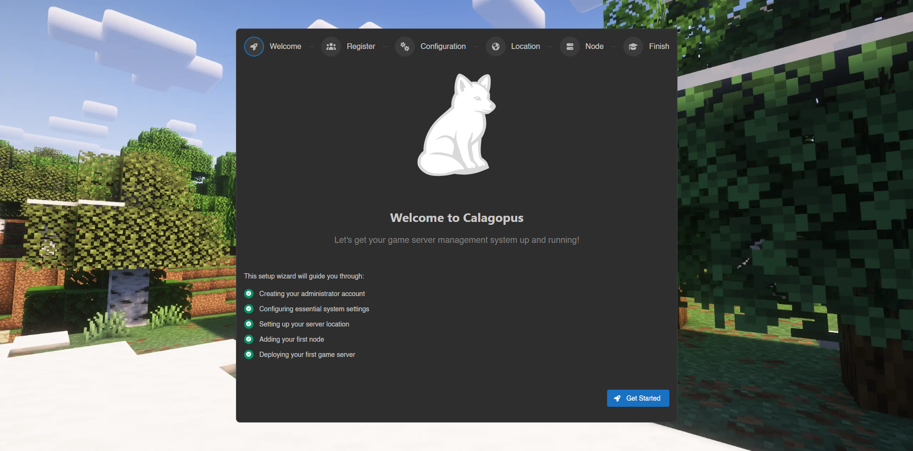

# Package Panel Installation

Please see the [Minimum Requirements](../overview.md#minimum-requirements) section in the Panel Overview documentation.

With the APT/RPM repository, you can directly install Calagopus from your package manager. Select your package manager below:

::::tabs
=== With APT
*todo: add postgres and redis server, maybe on different guide?*

#### Add the repository
The first step to install Calagopus is to add the Calagopus APT repository. To do so, on your server run theses commands:

```bash
curl -fsSL https://packages.calagopus.com/pub.gpg -o /usr/share/keyrings/calagopus-archive-keyring.gpg
echo "deb [signed-by=/usr/share/keyrings/calagopus-archive-keyring.gpg] https://packages.calagopus.com/deb stable main" | sudo tee /etc/apt/sources.list.d/calagopus.list
apt update
```

#### Install Calagopus Panel
Now that the repository has been added, you can now install the Calagopus Panel package. You can do this by running the following commands:
```bash
apt install -y calagopus-panel
```

#### Configure Environment Variables 

Before starting the Panel, you need to configure the environment variables. By default, the `.env` is not included in the package, you can download it manually by running the following commands:
```bash
mkdir -p /etc/calagopus
cd /etc/calagopus

curl -o .env https://raw.githubusercontent.com/calagopus/panel/refs/heads/main/.env.example
ls -lha # should show you the .env file
```

Edit the `.env` with your preferred text editor and modify the environment variables as needed. See the [Environment Configuration documentation](../environment.md) for more details on each variable.

If you prefer doing the absolute minimum, you can use this script to set the `APP_ENCRYPTION_KEY` variable to a random value:

```bash
RANDOM_STRING=$(cat /dev/urandom | tr -dc 'a-zA-Z0-9' | fold -w 16 | head -n 1)
sed -i -e "s/CHANGEME/$RANDOM_STRING/g" .env
```

Keep in mind you still need to setup the `DATABASE_URL` and `REDIS_URL` to your respective values.

To test the configuration, you can run:
```bash
calagopus-panel
```

#### Install Panel as a Service
To ensure that the panel starts automatically on system boot, you can install it as a systemd service. Create a new service file by running:
```bash
calagopus-panel service-install
```
This will also start the service and enable it to start on boot. To check the status of the Panel service, you can run:
```bash
systemctl status calagopus-panel
```
If everything went well, you should be able to access the Panel by navigating to `http://<your-server-ip>:8000` in your web browser and see the OOBE (Out Of Box Experience) setup screen.



=== With RPM
*todo: do the actual guide*

```bash
sudo rpm --import https://packages.calagopus.com/pubring.gpg
sudo tee /etc/yum.repos.d/calagopus.repo > /dev/null <<EOF
[calagopus]
name=Calagopus Repository
baseurl=https://packages.calagopus.com/rpm
enabled=1
gpgcheck=1
gpgkey=https://packages.calagopus.com/pubring.gpg
EOF
```
::::