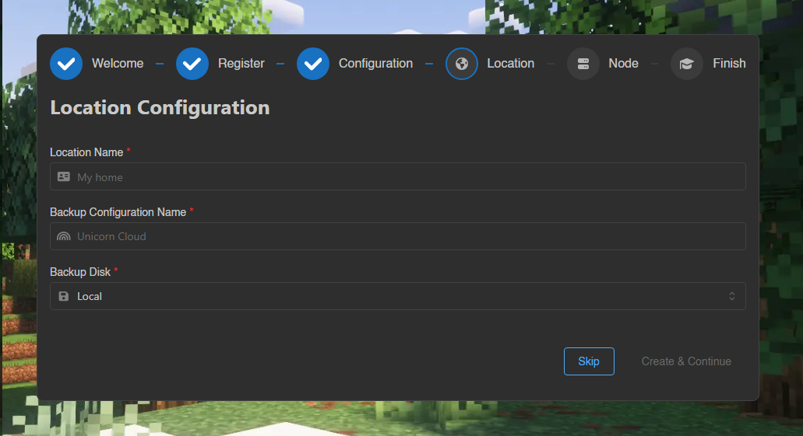

# Creating a New Node

Adding a node to Calagopus is the same way you would add a node in Pterodactyl. This can be done in both the OOBE and in the admin panel.

## Via the OOBE
During the OOBE, you will be asked to create a location. This is required to create a node.

## Via the admin panel
wip docs