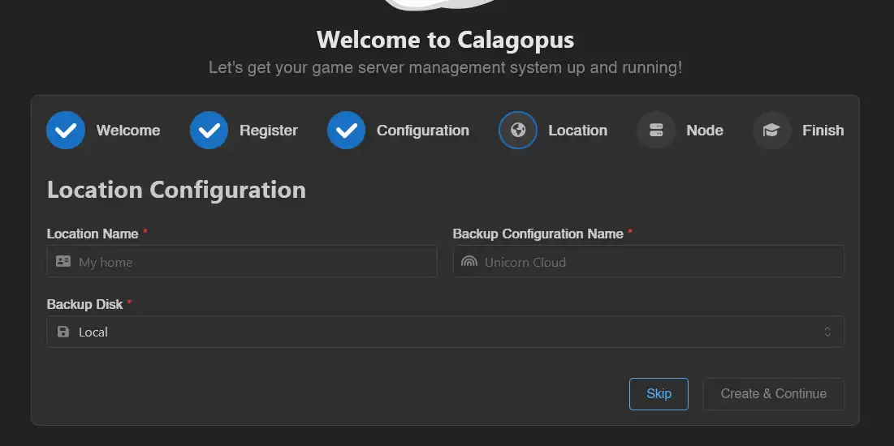
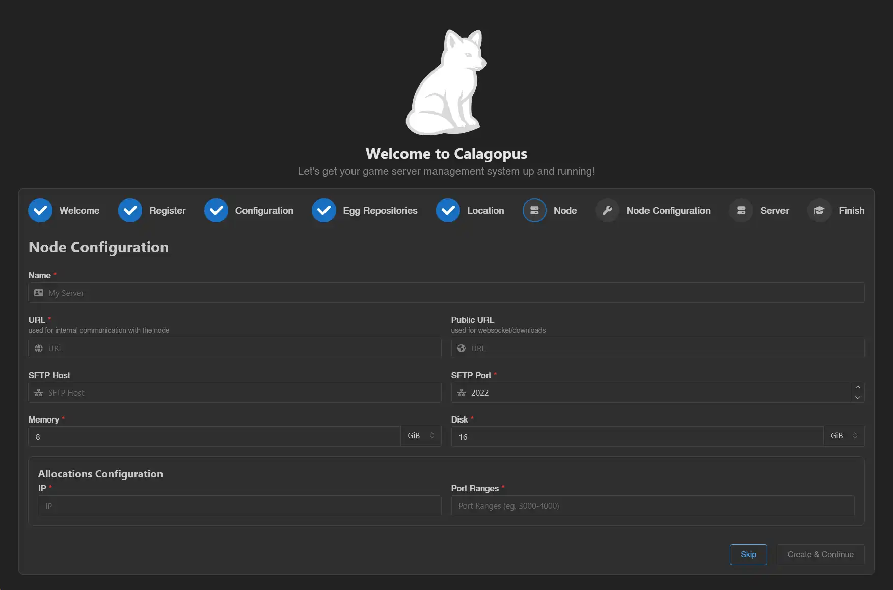
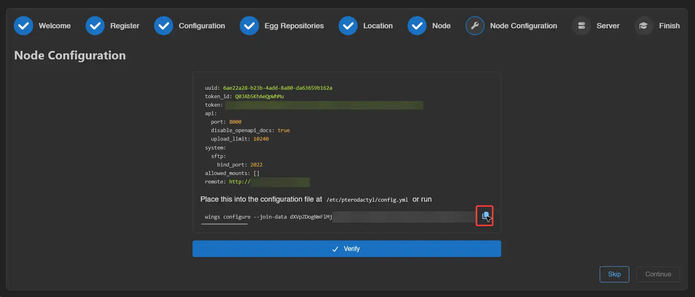
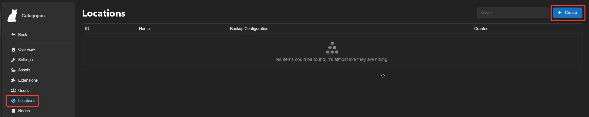
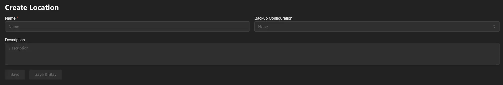

# Creating a New Node

A node connects Wings (running on a remote or local host) to the panel. You can create nodes during the OOBE or later from the admin panel.

## Via the OOBE

During the OOBE you'll be asked to create a **location** first. Locations group nodes together and are used for backup configuration inheritance.

Fill in the location fields:
- **Location Name**: A label to distinguish this location from others (e.g. `Germany`).
- **Backup Configuration Name**: The name of a backup storage configuration for nodes in this location.
- **Backup Disk**: Where backups are stored. If unsure, leave this as `Local`.



Click **Create & Continue**.

Then fill in the node fields:
- **Name**: A short, identifiable name for the node.
- **URL**: The URL the panel uses to reach Wings. For example, if Wings is at `node.calagopus.com` on port `8000` over HTTPS: `https://node.calagopus.com:8000`.
- **Public URL**: The URL browsers use to reach Wings directly. Useful when the URL above is an internal address.
- **SFTP Host**: A custom SFTP hostname shown in the dashboard. Leave empty to use the hostname from the URL.
- **SFTP Port**: The port for the SFTP/SSH server. Don't change this unless you know what you're doing.
- **Memory**: Total RAM this node can allocate across servers. Set to roughly 90% of the host's total RAM.
- **Disk**: Total disk space this node can allocate.
- **IP**: The IP address for allocations. Run `hostname -I | awk '{print $1}'` on the node to find it, or use `0.0.0.0` to bind all interfaces.
- **Port Ranges**: A single port (`10000`) or a range (`10000-11000`) to reserve for servers.



Click **Create & Continue**.

### Install Wings

At this point you need Wings running on the node. Follow the [Wings Installation](../../wings/installation.md) guide, then come back here.

### Apply the Node Configuration

Once you reach the Node Configuration page in the OOBE, copy the auto-deploy command and run it on the node host:

```bash
wings configure --join-data xxxxxx
```



## Via the Admin Panel

::: details How to create a location first
Head to **Admin → Locations** and create a new location. Fill in:
- **Location Name**: A label for this location (e.g. `Germany`).
- **Backup Configuration Name**: The name of the backup configuration for nodes in this location.
- **Description**: An optional longer description.




Click **Save**.
:::

Head to **Admin → Nodes** and click **Create**.


Fill in the node fields:
- **Name**: A short, identifiable name.
- **Location**: The location to assign this node to.
- **URL**: The URL the panel uses to reach Wings.
- **Public URL**: The URL browsers use to reach Wings directly.
- **SFTP Host**: Custom SFTP hostname. Leave empty to use the hostname from the URL.
- **SFTP Port**: Port for the SFTP/SSH server.
- **Memory**: Total RAM available for allocation (typically ~90% of the host's RAM).
- **Disk**: Total disk space available for allocation.
- **Backup Configuration**: The backup configuration to use for servers on this node.
- **Description**: Optional description.
- **Deployment Enabled**: Allow new servers to be deployed to this node via the deploy Endpoint.
- **Maintenance Enabled**: Block users from accessing servers on this node.


Click **Save**.

### Install Wings

If Wings isn't running on this host yet, follow the [Wings Installation](../../wings/installation/index.md) guide.

### Apply the Node Configuration

Head to **Admin → Nodes**, click the node you just created, then open the **Configuration** tab. Copy the auto-deploy command and run it on the node host:

```bash
wings configure --join-data xxxxxx
```


Then follow the Wings install process to complete setup via [Binary](../../wings/installation/binary.md#configure-wings) or [Package Manager](../../wings/installation/pkgmanager.md).
