# Egg Repositories

Egg repositories are Git repositories that store collections of eggs - the configuration files that tell the panel how to install and run a specific game server type. Calagopus has a built-in egg repository system that lets you browse and import eggs directly from the admin UI, similar to what Blueprint's Eggify extension provided for Pterodactyl.

Calagopus has backwards compatibility for Pterodactyl eggs, so you can use the official Pterodactyl egg repositories as a starting point:
- [pterodactyl/game-eggs](https://github.com/pterodactyl/game-eggs)
- [pterodactyl/application-eggs](https://github.com/pterodactyl/application-eggs)
- [pterodactyl/generic-eggs](https://github.com/pterodactyl/generic-eggs)

::: info
You can also add egg repositories directly from the OOBE when first setting up Calagopus - select the repositories you want and click Import.

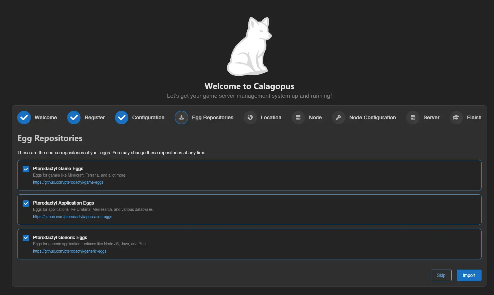
:::d

## How Egg Repositories Work

An egg repository is a Git repository organized into directories, with each egg defined as a JSON file following the Pterodactyl/Calagopus egg format. Repositories commonly separate games, applications, and programming languages into separate repositories or subdirectories.

## Adding a Repository

Head to **Admin → Egg Repositories** and click **Create**.

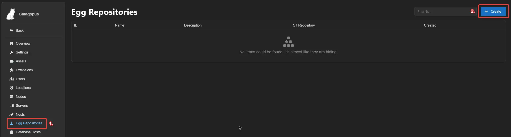

Fill in the fields:
- **Name**: A label to distinguish this repository from others.
- **Git Repository**: The full URL of the Git repository (e.g. `https://github.com/pterodactyl/game-eggs`).
- **Description**: Optional description.

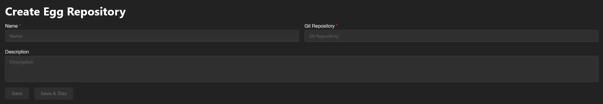

Click **Save**, then click **Sync** to pull the egg list from the repository.

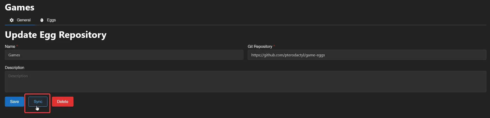

This doesn't install any eggs - it populates the Eggs tab with the full list from the repository so you can choose which ones to import.

## Importing Eggs

Head to the **Eggs** tab for the repository. You'll see a list of all available eggs.

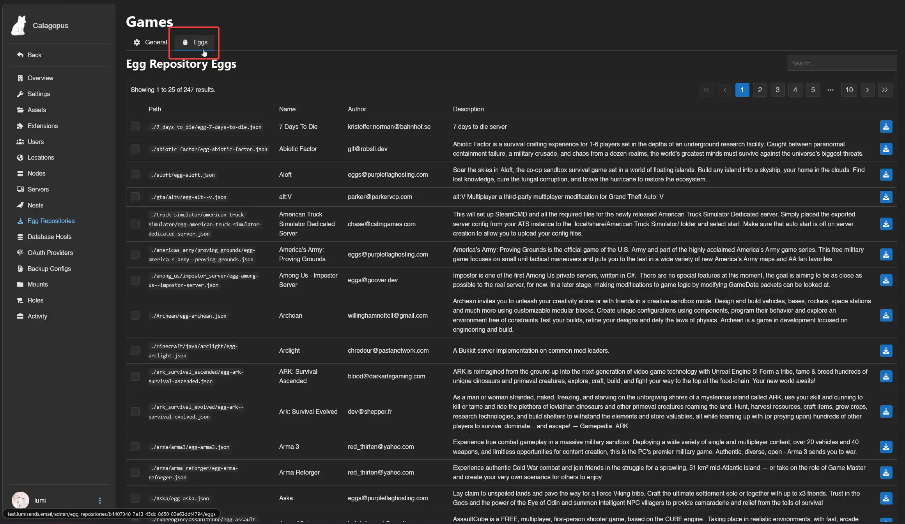

For documentation on what a specific egg does, check the same path in the source Git repository.

Select the eggs you want by dragging them into the selection area or searching by name, then click **Install**.

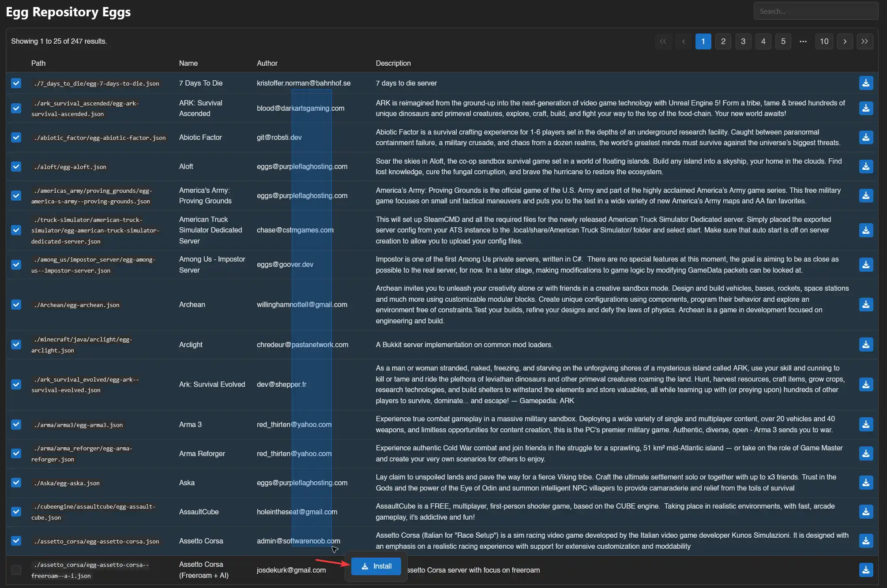

A popup will ask which nest to import into. Select the nest and click **Install**.

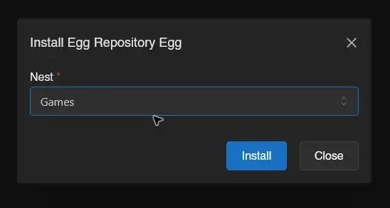

## Updating Eggs

When an egg in the repository has been updated, re-sync the repository first, then update the egg in the panel.

### Updating a Single Egg

Re-sync the repository:

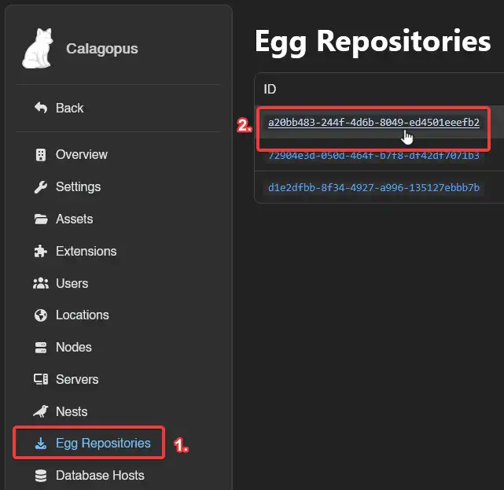

Then head to **Admin → Nests**, click the nest containing the egg, click the egg, scroll down to the **Update** section, and click **Update from Repository**.

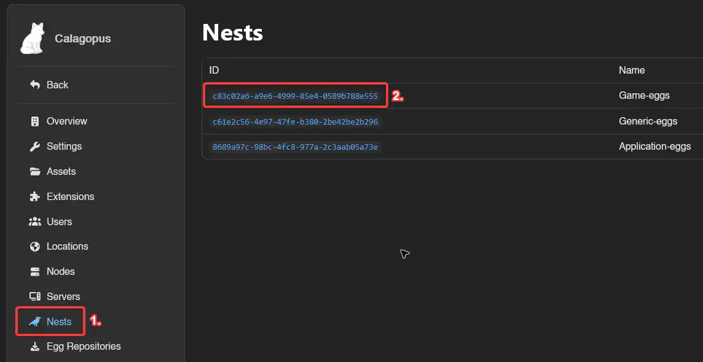
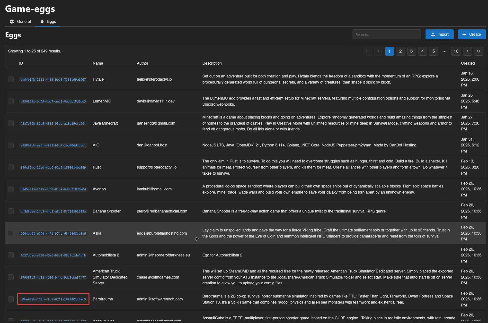
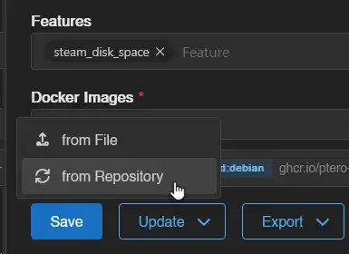

### Updating Multiple Eggs at Once

Re-sync the repository, then head to **Admin → Nests** and open the nest. Select the eggs you want to update and click **Update from Repository** in the action bar.

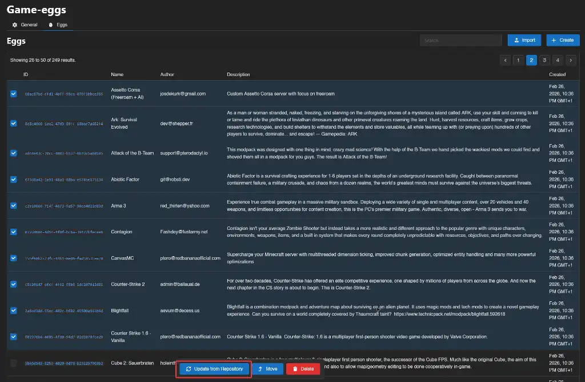

Keep in mind that egg updates may require updating server configurations or reinstalling servers to take effect.
