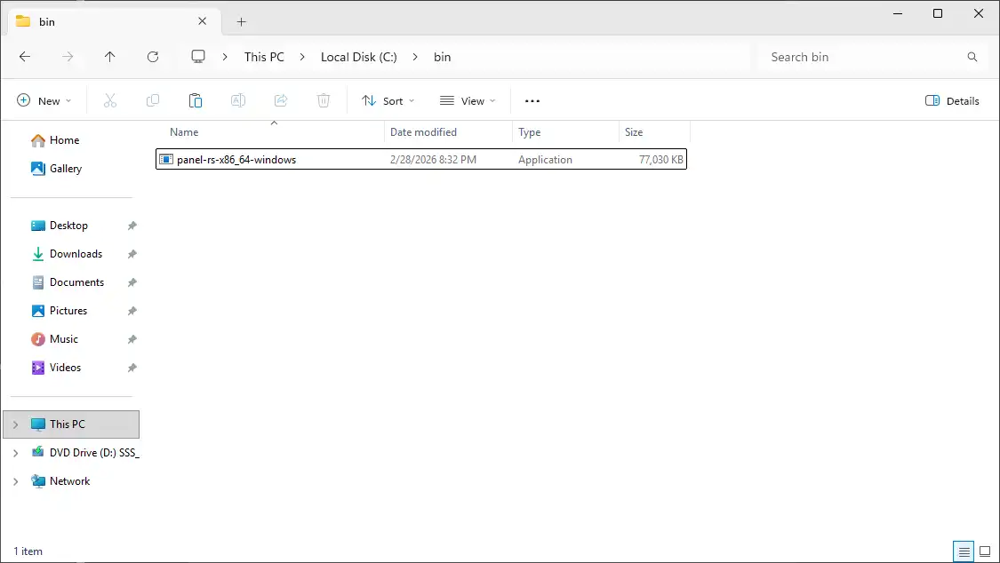
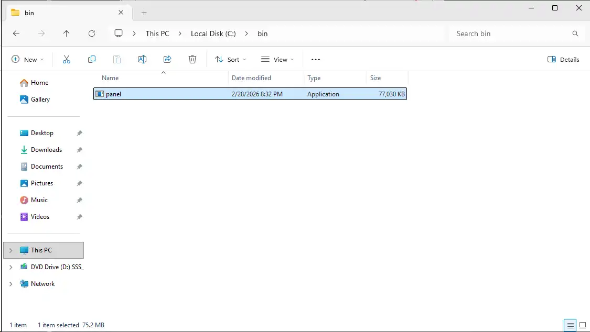

# Updating the Panel

::::tabs
=== Docker (Recommended)
Pull the latest images and restart the stack:
```bash
docker compose pull
docker compose up -d

# optionally, if you want to remove old images:
# this is recommended if you have limited disk space / are using the heavy image
docker image prune -a
```
=== APT / RPM / APK
Run the package manager upgrade, then restart the service:
```bash
# APT
apt update
apt upgrade -y

# RPM
dnf check-update
dnf upgrade -y

# APK
apk update
apk upgrade
```
```bash
systemctl restart calagopus-panel
```
=== Binary

**Linux**

Stop the service, replace the binary, then start it again:
```bash
systemctl stop calagopus-panel
```
```bash
sudo curl -L "https://github.com/calagopus/panel/releases/latest/download/panel-rs-$(uname -m)-linux" -o /usr/local/bin/calagopus-panel
sudo chmod +x /usr/local/bin/calagopus-panel

calagopus-panel version
```
```bash
systemctl start calagopus-panel
```

**Windows**

Stop the service:
```powershell
nssm stop "Calagopus Panel"
```

Download the latest executable [here](https://github.com/calagopus/panel/releases/latest/download/panel-rs-x86_64-windows.exe) and place it in the same directory as the existing `calagopus-panel.exe` (e.g. `C:\bin`). Delete the old executable and rename the new one to `calagopus-panel`.




Start the service again:
```powershell
nssm start "Calagopus Panel"
```
::::
