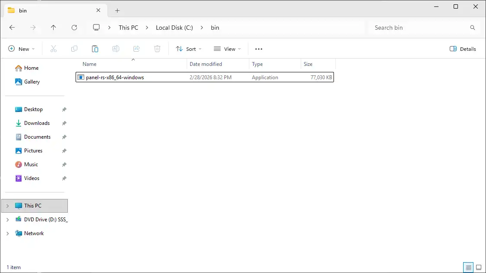
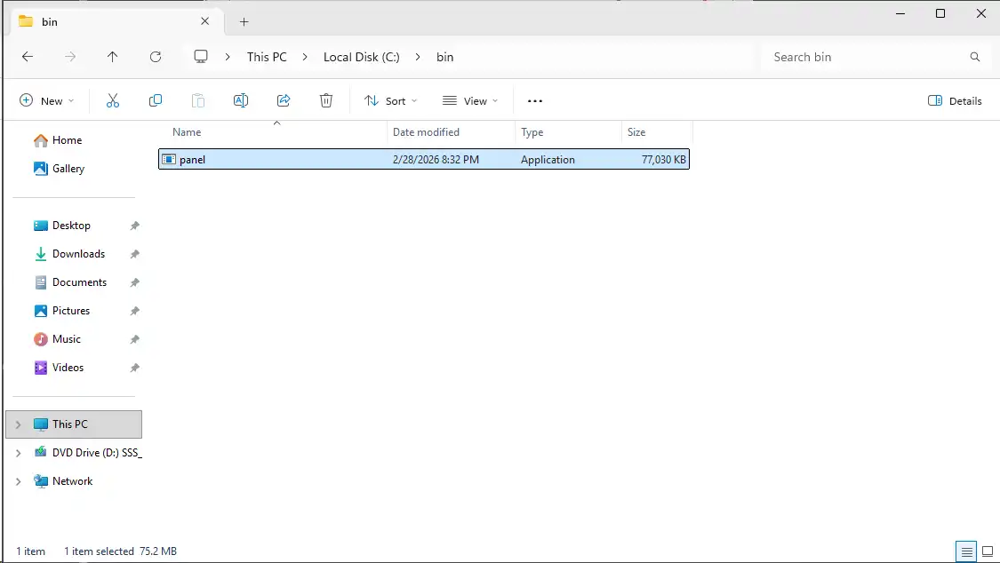

# Updating the Panel

Updating the panel gets you bug fixes, security patches, and new features. Its web interface and API will be briefly unavailable while it restarts. An AIO update also restarts the bundled Wings, briefly interrupting console connections and server management.

Read the [release notes](../releases/index.md) and back up the Panel database, configuration, and encryption key before updating. Keep standalone Panel and Wings installations on compatible releases; see [Versions and Clocks](../additional/troubleshooting.md#versions-and-clocks). AIO updates both components together.

Pick the method matching how you installed the panel:

::::tabs
=== Docker (Recommended)

#### 1. Pull and restart

Return to the directory containing your existing `compose.yml`, then update the `web` service used by the supplied Compose files:

```bash
docker compose pull web
docker compose up -d --no-deps web
docker compose ps
docker compose logs --tail 50 web
```

This updates the Panel image, including bundled Wings for AIO. Database and cache updates are separate maintenance tasks. Keep your existing Compose file and encryption key.

#### 2. Clean up old images (optional)
If you're on the `:heavy` image or have limited disk space, old image layers can pile up quickly. Remove unused ones:
```bash
docker image prune -a
```

#### 3. Still on the old version? (heavy image only)
The heavy image keeps the last binary it built under `./build/binaries` and keeps running it until extensions have been rebuilt. If the version shown doesn't change, or extensions fail to build against the new release, see [Extensions troubleshooting](./extensions/installing-extensions.md#troubleshooting).

=== APT / RPM / APK

#### 1. Upgrade the package
Run the command for your package manager. If you installed the AIO package, replace `calagopus-panel` with `calagopus-panel-aio` in the upgrade command:

::: code-group
```bash [APT]
apt update
apt install --only-upgrade calagopus-panel
```
```bash [RPM]
dnf upgrade calagopus-panel
```
```bash [APK]
apk update
apk upgrade calagopus-panel
```
:::

These commands target the named package and any required dependencies. Schedule OS-wide updates separately.

#### 2. Restart the service
Restart the service to load the updated binary:

::: code-group
```bash [systemd]
systemctl restart calagopus-panel
```
```bash [OpenRC (Alpine)]
rc-service calagopus-panel restart
```
:::

=== Binary

Pick your platform:

:::tabs
== Linux

##### 1. Stop the service
```bash
systemctl stop calagopus-panel
```

##### 2. Replace the binary
```bash
sudo curl -L "https://github.com/calagopus/panel/releases/latest/download/panel-rs-$(uname -m)-linux" -o /usr/local/bin/calagopus-panel
sudo chmod +x /usr/local/bin/calagopus-panel
```

##### 3. Verify the new version
```bash
calagopus-panel version
```
Check the output against the [latest release](https://github.com/calagopus/panel/releases/latest) to confirm the update applied.

##### 4. Start the service
```bash
systemctl start calagopus-panel
```

== Windows

##### 1. Stop the service
```powershell
nssm stop "Calagopus Panel"
```

##### 2. Replace the executable
Download the latest executable [here](https://github.com/calagopus/panel/releases/latest/download/panel-rs-x86_64-windows.exe) and place it in the same directory as the existing `calagopus-panel.exe` (e.g. `C:\bin`). Delete the old executable and rename the new one to `calagopus-panel`.




##### 3. Start the service
```powershell
nssm start "Calagopus Panel"
```
:::

::::

After updating, sign in, check the Panel version in Admin, and open a server console to confirm its connection works.
