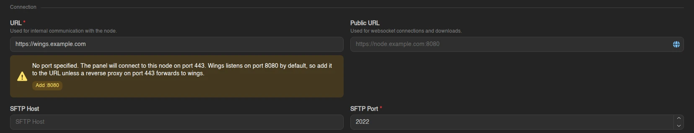
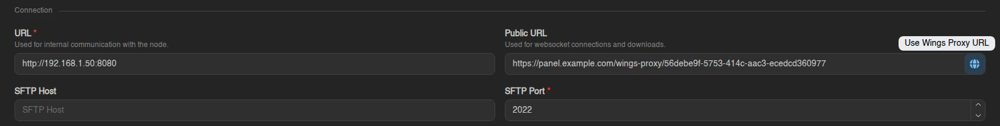
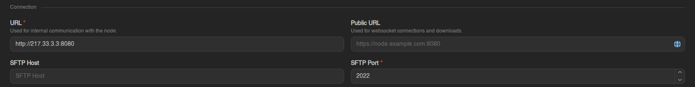

# Exposing Wings in a Homelab

A node at home sits behind a router that hands out private addresses. Nothing outside your network can reach it until you open a path in, and the path you pick decides how much of the node ends up on the internet, whether you need a domain, and where the certificate goes. This page walks through the three options.

## What Needs to Reach the Node

Four kinds of traffic arrive at a Wings node, and an HTTP reverse proxy only carries the first two:

| Who connects | What for | Default port | Carried by a reverse proxy? |
| --- | --- | --- | --- |
| The Panel | Wings API: power actions, installs, backups, file operations | `8080` TCP | Yes |
| Your users' browsers | Console, live statistics, uploads and downloads (WebSockets) | `8080` TCP | Yes |
| SFTP clients | File access over SFTP | `2022` TCP | No |
| Players | The game servers' allocations | Per server, TCP and UDP | No |

Player and SFTP ports are forwarded on the router no matter which method you choose. The methods below differ in how the first two rows get in.

## Prerequisites

- A working Calagopus Panel. It can run at home on the same network as Wings, or elsewhere; the second case is called out where it matters.
- A working Wings node that the Panel can already reach. Two machines on the same LAN reach each other on their LAN addresses; a Panel hosted elsewhere needs one of the methods below first.
- Admin access to your router to forward ports.
- A domain name, or a dynamic DNS name if your home IP changes. Optional for port forwarding, needed for anything with a certificate.

## Which Method

| | Reverse proxy | Reverse proxy + Wings Proxy Mode | Port forwarding |
| --- | --- | --- | --- |
| Ports opened on the router for Wings | `80`, `443` | None for Wings (the Panel's `443` covers it) | `8080` |
| Domain name | Required | Required for the Panel | Optional |
| Certificate | On the proxy | On the Panel's proxy only | On Wings itself, or none |
| Wings exposed to the internet | Behind the proxy | Not at all | Directly |
| Fits best when | The node has a public hostname | Panel and Wings are on the same home network | You want the least setup and accept the trade-offs |

:::: tabs
=== Reverse Proxy

A reverse proxy runs on the node (or another machine on your network) and answers on ports `80` and `443`. It terminates HTTPS and forwards to Wings on `8080`. Wings is never reachable from the internet on its own port.

| Pros | Cons |
| --- | --- |
| Certificate lives in one place and renews with the proxy | One more service to configure and keep running |
| Wings is only reachable through the proxy | Needs a domain name |
| Several services can share ports 80 and 443 on the same public IP | Adds a hop, so slightly more latency on the console |
| | SFTP does not go through it; forward `2022` separately or use it on the LAN only |

**1. Forward ports 80 and 443** on your router to the machine that runs the proxy. Port 80 is what Let's Encrypt uses to issue the certificate; port 443 carries the traffic.

**2. Set up the proxy and trust it in Wings.** Follow [Putting Wings behind a reverse proxy](../../additional/reverse-proxies.md#putting-wings-behind-a-reverse-proxy). It covers the Nginx, Apache and Caddy configurations, the upload size limit, and `api.trusted_proxies`, which Wings needs so it sees your users' real addresses instead of the proxy's.

**3. Point the node at the proxy.** In **Admin → Nodes → (your node) → General**, set **URL** to the proxy's address without a port, for example `https://wings.example.com`. The form warns that no port was given and offers to add `:8080`. Ignore that here: the proxy listens on `443`, and `:8080` would go around it. Leave **Public URL** empty so browsers use the same address.



**4. Verify.** Open the node's **Configuration** tab and click **Verify Connection**. **Backend to Wings** proves the Panel reaches the node through the proxy; **Frontend to Wings** proves your browser does, which the console and file manager depend on.


=== Reverse Proxy + Wings Proxy Mode

In Wings Proxy Mode the Panel relays browser traffic to the node. Users' browsers only ever talk to the Panel's address, and the Panel talks to Wings over your LAN. The node needs no public hostname, no certificate and no open port of its own. The only thing exposed is the Panel, behind [its own reverse proxy](../../additional/reverse-proxies.md).

This works when the Panel can reach Wings privately, which in a homelab means the Panel runs on the same network as the node, or the two are joined by a VPN. A Panel hosted in a datacenter still needs port forwarding or a reverse proxy to reach a node at home, so this mode does not remove that step for split setups.

| Pros | Cons |
| --- | --- |
| Only the Panel is reachable from the internet | Every console line, upload and download passes through the Panel, so heavy use loads it |
| One domain, one certificate, one proxy configuration | Slightly more latency, since the Panel sits in the middle |
| No router changes for Wings | Needs `APP_ENABLE_WINGS_PROXY` on the Panel |
| | SFTP still connects to the node directly; forward `2022` or use it on the LAN only |

**1. Enable proxy mode on the Panel.** Set [`APP_ENABLE_WINGS_PROXY`](../../panel/environment.md#app-enable-wings-proxy) to `true`. On a Docker installation, add it to the `web` service in `compose.yml` and run `docker compose up -d`:

```yaml
services:
  web:
    environment:
      - APP_ENABLE_WINGS_PROXY=true
```

The compose files shipped with the Panel already set this to `true`.

**2. Give the node its LAN address and the proxy URL.** In **Admin → Nodes → (your node) → General**, set **URL** to the address the Panel uses to reach Wings on your network, for example `http://192.168.1.50:8080`. Then click the globe button at the right of **Public URL** (**Use Wings Proxy URL**). It fills in `<panel URL>/wings-proxy/<node uuid>`, the address browsers will use from now on. Save.



**3. Verify.** On the **Configuration** tab, click **Verify Connection**. **Frontend to Wings** now goes through the Panel, so it passes as long as the Panel can reach the LAN address from step 2.

::: info
The All-in-One image uses this mode for its built-in Wings automatically, which is why a single reverse proxy in front of the Panel is enough there.
:::

=== Port Forwarding

Forward port `8080` on the router straight to the node and enter your public address in the Panel. There is no proxy and no certificate unless you add one to Wings yourself.

| Pros | Cons |
| --- | --- |
| Quickest to set up | Wings answers the internet directly on its own port |
| Works without a domain name | Without a certificate, browsers refuse to open the console from a Panel that is served over HTTPS |
| Nothing extra runs on the node | A changing home IP breaks the node URL unless you use dynamic DNS |

**1. Forward port 8080 (TCP)** on your router to the node's LAN address. Your router's manual has the exact steps; the feature is usually called port forwarding or virtual server.

**2. Enter the public address in the Panel.** In **Admin → Nodes → (your node) → General**, set **URL** to your public IP or dynamic DNS name **with the port**, for example `http://217.33.3.3:8080` or `http://mywings.dyndns.org:8080`.



**3. Add a certificate if the Panel uses HTTPS.** Browsers block plain `ws://` and `http://` connections from a page served over `https://`, so an HTTPS Panel cannot open the console on an `http://` node. Give the node a dynamic DNS or domain name, get a certificate for it with the [DNS challenge](../../additional/ssl-certificates.md) (port 80 is not needed), and [enable SSL in Wings](../configuration.md#ssl-configuration). Then use `https://mywings.dyndns.org:8080` as the URL. The DNS challenge needs a name, so a bare IP address will not do for this step.

**4. Verify** on the **Configuration** tab with **Verify Connection**.

::::

## Game Server and SFTP Ports

Whichever method you chose, players still connect to the node directly. Forward each port range you hand out as [allocations](../next-steps/setting-up-allocations.md) on the router, TCP and UDP as the game requires. Create the allocations with the node's LAN IP and set the **IP Alias** to your public hostname, so users see an address they can actually connect to.

SFTP on port `2022` follows the same rule. Forward it if users need SFTP from outside, and set the node's **SFTP Host** to the public hostname; on the LAN it works without any of that.

The [private network](./private-network.md) between nodes also bypasses the proxy. Its UDP port has to be forwarded to the node when a homelab node talks to nodes elsewhere.

## Troubleshooting

**Backend to Wings passes, Frontend to Wings fails.** The Panel reaches the node but your browser does not. With port forwarding, this is almost always the mixed-content block described above: the Panel is on `https://` and the node on `http://`. Otherwise check that the hostname resolves publicly and the port is forwarded from outside your network, not only from the LAN.

**Both checks pass, but the console never connects.** The WebSocket upgrade is not getting through. On a reverse proxy, check the `Upgrade` and `Connection` headers in the [proxy configuration](../../additional/reverse-proxies.md#putting-wings-behind-a-reverse-proxy).

**The node worked yesterday and is unreachable today.** Your home IP changed. Use a dynamic DNS name in the node URL instead of the raw address.

**Users cannot reach their servers.** The game ports are not forwarded, or the allocation shows the LAN IP with no alias. See [Game Server and SFTP Ports](#game-server-and-sftp-ports).
