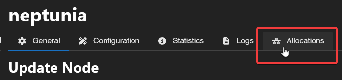
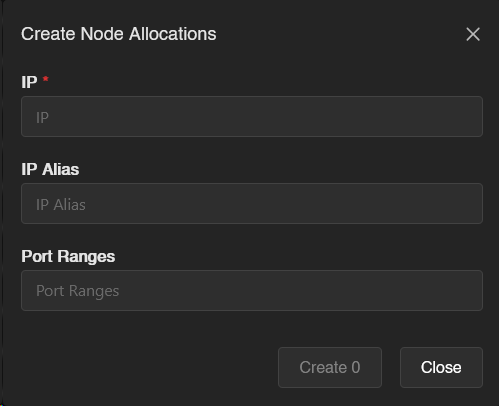

# Binary Wings Installation

Please see the [Minimum Requirements](../overview.md#minimum-requirements) section in the Wings Overview documentation.

## Install Docker

The Calagopus Wings Daemon requires Docker to be installed and running on the host machine to manage game server containers.
You can validate your Docker installation by running:

```bash
docker --version
```

If Docker is not installed, please refer to the [official Docker installation guide](https://docs.docker.com/engine/install) for your operating system.
In many cases running Dockers installation script is the easiest way to get started:

```bash
curl -sSL https://get.docker.com/ | CHANNEL=stable bash
```

## Install the Wings Binary

Next, you need to download and install the Wings binary. You can do this by running the following commands:

```bash
curl -L "https://github.com/calagopus/wings/releases/latest/download/wings-rs-$(uname -m)-linux" -o /usr/local/bin/wings
chmod +x /usr/local/bin/wings
```

This will download the latest version of Wings for your architecture and make it executable using `wings`.
To test that the installation was successful, you can run:

```bash
wings version
```

## Configure Wings

Before starting Wings, you need to configure it to connect to your Calagopus Panel. To do this, create the Node on the Panel using this guide [here](../../panel/next-steps/add-node.md).
Then, paste the copied configuration command into your terminal, which will look something like this:

```bash
wings configure --join-data xxxxxx
```

To test the configuration, you can run:

```bash
wings
```

This will start Wings in the foreground, and you should see it connecting to the Panel.

## Install Wings as a Service

To ensure that Wings starts automatically on system boot, you can install it as a systemd service. Create a new service file by running:

```bash
wings service-install
```

This will also start the service and enable it to start on boot. To check the status of the Wings service, you can run:

```bash
systemctl status wings
```

## Node Allocations
Allocation is a combination of IP and Port that you can assign to a server. The allocation would be the IP address of your network interface, such as `65.20.69.420`, or when behind NAT, an internal IP.

To create allocations, go to Nodes, then click on your node, and click on the Allocation tab.


Then, click on the Create button and a popup should come up:


To find the IP to be used for the allocation, type `hostname -I | awk '{print $1}'` on your terminal. Alternatively, you can type `ip addr | grep "inet "` to see all your available interfaces and IP addresses, or use `0.0.0.0` as the IP to bind all the available interfaces.

::: warning
You can use `127.0.0.1` for allocations if you don't want the server to be exposed via the internet. This is useful for internal services that are hosted locally on the same server.
:::

The IP Alias can be set to anything, as this value is shown to the user in the console, the network tab, etc. This is useful for people who are behind NAT and/or don't want to show their IP directly.

The Port Ranges value is what you'll use to connect to your server. It can either be a single port `10000`, or a range `10000-11000`.

Once you're done filling theses 2-3 values, click on the Create button, and you should now be able to assign allocations to servers!