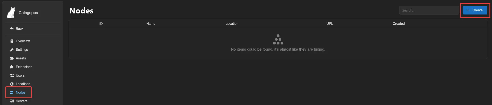
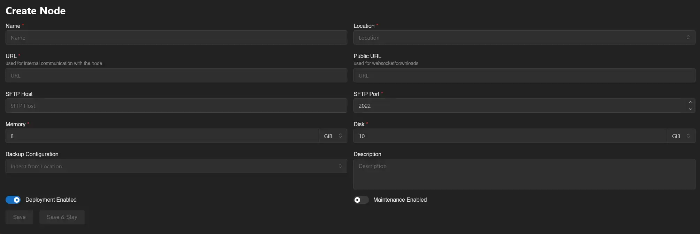
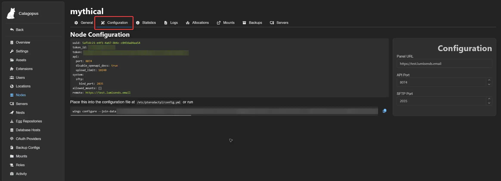

# Configuring a New Node

A node connects Wings (running on a remote or local host) to the panel. Creating one takes four steps: create a location, create the node, install Wings, and apply the node's configuration to it.

You can do this during the **OOBE** (first-time setup) or anytime later from the **Admin panel**. The steps are the same either way, just noted below where they differ.

## Create a location

Locations group nodes together and control backup configuration inheritance. You only need one location per logical group of nodes (e.g. per region or provider). Skip this step if you already have one you want to use.

- **OOBE**: shown automatically before you create your first node.
- **Existing panel**: go to **Admin → Locations → Create**.

| Field | Description |
|---|---|
| Name | A label to distinguish this location (e.g. `Germany`). |
| Backup Configuration Name | The backup storage configuration used by nodes in this location. |
| Backup Disk | Where backups are stored. Leave as `Local` if unsure. *(OOBE only)* |
| Description | Optional notes about this location. *(Admin panel only)* |


## Create the node

- **OOBE**: continues automatically after the location step.
- **Existing panel**: go to **Admin → Nodes → Create**.

| Field | Description |
|---|---|
| Name | A short, identifiable name for the node. |
| Location | The location to assign this node to. *(Admin panel only which is set automatically in the OOBE)* |
| URL | The address the panel itself uses to reach Wings, including its port (default `8080`). |
| Public URL | The address browsers use to reach Wings directly, for websocket connections and downloads. Leave empty to reuse **URL**. |
| SFTP Host | Custom SFTP hostname shown in the dashboard. Leave empty to reuse the hostname from URL. |
| SFTP Port | Port for the SFTP/SSH server. Leave default unless you know you need to change it. |
| Memory | Total RAM this node can allocate across servers. |
| Disk | Total disk space this node can allocate. |
| Backup Configuration | The backup configuration servers on this node will use. *(Admin panel only)* |
| Description | Optional description. *(Admin panel only)* |

**URL vs. Public URL:** **URL** is what the panel itself uses to reach Wings, so it can be an internal address like a LAN IP or `localhost`. **Public URL** is what the browser uses, so it must be reachable from wherever your users are, e.g. a domain with SSL like `https://node.calagopus.com:8080`. Leave Public URL empty to just reuse URL.

If your panel has SSL but Wings doesn't, use **Wings Proxy Mode** instead of a second reverse proxy: the panel proxies Wings traffic itself, so only the panel needs a cert. Enable it via `APP_ENABLE_WINGS_PROXY=true` in the panel's `.env`, then click the globe icon next to Public URL to auto-fill it. Full details and trade-offs (no SFTP, extra load on the panel): [Exposing Wings in a Homelab](../../wings/advanced/exposing-wings-in-a-homelab.md).





> The OOBE also asks for an **IP** and **Port Ranges** here, so your first allocation is ready immediately. Via the Admin panel, add allocations afterward. See [Setting up Allocations](./setting-up-allocations.md).

Click **Create** (or **Create & Continue** in the OOBE).

## Install Wings

Wings needs to actually be running on the node's host before it can be configured. Follow the [Wings Installation](../../wings/installation/index.md) guide, then come back here.

## Apply the node configuration

Once the node exists in the panel, copy its join command and run it on the node's host:

```bash
wings configure --join-data xxxxxx
```

Where to find the command:
- **OOBE**: shown on the Node Configuration step.
- **Admin panel**: go to **Admin → Nodes → (your node) → Configuration** tab.




After running it, finish setup via [Docker](../../wings/installation/docker.md#configure-wings), [Binary](../../wings/installation/binary.md#configure-wings), or [Package Manager](../../wings/installation/pkgmanager.md#configure-wings) guide.

## Next step: enable SSL

SSL is disabled by default on a fresh Wings install. Before using this node for anything beyond testing, generate a certificate and enable it. See [Generating SSL Certificates](../../additional/ssl-certificates.md) and [SSL Configuration](../configuration.md#ssl-configuration).