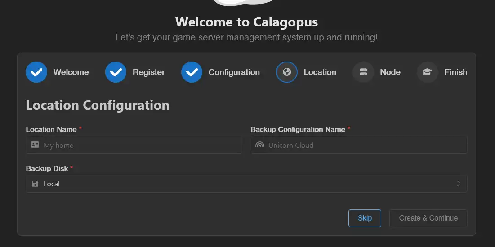
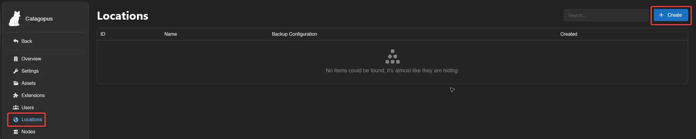
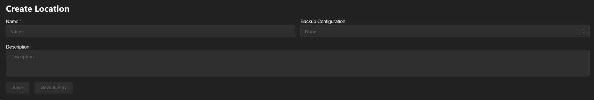
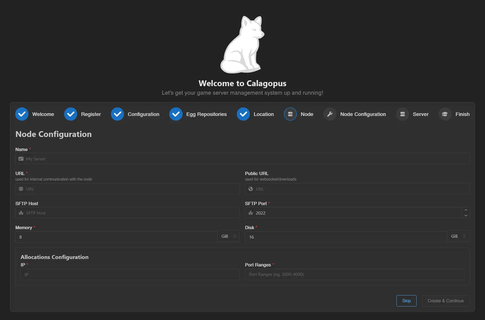
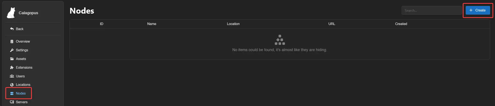
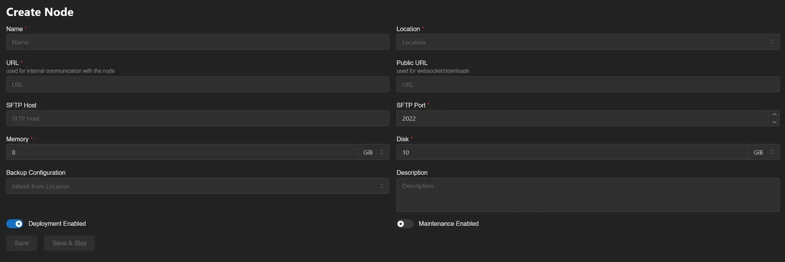
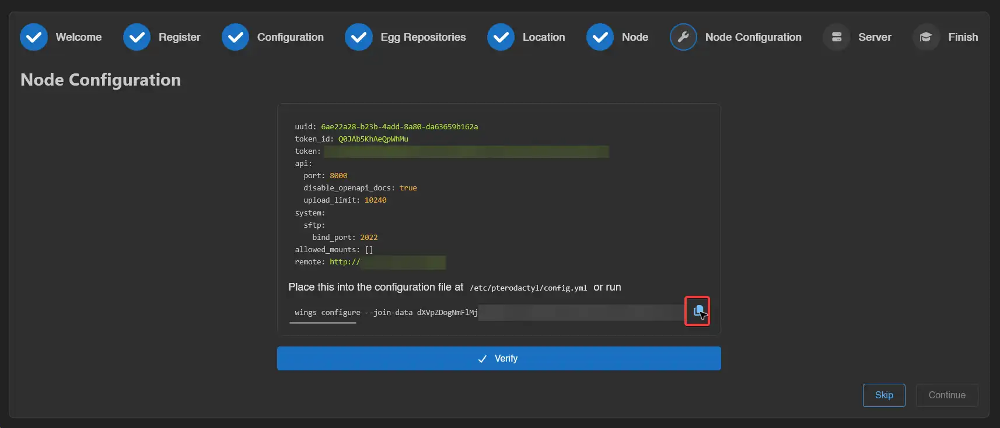
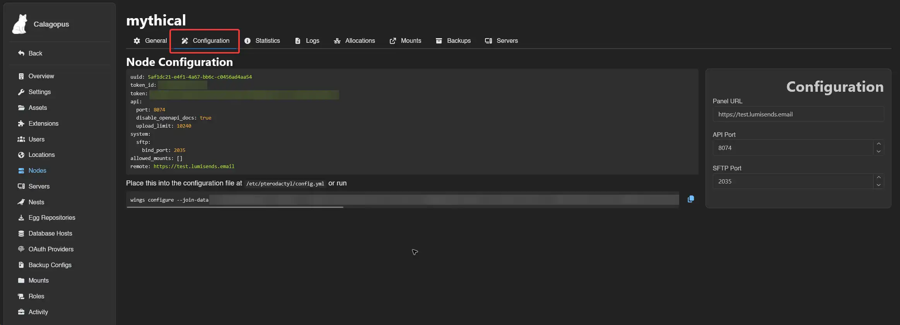

# Configuring a New Node

A node connects Wings on a remote or local host to the panel. Create a location and node, install Wings, then apply its configuration before starting it.

If you use the Panel's All-in-One image, its integrated node is already configured. Use that existing node; these steps are for adding a separate Wings installation.

You can do this during the **OOBE** (first-time setup) or anytime later from the **Admin panel**. The steps are the same either way, just noted below where they differ.

## Create a location

Locations group nodes together and control backup configuration inheritance. You only need one location per logical group of nodes (e.g. per region or provider). Skip this step if you already have one you want to use.

- **OOBE**: shown automatically before you create your first node.
- **Existing panel**: go to **Admin → Locations → Create**.

| Field | Description |
|---|---|
| Name | A label to distinguish this location (e.g. `Germany`). |
| Backup Configuration Name | The backup storage configuration used by nodes in this location. |
| Backup Disk | Where backups are stored. `Local` stores them on the Wings host; keep a copy elsewhere in case that host is lost. *(OOBE only)* |
| Description | Optional notes about this location. *(Admin panel only)* |





## Create the node

- **OOBE**: continues automatically after the location step.
- **Existing panel**: go to **Admin → Nodes → Create**.

| Field | Description |
|---|---|
| Name | A short, identifiable name for the node. |
| Location | The location to assign this node to. *(Admin panel only which is set automatically in the OOBE)* |
| URL | The address the panel itself uses to reach Wings, including its port (default `8080`). |
| Public URL | The address browsers use to reach Wings directly, for websocket connections and downloads. Leave empty to reuse **URL**. |
| SFTP Host | Custom SFTP hostname shown in the dashboard. Leave empty to reuse the hostname from URL. |
| SFTP Port | Port for the SFTP/SSH server. Leave default unless you know you need to change it. |
| Memory | RAM budget for planning and automatic placement; reserve memory for the OS and other services. Manual server creation can exceed it. |
| Disk | Disk budget for planning and automatic placement; leave space for images, logs, and backups. This is not a filesystem quota. |
| Backup Configuration | The backup configuration servers on this node will use. *(Admin panel only)* |
| Description | Optional description. *(Admin panel only)* |

**URL vs. Public URL:** **URL** is what the panel itself uses to reach Wings, so it can be a reachable internal address such as a LAN IP. With a Panel running in Docker, `localhost` refers to that container, not the host or a separate Wings container. Use an address reachable from the Panel's network. The AIO image is an exception: its bundled Wings shares the Panel's container and is configured automatically.

**Public URL** is what the browser uses, so it must be reachable from wherever your users are, e.g. a domain with SSL like `https://node.calagopus.com:8080`. Leave Public URL empty to reuse URL.

If your panel has SSL but Wings doesn't, **Wings Proxy Mode** lets the panel proxy browser traffic to Wings. With the supplied Docker Compose stack, set `APP_ENABLE_WINGS_PROXY=true` in the `web` service's `environment` list, then run `docker compose up -d --no-deps web` from the Compose directory. For a native installation, set it in the Panel's `.env` and restart the Panel service. Click the globe icon next to Public URL to auto-fill the proxy URL. This adds load to the Panel and does not proxy SFTP. See [Exposing Wings in a Homelab](../advanced/exposing-wings-in-a-homelab.md) for the network requirements and trade-offs.





> The OOBE also asks for an **IP** and **Port Ranges** here, so your first allocation is ready immediately. Via the Admin panel, add allocations afterward. See [Setting up Allocations](./setting-up-allocations.md).

Click **Create** (or **Create & Continue** in the OOBE).

## Install Wings

Follow the [Wings Installation](../../wings/installation/index.md) guide for your chosen method. Install the binary or package, or download the Docker Compose file, then return here for the node configuration. Apply that configuration before starting Wings.

## Apply the node configuration

Once the node exists in the panel, open its configuration:

- **OOBE**: shown on the Node Configuration step.
- **Admin panel**: go to **Admin → Nodes → (your node) → Configuration** tab.

For **Docker**, copy the generated YAML into `config/config.yml` as described in the [Docker installation guide](../installation/docker.md#configure-wings).

For a **binary installation**, run the generated join command on the node's host:

```bash
wings configure --join-data xxxxxx
```

For a **package installation**, use `calagopus-wings configure --join-data xxxxxx` instead, unless you created the optional `wings` alias. Replace `xxxxxx` with the join data supplied by your Panel.




After applying the configuration, return to your [Docker](../installation/docker.md#start-wings), [Binary](../installation/binary.md#configure-wings), or [Package Manager](../installation/pkgmanager.md#configure-wings) guide to start Wings and check the connection.

## Next step: secure the browser connection

SSL is disabled by default on a fresh Wings install. For browsers to reach Wings from an HTTPS Panel, serve Wings over HTTPS using [its own certificate](../configuration.md#ssl-configuration) or a [reverse proxy](../../additional/reverse-proxies.md#putting-wings-behind-a-reverse-proxy). If you use Wings Proxy Mode through an HTTPS Panel, Wings does not need a separate public certificate; follow the [proxy-mode guide](../advanced/exposing-wings-in-a-homelab.md) instead.
