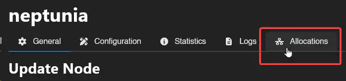
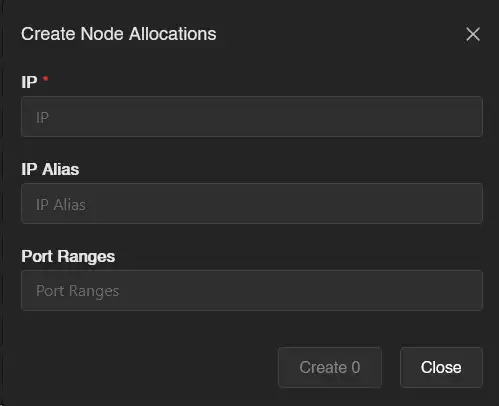

# Setting up Allocations

An allocation is an IP address and port combination that you assign to a server. It's how players connect to their game server - the allocation determines what address and port appear in the panel.

To create allocations, go to **Admin → Nodes**, click your node, then open the **Allocations** tab.

Click **Create** and a popup will appear:

**IP address**: Use the public IP of the node's network interface. To find it, run `hostname -I | awk '{print $1}'` on the node, or `ip addr | grep "inet "` to see all interfaces. You can also use `0.0.0.0` to bind all available interfaces.

::: warning
You can use `127.0.0.1` for allocations if you want the server to be accessible only from the same machine. This is useful for locally hosted services that shouldn't be exposed to the internet.
:::

**IP Alias**: An optional display name shown to users in the panel instead of the raw IP. Useful if you're behind NAT and don't want to expose the internal address.

**Port Ranges**: A single port (`10000`) or a range (`10000-11000`). These are the ports players use to connect.

Fill in the fields and click **Create**. The allocations are now available to assign to servers.
