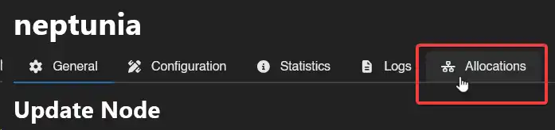
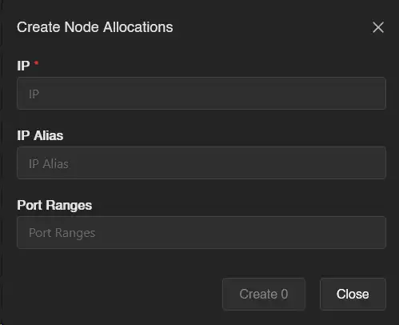

# Setting up Allocations

An allocation is an IP address and port combination that you assign to a server. It's how players connect to their game server - the allocation determines what address and port appear in the panel.

To create allocations, go to **Admin → Nodes**, click your node, then open the **Allocations** tab.

Click **Create** and a popup will appear:

**IP address**: Use an IP assigned to an interface on the Wings host, or `0.0.0.0` to bind all its IPv4 interfaces. Run `ip addr` to inspect the host's addresses. `hostname -I` can include private and Docker addresses; its first result is not necessarily your public IP. If your provider routes a public IP to a private address on the VPS, bind the private address or `0.0.0.0` and enter the public address as the alias below.

::: info
`127.0.0.1` has special handling in Wings: it normally maps to [`docker.network.interface`](../configuration.md#docker-network-interface), and an internal network can leave it unpublished. It does not guarantee a host-loopback-only port. [`docker.network.disable_interface_binding`](../configuration.md#docker-network-disable-interface-binding) can also make ports bind to all interfaces. Check the game container's actual port bindings before relying on an allocation for isolation.
:::

**IP Alias**: The public IP or hostname shown to players instead of the bind address. For example, bind `0.0.0.0` and use your VPS's public IP as the alias. The alias only changes what the Panel displays; it does not configure DNS, NAT, or firewall rules.

**Port Ranges**: A single port (`10000`) or a range (`10000-11000`). These are the ports players use to connect.

Fill in the fields and click **Create**. The allocations are now available to assign to servers.

Allow the game's ports and protocols through the provider firewall and any host firewall or router in the path. Creating an allocation does not open those firewalls.
