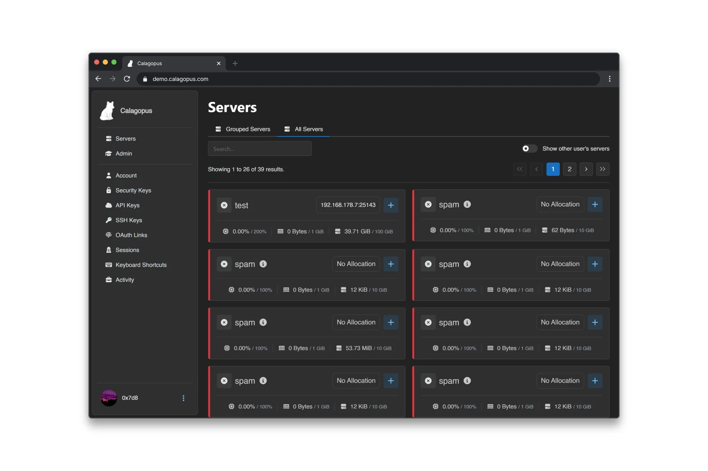
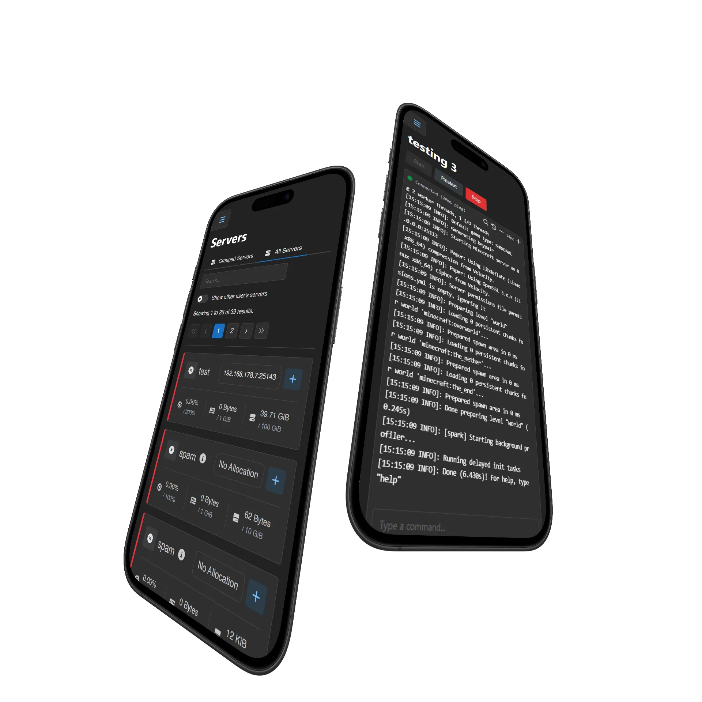

<Stats />

  
  

<Features />

<section class="switch-wrapper" aria-labelledby="switch-heading">
  <h2 id="switch-heading" class="section-heading">Switching from another panel?</h2>
  

    Calagopus manages anything that runs in a Linux Docker container - Minecraft (Java and Bedrock), Rust,
    ARK, Valheim, FiveM, and more. Pterodactyl eggs work without modification, and migration tooling is
    built in. See how it stacks up against the panel you run today:
  

  

    <a class="switch-card" href="/compare/calagopus-vs-pterodactyl">
      <strong>Calagopus vs Pterodactyl</strong>
      Side-by-side comparison and a node-by-node migration path.
    </a>
    <a class="switch-card" href="/compare/calagopus-vs-pelican">
      <strong>Calagopus vs Pelican</strong>
      How the two Pterodactyl successors differ.
    </a>
    <a class="switch-card" href="/compare/calagopus-vs-amp">
      <strong>Calagopus vs AMP</strong>
      Open-source panel vs the licensed alternative.
    </a>
  

  

    <a href="/compare/">All Pterodactyl alternatives compared</a> ·
    <a href="/docs/additional/migrations/pterodactyl">Pterodactyl migration guide</a> ·
    <a href="/docs/additional/migrations/pelican">Pelican migration guide</a>
  

</section>

<section class="faq-wrapper" aria-labelledby="faq-heading">
  <h2 id="faq-heading" class="section-heading">Frequently Asked Questions</h2>
  

    

      
{{ faq.q }}

      
{{ faq.a }}

    

  

  

    <a href="/docs/about/what-is-calagopus">See more questions →</a>
  

</section>

